# 1. 基于微透镜阵列的计算成像研究

【以下内容摘自上篇文章中】

微透镜阵列能够实现多通道成像，并且体积小，重量轻，便于集成化。采集得到的图像数据量大小和常规方法得到的图片相当，在很大程度上方便了后期图像处理。

微透镜阵列对空间场景成像，可以看做为透镜对空间光线进行编码。通过计算成像方法对这些编码信息进行计算，就能够得到空间的三位信息。基于微透镜阵列的计算成像研究主要集中在光场相机成像和计算集成成像两个方面。

一个物体的外观需要由入射的照明条件，物体表面的几何特性，时间等因素同时决定。用光场这个概念来描述光在三维空间中的辐射传输特性，表示一根携带物体视觉特性的光线的传播规则。利用七维全光函数来表征光场。

光场成像由于记录的信息是空间的光场信息，观看时候需要对这些采集到的光场信息进行计算处理。光场采集与光场数据处理。光场采集方式的区别决定了光场信息处理方法的不同，按照结构的不同分为多相机组合和单相机改造。

通过对各个相机时间同步的精确控制以及相机间相对位置的精确计算，能够精确的对光场进行处理，获得高质量的合成图像。通过对所采集的光场进行处理，能够获得景深非常浅的图像，称为合成孔径成像。由于成像景深短，在还原被遮物体时候，能够使前方的离焦遮挡物体严重虚化，实现透视的效果。

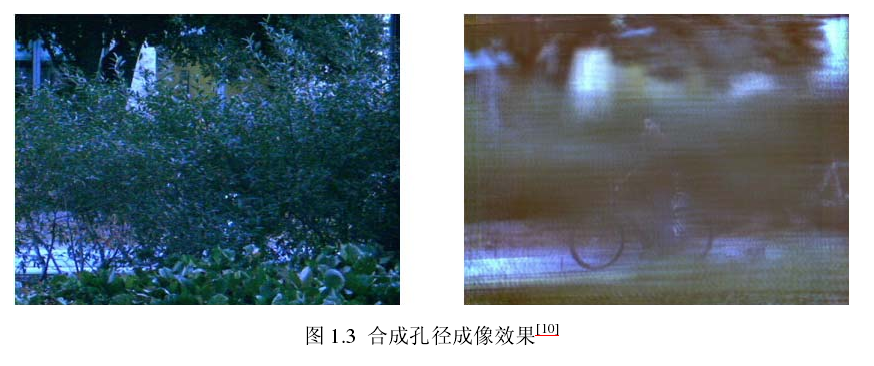

## 1.1 光场成像

单相机的光场采集一般在相机内部加入某种编码调制原件，在成像过程中对光场信息进行调制，使相机内部的光场可以被二维光电传感器记录。EA等设计一种全光相机的原理结构。目标物体的信息，由主透镜进行采集，透过主透镜的光线经过微透镜阵列最终被探测器所采集。这些光线通过微透镜阵列形成若干个与微透镜数对应的宏像素。宏像素的意义在于坐标位置代表了目标像点的空间位置，宏像素所包含的探测器单元代表目标物体在不同视角情况下的成像细节。

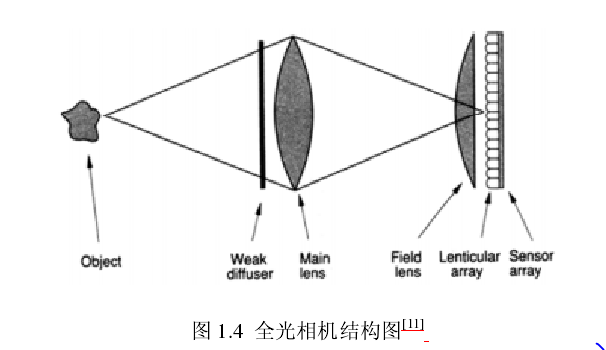

为了让微透镜阵列更好的工作，系统还引入了一个光学扩散片与一个场景。光学扩散片箱单与低通滤波器，用来消除采样中的高频成分，这些高频成分高于微透镜阵列的采样频率，会在最终图像中造成噪声。场镜的主要作用是让为透镜所成的像能够更好的记录在探测器上。

Ｒ对全光相机进行了简化，微透镜阵列直接安装在探测芯片之前。减小了中继镜头带来的额外尺寸，实现了手持的光场相机。拍摄图像如下，可以看出每个微透镜都对应一个包含若干像元的宏像素。这些宏像素阵列记录了相机内部空间的四维光场矩阵。通过对嗣位光场的计算，可以获得聚焦在不同焦平面的图像。这种牺牲相机空间分辨率来获得角度分辨率，光场相机获得了常规相机不具备的重聚焦功能。

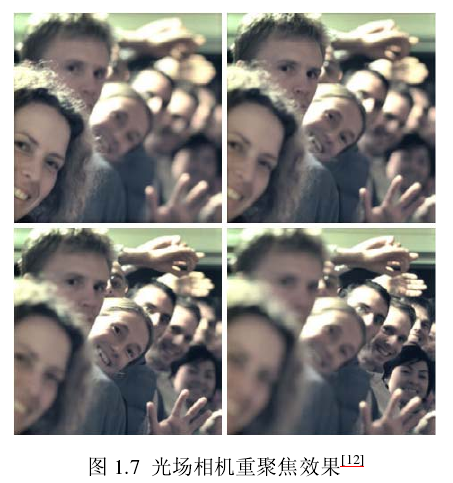

然而这种方法构建的光场相机在空间分辨率与角度分辨率与微透镜阵列的参数有直接的联系，并且装调难度比较大。针对这个问题，提出了“聚焦型光场相机”，结构如下，光场相机2.0

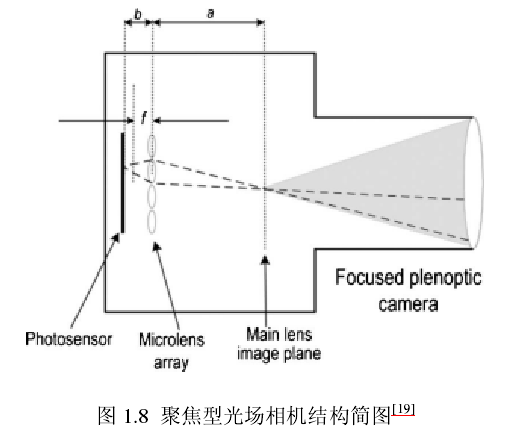

改变微透镜阵列与主光学系统间的位置关系，使微透镜阵列对主光学系统所成实现进行二次成像。相机的空间分辨率和角度分辨率之间的权衡关系变成由微透镜阵列和主光学系统实像面距离来决定，这样就增加了系统空间分辨率选择的灵活性，来开了微透镜阵列与探测面之间的间隔，降低了光场相机对微透镜阵列的要求，方便了系统的装调。

---

小结：采用微透镜阵列进行光场成像的系统有两种方式，第一种是直接将微透镜阵列放在成像芯片之前，这样的系统会使成像的空间分辨率和角度分辨率和微透镜阵列的参数有之间的关系，因此不是特别的好。这里应该需要考虑微透镜阵列成像的时候物象大小和微透镜阵列之间的关系。为了避免上述的问题，光场相机2.0被提出来，也就是聚焦型光场相机，他是利用微透镜阵列对主光学系统得到的实像进行二次成像得到结果。通过改变微透镜和实像之间的距离可得到不同的空间分辨率角度分辨率。

---

## 1.2 计算集成成像

将采集设备放置在微透镜阵列的后焦面处，物体将透过透镜阵列成像在采集设备上，形成一个包含三维空间信息的单元图像阵列。在观察这个单元图像时，在其前面放置一个微透镜阵列即可观察到所采集物体的三维图案。当观察位置发生变化时，就可以观察到物体不同视角变化。

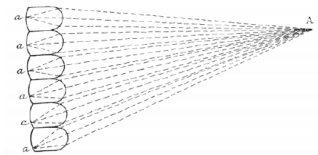

2001年，H提出任意视角的计算集成成像图片重建方法。利用微透镜阵列得到单元图像阵列后，通过视差计算，选择单元图像上具体位置处的像素组成该视点处的视点图像，该方法能够重建处任意视点处的视点图像，在立体测量上有非常大的应用潜力。

2004，S等人利用计算机对集成成像所采集到的图片进行逆向投影，成功重构处物体的三位图像。该方法利用集成成像的采集装置采集到包含空间信息的单元图阵列，利用计算机模拟处针孔阵列，透过这个针孔阵列将对应单元图像投影到任意的目标深度处，其系统结构与最终效果如图。

2008，Chunghong提出利用集成成像的视点图像来进行空间物体的深度测量，测距效果如图所示，通过柱透镜阵列获得单元图像阵列，结合多基线测距算法，比较准确的测量出空间物体的深度。

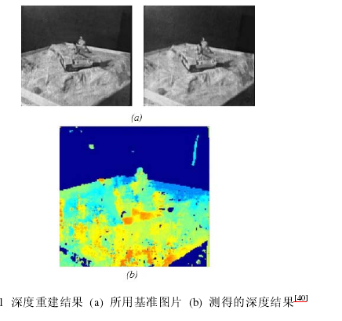

## 2.1 四维光场理论

传统相机中探测器的每个像素点记录的是到达该点的所有光线的叠加，不能对光线的入射信息进行表达。微透镜阵列同时记录了相机内部光线的强度和方向信息。

对全光函数进行简化，认为光在传播的过程中波长和强度都不随时间变化，以及光线的强度不会改变。函数简化为

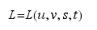

函数的右边是四维坐标来表示的空间自由光线，左边是输出的光线强度。针对双平面参数化方法进行简单的介绍。该参数化方法利用空间光线和两个平行平面的焦点$(u,v)$和$(s,t)$来表示这条空间光线。该方法最大程度上减小奇异点，但是该方法不能表示平行于这两个平面的光线。

一维简化的相机内部空间光线传播如下图所示，一根独立的光线穿过光瞳面$u$，最终记录在探测器$x$上。这条光线在以$u$为纵轴，$x$为横轴的二维坐标系中可以表示成一个点。$u$和$x$决定了这条光线的方向信息，探测器像元的强度就是光线的强度。

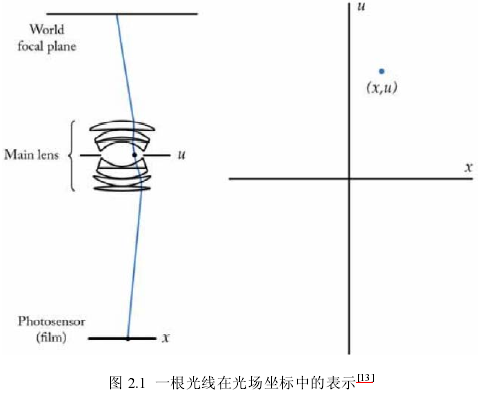

空间中每条光线都对应于光场坐标分布图中的一个点。

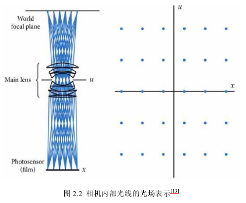

对于传统相机中，一个物点发出的光线通过光瞳平面，汇聚在最终的像素上。由于传统相机结构限制，无法区分出光线与光瞳面的交点坐标，因此他的光场信息如图中所示。每一个长条代表了不同像素采集到的光线信息，长条的宽度等于像素像元的宽度。从图中可以看出常规相机实际上是采集到相机内部光场在$x$平面上的投影，这种投影最大化的保存$x$信息，但是完全丢失$u​$信息。

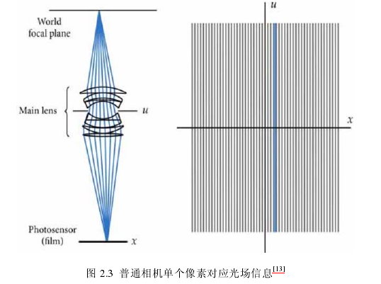

当聚焦物体的空间位置改变时，仍然以$x$作为四维光场的坐标面。当聚焦物体变近时，所成的像就要离焦平面更远一点。对应的光场分布如图，光场信息相对于正常情况发生了逆时针的倾斜。可以看出，光场分布图的倾斜情况正对应者相机聚焦位置的变化。

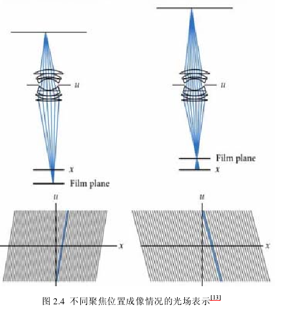

利用光场信息来建立探测面处的二维强度分布可以通过方程

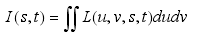

---

小结：这里是聚焦物体发生位置变化时候出现的结果，整个光学系统内部的参数是不发生变化的。这里的$x,u$分别进行考虑，$x$可以看作是探测阵列上面的第几个探测像素元，而$u$可以看作是光瞳平面上第几根光线的位置。第一幅图中发生顺时针旋转，是因为$x,u$是正比的关系。第一个像元$x$对应第一个光线的光瞳面$u$。

---

## 2.2 斯坦福光场相机

为了克服传统相机中光瞳面坐标信息丢失的问题，光场相机理论弥补了。光场相机在主光学系统的像平面处添加了一块微透镜阵列，利用探测器来探测微透镜焦面处的光场图像。每个微透镜都对应于探测器上一小块区域，宏像素。宏像素平面对应四维光场中$(s,t)$的坐标信息，每个宏像素都是对应微透镜对光瞳面所成的像。因此，每个宏像素下所包含的探测器像素都对应着光瞳面上的不同区域即$(u,v)$，通过对这些像素的重新计算，得到光场相机特有的一些三维功能。

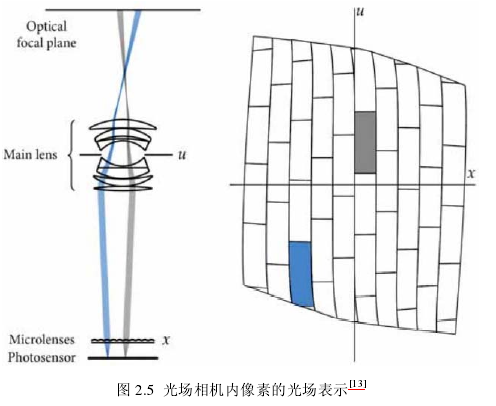

每个像素不再是对应一个长条，而是光场分布图上的一个网格。这些网格表示入射到该宏像素处某一方向光线强度。光场相机中的条形宽度对应于宏像素的宽度，同一个宏像素记录的空间位置信息是相同的，只是角度不同。从这个角度来进行分析，光场相机牺牲了最终的空间分辨能力，即$x$的采样间隔，来获取角度分辨能力，即$u$的采样能力。

拍照过程中的重聚焦可以对应于相机内部光场信息的倾斜，常规相机中一次曝光只能进行某个方向的投影，一次只能记录一个聚焦平面的信息。光场相机将空间的光场分布进行网格化，理论上只要进行合理的计算，就能得到重聚焦的图片。

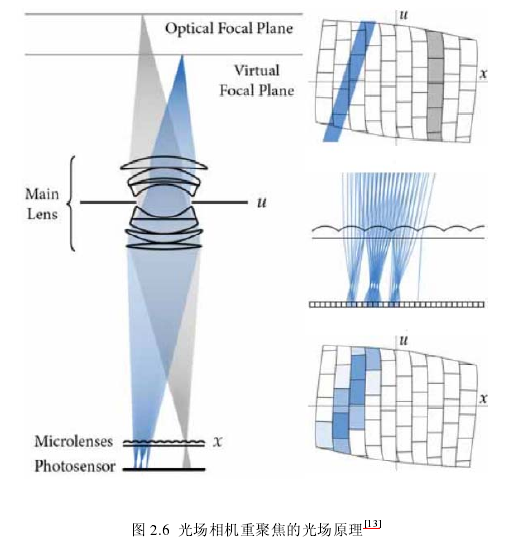

当我们对光场所用的坐标系进行变换时，其所表示光线不会有所改变，只是表示所用的参考系发生了变换。

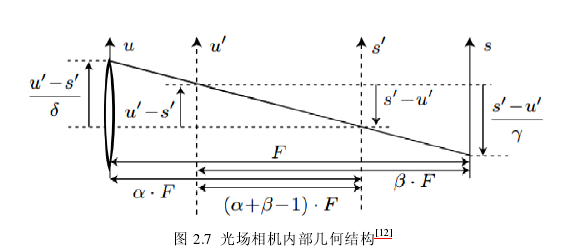

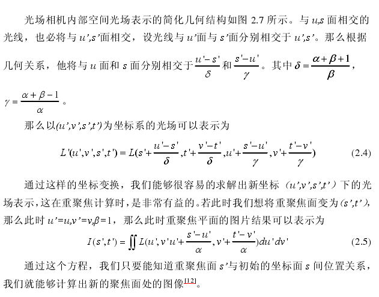

公式中$L$是以探测器面$(u,v)$和微透镜阵列面$(s,t)$为坐标系的空间光场。$I$是我们在重聚焦面所得到的重聚焦图像。要获得最终的重聚焦图片，最直接的办法就是将我们采集到的光场图像按照这个方程进行计算，通过将坐标相同方向不同的光线叠加，得到最终的图像信息。

### 2.2.1 斯坦福光场相机仿真

利用zemax搭建了一套光场相机系统，仿真得到光学系统的光场图像，通过对仿真光场图片进行处理，验证光场相机的成像与重聚焦功能。

由主镜头、微透镜阵列和像平面组成，主光学系统采用理想透镜作为主光学系统和。

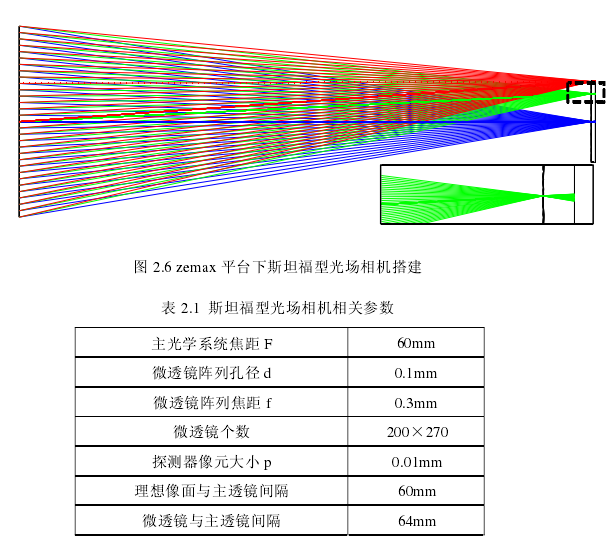

光场采集过程中所用的光学系统中，光线透过理想主光学系统，成像在透镜阵列上。从光学系统的细节可以看出来，微透镜阵列将入射光线分散至最终的探测面上，实现对光线的记录。由于zemax只能针对平面物体进行成像，本文以软件自带的图像作为处理图进行光场相机成像仿真，为实现光场相机的重聚焦功能，本文将物体放在无穷远，微透镜阵列放在主光学系统焦平面后方，产生离焦效果。希望后期的光场处理中得到正确的聚焦图片。

原图和普通相机拍摄图如下所示

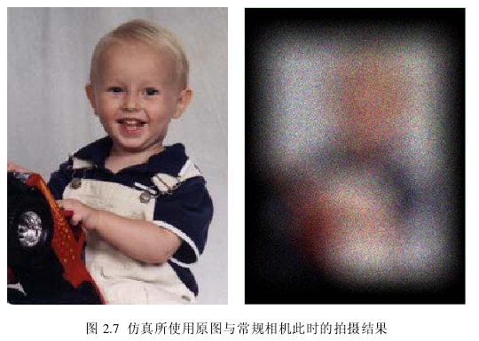

光场相机获得的光场图像如下所示，包含$200*270​$个宏像素，部分放大细节中，看到每个宏像素都是一个圆形，每个宏像素下包含$10*10​$个像元。整体的图像轮廓中，只能分辨处小孩的离焦图片，从放大的宏像素细节下看出，每个宏像素都记录了部分的空间信息。

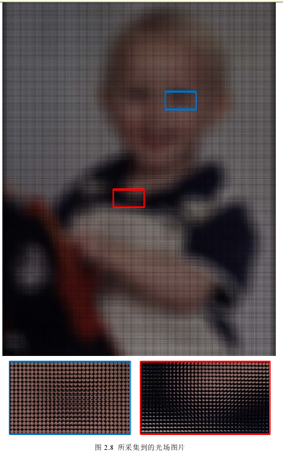

