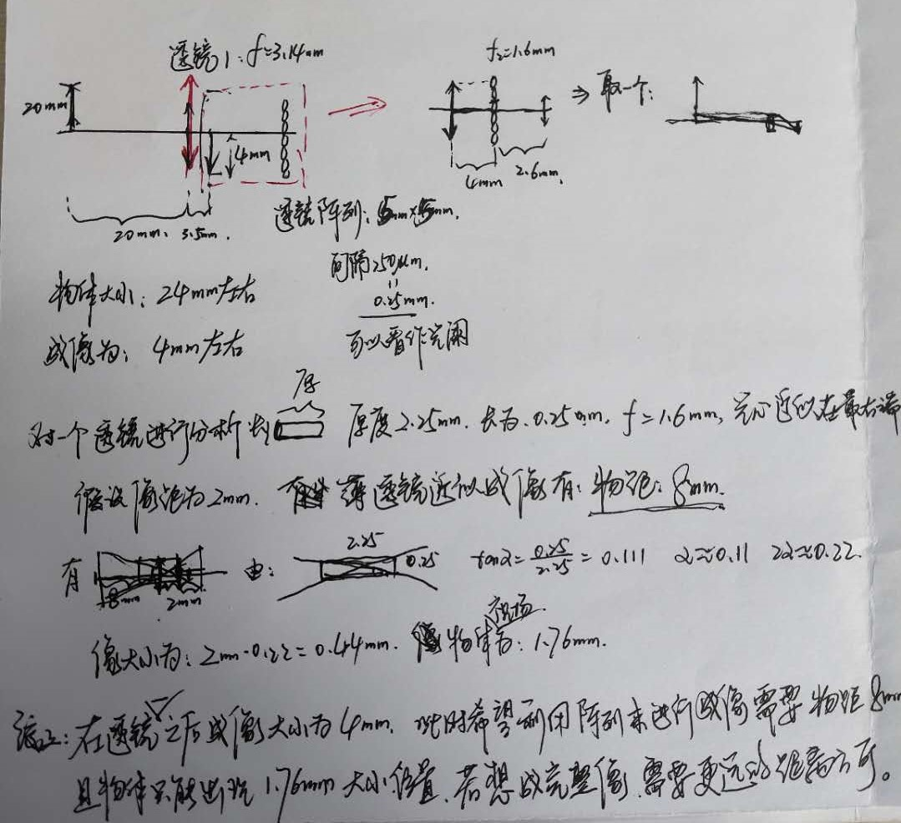
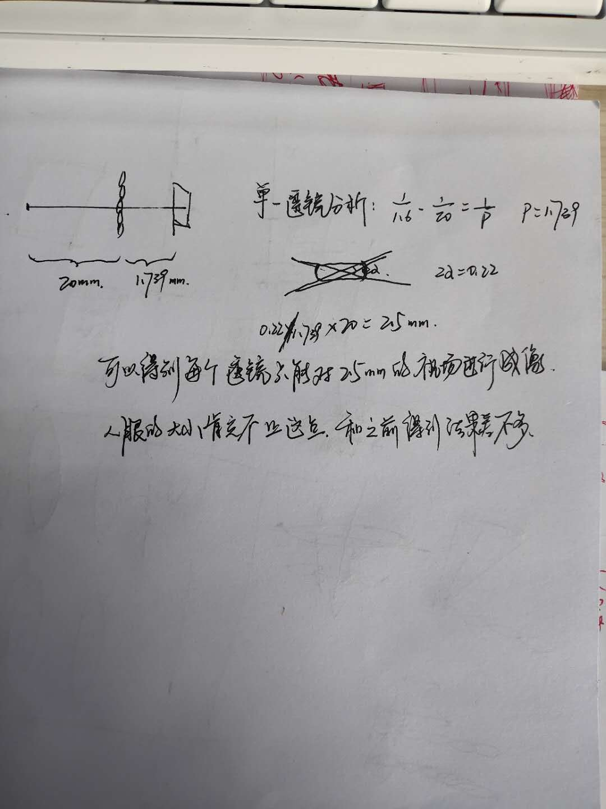

## 一些和毕设相关的思考，可能是有用的也可能是无用的

### 1. 关于多透镜阵列的问题

1. 在镜头后面加透镜阵列

   多透镜阵列的实质是为了得到视场差，进而类似于双目视觉系统得到特征点的三维空间信息。在进行多透镜阵列的搭建过程中发现，由于多透镜阵列之间的相互透光现象，导致各个成像之间的结果会相互影响。学长采用的是在原来的镜头后面放置透镜，根据计算可以知道前方透镜的焦距和光心位置，该透镜所成的像应该在光心后一定距离。此时，利用透镜阵列来对得到的像进行成像。如下图所示：

分析发现，如果想要在镜头后面加透镜阵列的话需要很长的距离，透镜1有3.5mm像距，此时透镜2有8mm的物距，加在一起就是11.5mm的距离，这在我们已有的镜头上面是实现不了的。而且这个镜头会非常长，不利于硬件系统的安装。

2. 去掉镜头直接利用透镜阵列成像

不能对人眼实现完全的成像，每次都只能成像一部分。

### 2. 关于透镜阵列的设想

