[TOC]

## 一些和毕设相关的思考，可能是有用的也可能是无用的

### 1. 关于多透镜阵列的问题

1. 在镜头后面加透镜阵列

   多透镜阵列的实质是为了得到视场差，进而类似于双目视觉系统得到特征点的三维空间信息。在进行多透镜阵列的搭建过程中发现，由于多透镜阵列之间的相互透光现象，导致各个成像之间的结果会相互影响。学长采用的是在原来的镜头后面放置透镜，根据计算可以知道前方透镜的焦距和光心位置，该透镜所成的像应该在光心后一定距离。此时，利用透镜阵列来对得到的像进行成像。如下图所示： 

分析发现，如果想要在镜头后面加透镜阵列的话需要很长的距离，透镜1有3.5mm像距，此时透镜2有8mm的物距，加在一起就是11.5mm的距离，这在我们已有的镜头上面是实现不了的。而且这个镜头会非常长，不利于硬件系统的安装。

2. 去掉镜头直接利用透镜阵列成像

不能对人眼实现完全的成像，每次都只能成像一部分。

### 2. 关于透镜阵列的设想

透镜阵列应该尽量的满足我们的要求：首先成像的大小要大，其次成像的内容要

[迈得特光学](http://www.mdtp-optics.com/producta/?type=detail&id=15)

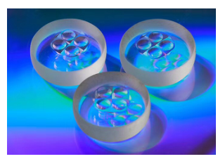

透镜阵列多孔径成像

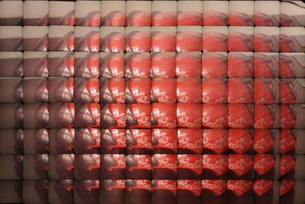

[学长买透镜的地方](http://io.rayscience.com/product-314.html)

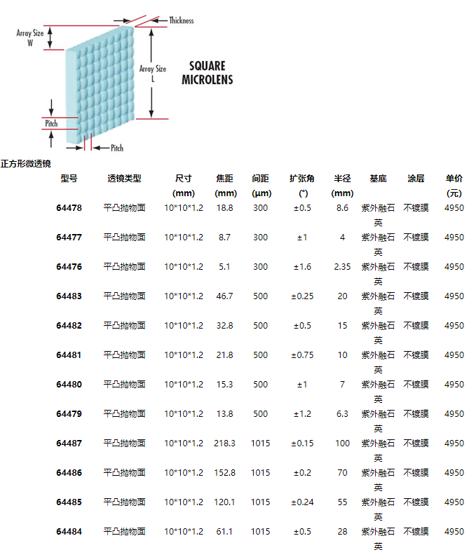

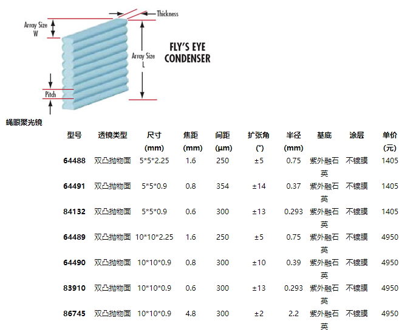

### 3.手机双摄模组的采用

[舜宇光学](http://www.sunnyoptical.com/001007009/p265.html)

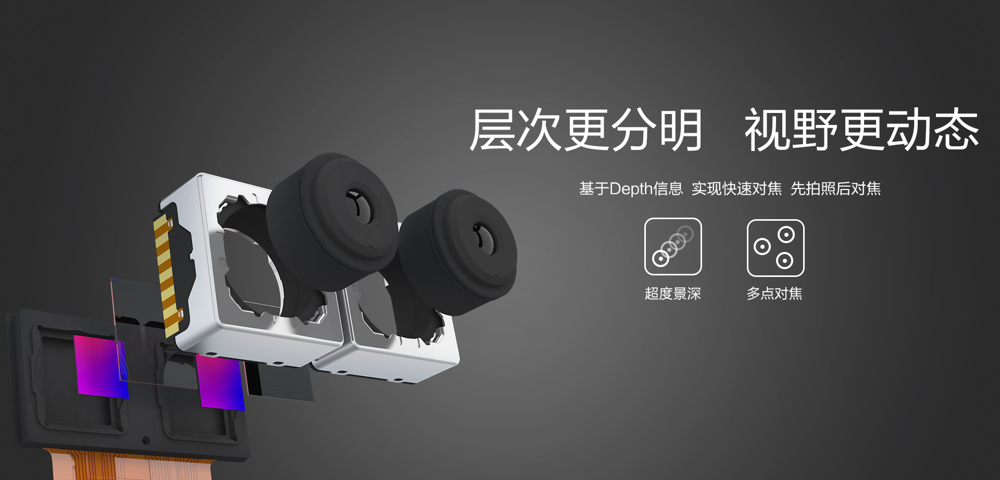

[OFILM](http://www.ofilm.com/field_inner_19.html)

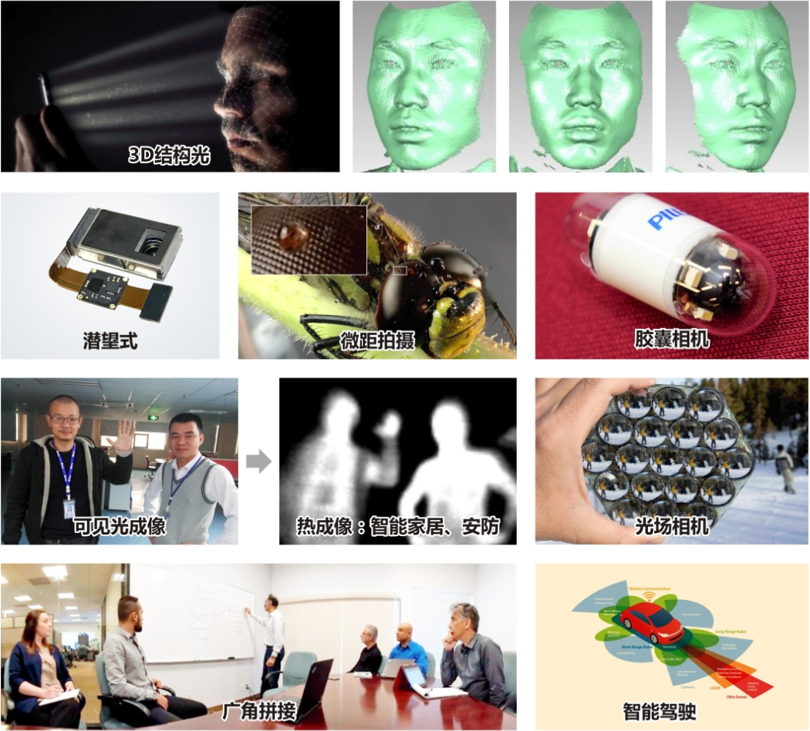

[丘钛科技](http://www.qtechglobal.com/product_info_2.html?page=1)

双摄模组有共基、一体和分体式三种

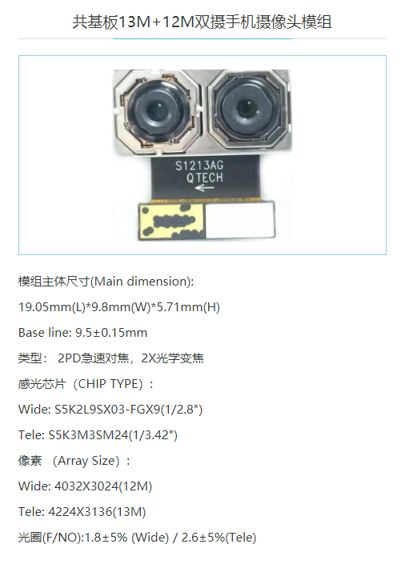

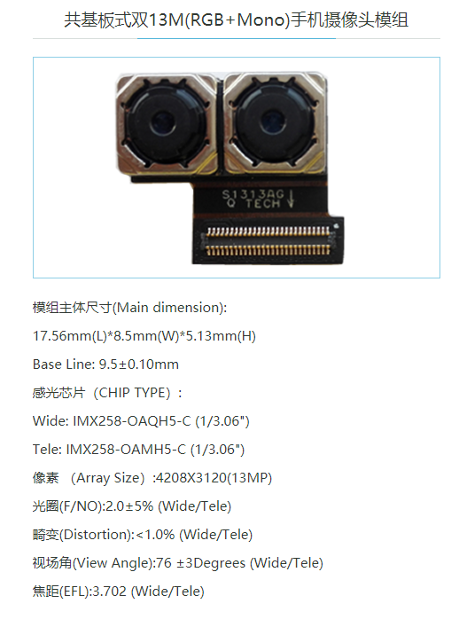

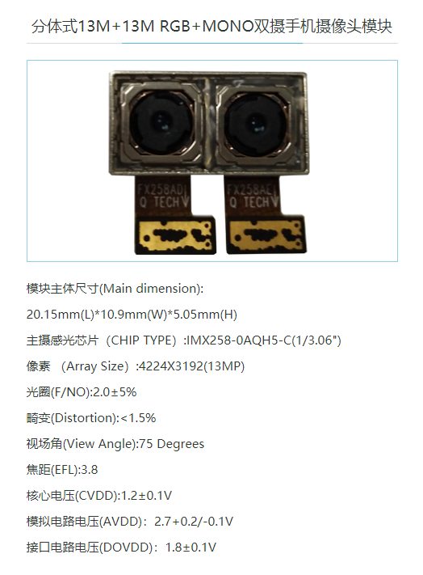

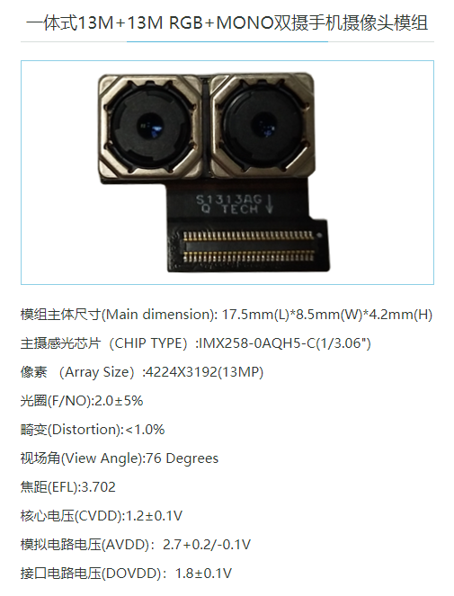

### 4. 关于眼纹特征的提取

在这里关于眼纹特征的提取过程中，拟采用神经网络的方式来实现对眼纹相交点大概位置的提取，然后对该点的区域进行截取，再次利用常规方法得到准确眼纹相关点准确位置。并在此时对眼纹的描述子进行计算，实现多图中眼纹特征的采集。

在进行一定的思考后发现，眼纹特征还有颜色也是一个很好的特征。眼纹做为人眼的表层血管组织，在很大程度上具有血管的颜色特征。相较与巩膜的其他部位，眼纹的颜色稳定性具有很好的表达力。

特征提取可能出现的问题：眼睛的光照不一，导致局部出现较暗的变化。这里如果可以处理掉光照变换和颜色之间的关系就可以很好的解决这些问题。首先颜色在探测器中的呈现是通过三个颜色通道的融合来实现的，也就是三个颜色通道按照一定的比例进行混合得到。三种颜色在空间汇总对应着一个空间的维度。

如果在该空间维度进行聚类可以很好的将具有一定颜色空间特点的特征进行聚类。神经网络可以进行分类，是否可以利用神经网络训练一个对血管颜色特征空间敏感的网络，利用该网络实现眼纹的提取。

#### 4.1 亮度和颜色之间的关系

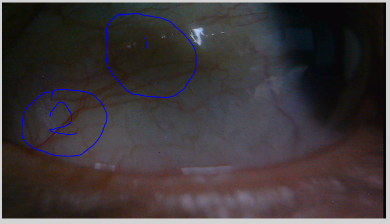

如上图所示，1和2位置的亮度明显不同，但是这两个位置都存在着明显的眼纹。颜色和亮度的问题，虽然在整体的亮度上存在明显变换，但是我们依旧能够从视觉上看到存在的眼纹结构，说明从局部来进行分析的话，依旧存在一定的合理性。

从人本身来说，没有人在对物体进行观看和识别的时候是在像素级，我们总是将一定区域内的像素进行统一观察来实现物体的观察的。这里就需要考虑像素块的响应问题。对于一个像素块来说，该像素块的响应肯定是几个像素块的集合。比如将三个像素的平均响应度作为一个高层的

还有一个问题就是分离和连续的问题，日常生活中存在的物体都是连续的，但是在像素图中需要分离的进行记录。可否利用这些点的位置关系将分离的点转化为连续的分布问题。    

针对具体的像素可以进行一定的像素点的分析，但是从人类的视觉感知来说，我们需要使用聚类算法来进行分析。

#### 4.2 K-means聚类算法

网上已有通过k-means算法来实现图像分割的[参考](https://blog.csdn.net/dcrmg/article/details/53014023)。根据人眼的视觉特性，我们发现我们对于聚集的东西更容易分辨。对于一张图来说就是颜色的聚集和空间的聚集。在进行聚类或者是二值化计算的时候，不仅仅应该考虑颜色值的大小分布，也应该考虑像素之间的空间分布。                                                   

原图：

k=2

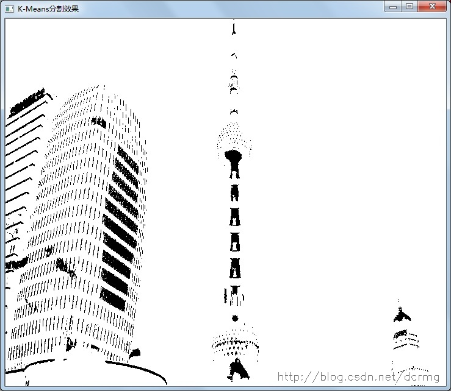

k=3

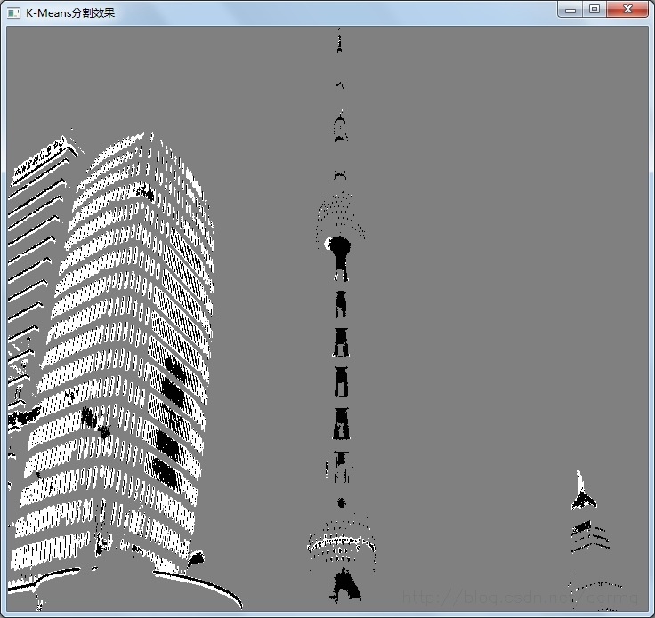

k=4

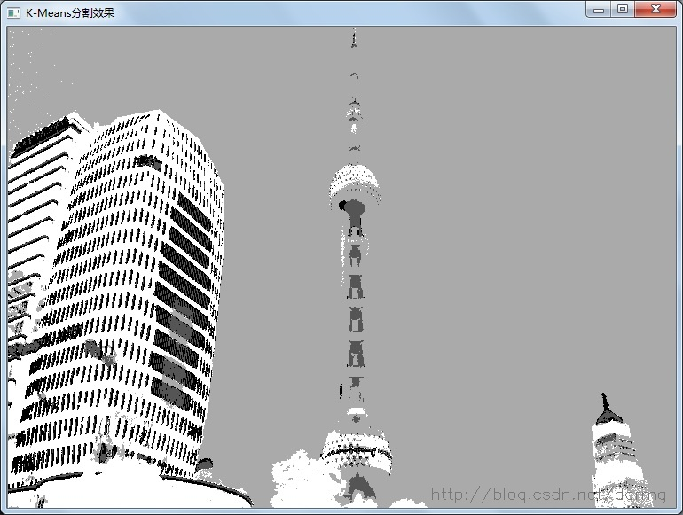

一个简单的K-means算法的过程

首先确定聚类的类别K值，在图中随机的选取聚类的中心位置。计算所有点到中心位置的距离进行K分类，将分类后的结果再次进行中心位置计算，得到新的中心位置。再次计算所有点到中心位置的距离，进一步进行K分类，并计算分类后的中心位置。以此类推，直到满足某一终止条件。

K-means算法的特点：该算法每次的分类过程都需要对全局的点进行一次遍历，如果点的数目过多，计算起来将会非常的复杂。而且在分类过程中需要进行多次的分类计算，计算起来会很复杂消耗时间。                                                                                                                                                                                                                                                                                                                                                                                                                                     