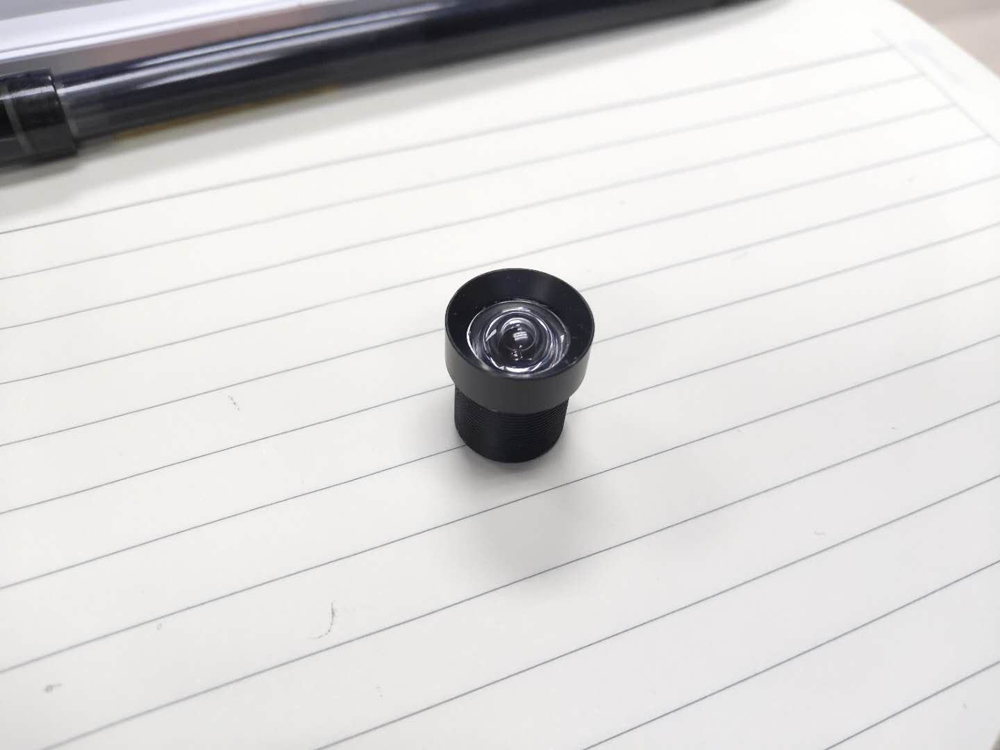
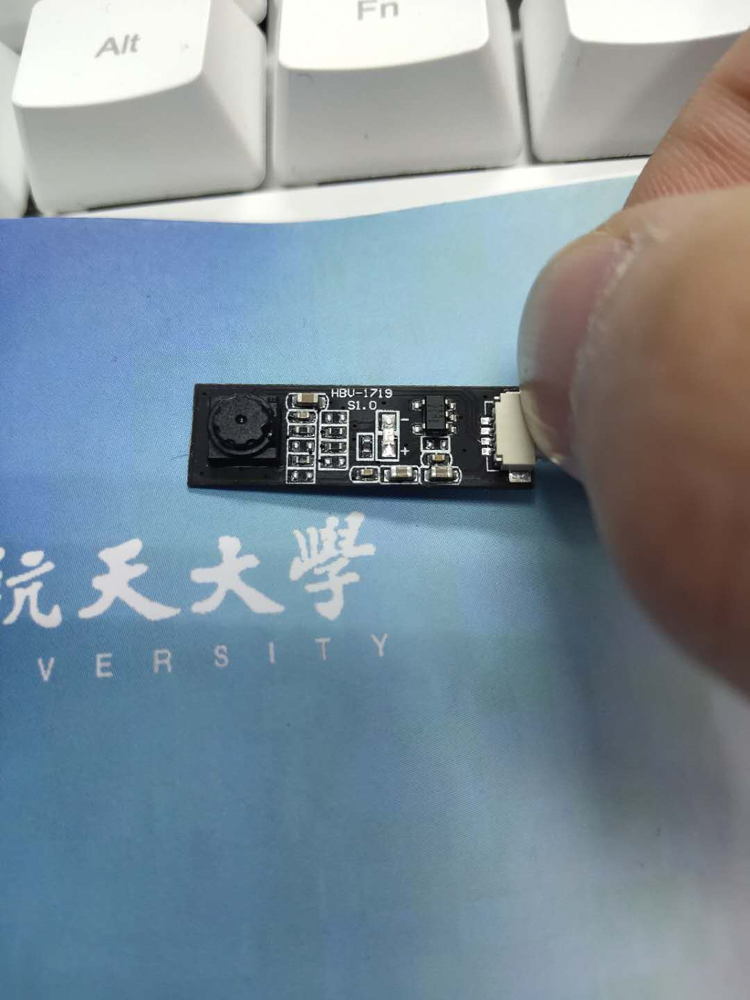
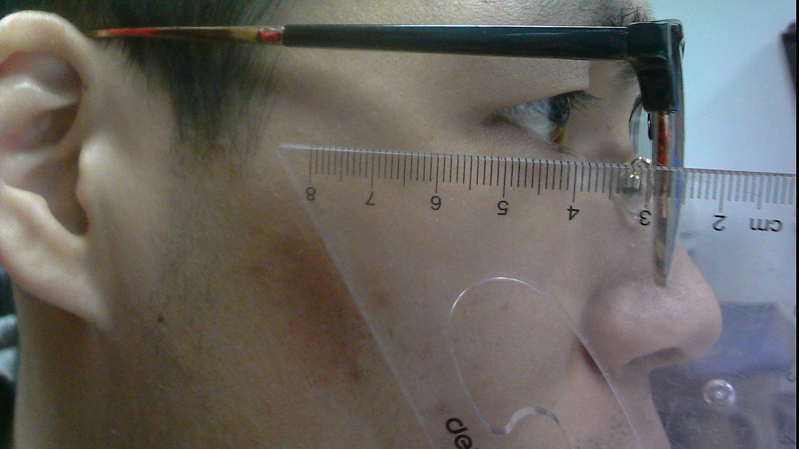
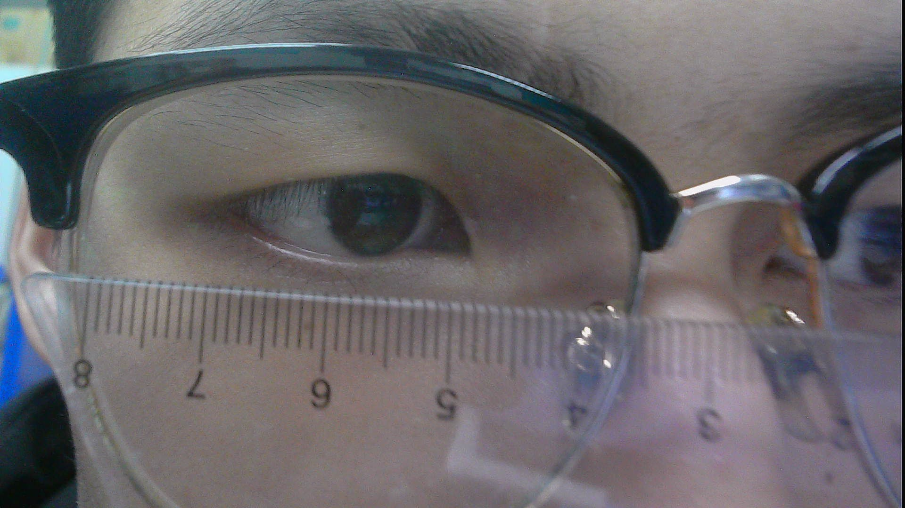
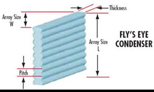

# 光学相关内容

## 1. 薄透镜成像公式

$$
1/f = 1/p + 1/p'
$$

分析可知：在$p'$不确定的时候，$p$跟着$p'$后面进行变化。也就是说在镜头和成像阵列之间的距离为某一特定值的时候，镜头和物体之间也需要保持一个固定的距离，物体才能在成像阵列上有一个清晰的像。而且学长这个不是一个薄透镜，具体的成像细则和公式计算得到的数据可能存在有一定的偏差。

由于人眼进行反射进入到透镜的光不可能是汇聚光，为此成像阵列和透镜之间的距离必须大于透镜的焦据

## 2. 人眼的真实距离参数

在通过自拍和利用尺子进行比对，得到大概的眼睛距离，以及两眼间距离的大小。

## 3. 视场角的确定

上图所示，由于通过透镜光心的光线方向保持不变，可以发现视场角和成像阵列的大小，以及成像阵列与透镜之间的距离有关。一般成像阵列的大小固定了，透镜和阵列之间的距离必须大于透镜的焦距。

$$
假设透镜的焦据为4mm,成像阵列的距离为4mm,根据薄透镜的成像公式可以计算可以检测到的人眼范围。
$$

## 4. 已有器件参数

学长留下来的镜头经测试，[焦距]大概为3mm，在进行人眼测试的时候[像距]保持在3.5mm，[物距]保持在20mm。经过计算和实验比较，发现结果和理论得到结果相差不大，该透镜可以近似看作[薄透镜]。在视场角的记录中，利用尺子进行比对，在如图所示的结果中，能够得到一个比较清晰的像，此时视场的大小为23mm左右。

发现成像系统得到的视场大小长约为2.4mm，进行相应计算，可以估计出[成像阵列]的大小约等于$4(确定)*2.5$。学长留下来的镜头如下，已知的像距是镜头框底部和成像阵列之间的距离，但这样的话，就是默认光心在镜头的最底部。经过计算，光心位置大概在距离镜头底部0.174的位置处，基本位于框底部。可以用来进行一定程度的近似。

[关键参数]：[物体到成像阵列之间的距离大约为27mm，像距比焦距稍微大一点就行，能够成像的物体大小约为20mm]。该参数是由焦距大小，物距大小等因素决定的。这个是在试验得到的一个比较好的结果。

场景摄像头模组：该模组的大小为$25*8mm$，相机的大小为$4.5*4.5mm$。分辨率为$640*480$。

## 5. 小镜头摄像机

这里要解决的内容太多，首先还是解决小镜头的问题吧。考虑到之前有论文中采用医用内窥镜作为这里的小镜头眼睛摄像装置，为此尝试在淘宝上搜索内窥镜来进行比较。

### 淘宝店搜索结果

- [1.](https://item.taobao.com/item.htm?spm=a230r.1.14.60.20232861m538Nv&id=583013574447&ns=1&abbucket=2#detail)

- [2.深圳市远恒科技有限公司](https://item.taobao.com/item.htm?spm=a230r.1.14.70.20232861m538Nv&id=541199442293&ns=1&abbucket=2#detail)

## 6. 光学系统方案

光学系统的设计方案有很多，主要目的是对两个眼睛进行成像，利用双目相机来实现成像的空间位置坐标计算。要求系统尽量靠近眼睛，能够对眼睛成一个清晰的像。相机空间位置的放置由笔者进行确定，选择一个比较好，而且尽量不遮挡视线的方法。关于眼睛成像的问题就是由光学系统的参数来进行决定。

- 在眼睛托的两侧，靠近眼睛的地方放置摄像机。该地方的位置较大，且存在一定的视野盲区，用来放置小型的摄像机是没有问题的。而且该位置接近眼角，能够很好的对眼角位置进行成像。如下图所示位置就是:在鼻托靠内侧的地方，放置我们一个3-4mm的镜头是不会影响的。两侧各放一个，用来分别进行测量眼角的信息。但是该方法只能在一侧放置一个摄像机，不知道能不能放下两个相机，无法生成立体的像。

- 便携式方案：在眼睛的上弄出一个支撑出来用来固定摄像机，通过对我自己的眼睛框的形状进行尺寸的计算，来得到镜头放置的方案：

  发现眼镜片到眼球的距离大约是15mm，右侧镜腿到眼睛的距离大约15mm。暂定在这里添加一个便携式的镜头架的方法。

## 7. 多透镜阵列

尺寸为5mm*5mm，焦距为1.6mm，间距250微米