[TOC]

---

# 1. 基于微透镜阵列的计算成像研究

【以下内容摘自上篇文章中】

微透镜阵列能够实现多通道成像，并且体积小，重量轻，便于集成化。采集得到的图像数据量大小和常规方法得到的图片相当，在很大程度上方便了后期图像处理。

微透镜阵列对空间场景成像，可以看做为透镜对空间光线进行编码。通过计算成像方法对这些编码信息进行计算，就能够得到空间的三位信息。基于微透镜阵列的计算成像研究主要集中在光场相机成像和计算集成成像两个方面。

一个物体的外观需要由入射的照明条件，物体表面的几何特性，时间等因素同时决定。用光场这个概念来描述光在三维空间中的辐射传输特性，表示一根携带物体视觉特性的光线的传播规则。利用七维全光函数来表征光场。

光场成像由于记录的信息是空间的光场信息，观看时候需要对这些采集到的光场信息进行计算处理。光场采集与光场数据处理。光场采集方式的区别决定了光场信息处理方法的不同，按照结构的不同分为多相机组合和单相机改造。

通过对各个相机时间同步的精确控制以及相机间相对位置的精确计算，能够精确的对光场进行处理，获得高质量的合成图像。通过对所采集的光场进行处理，能够获得景深非常浅的图像，称为合成孔径成像。由于成像景深短，在还原被遮物体时候，能够使前方的离焦遮挡物体严重虚化，实现透视的效果。

## 1.1 光场成像

单相机的光场采集一般在相机内部加入某种编码调制原件，在成像过程中对光场信息进行调制，使相机内部的光场可以被二维光电传感器记录。EA等设计一种全光相机的原理结构。目标物体的信息，由主透镜进行采集，透过主透镜的光线经过微透镜阵列最终被探测器所采集。这些光线通过微透镜阵列形成若干个与微透镜数对应的宏像素。宏像素的意义在于坐标位置代表了目标像点的空间位置，宏像素所包含的探测器单元代表目标物体在不同视角情况下的成像细节。

为了让微透镜阵列更好的工作，系统还引入了一个光学扩散片与一个场景。光学扩散片箱单与低通滤波器，用来消除采样中的高频成分，这些高频成分高于微透镜阵列的采样频率，会在最终图像中造成噪声。场镜的主要作用是让为透镜所成的像能够更好的记录在探测器上。

Ｒ对全光相机进行了简化，微透镜阵列直接安装在探测芯片之前。减小了中继镜头带来的额外尺寸，实现了手持的光场相机。拍摄图像如下，可以看出每个微透镜都对应一个包含若干像元的宏像素。这些宏像素阵列记录了相机内部空间的四维光场矩阵。通过对嗣位光场的计算，可以获得聚焦在不同焦平面的图像。这种牺牲相机空间分辨率来获得角度分辨率，光场相机获得了常规相机不具备的重聚焦功能。

然而这种方法构建的光场相机在空间分辨率与角度分辨率与微透镜阵列的参数有直接的联系，并且装调难度比较大。针对这个问题，提出了“聚焦型光场相机”，结构如下，光场相机2.0

改变微透镜阵列与主光学系统间的位置关系，使微透镜阵列对主光学系统所成实现进行二次成像。相机的空间分辨率和角度分辨率之间的权衡关系变成由微透镜阵列和主光学系统实像面距离来决定，这样就增加了系统空间分辨率选择的灵活性，来开了微透镜阵列与探测面之间的间隔，降低了光场相机对微透镜阵列的要求，方便了系统的装调。

---

小结：采用微透镜阵列进行光场成像的系统有两种方式，第一种是直接将微透镜阵列放在成像芯片之前，这样的系统会使成像的空间分辨率和角度分辨率和微透镜阵列的参数有之间的关系，因此不是特别的好。这里应该需要考虑微透镜阵列成像的时候物象大小和微透镜阵列之间的关系。为了避免上述的问题，光场相机2.0被提出来，也就是聚焦型光场相机，他是利用微透镜阵列对主光学系统得到的实像进行二次成像得到结果。通过改变微透镜和实像之间的距离可得到不同的空间分辨率角度分辨率。

---

## 1.2 计算集成成像

将采集设备放置在微透镜阵列的后焦面处，物体将透过透镜阵列成像在采集设备上，形成一个包含三维空间信息的单元图像阵列。在观察这个单元图像时，在其前面放置一个微透镜阵列即可观察到所采集物体的三维图案。当观察位置发生变化时，就可以观察到物体不同视角变化。

2001年，H提出任意视角的计算集成成像图片重建方法。利用微透镜阵列得到单元图像阵列后，通过视差计算，选择单元图像上具体位置处的像素组成该视点处的视点图像，该方法能够重建处任意视点处的视点图像，在立体测量上有非常大的应用潜力。

2004，S等人利用计算机对集成成像所采集到的图片进行逆向投影，成功重构处物体的三位图像。该方法利用集成成像的采集装置采集到包含空间信息的单元图阵列，利用计算机模拟处针孔阵列，透过这个针孔阵列将对应单元图像投影到任意的目标深度处，其系统结构与最终效果如图。

2008，Chunghong提出利用集成成像的视点图像来进行空间物体的深度测量，测距效果如图所示，通过柱透镜阵列获得单元图像阵列，结合多基线测距算法，比较准确的测量出空间物体的深度。

## 2.1 四维光场理论

传统相机中探测器的每个像素点记录的是到达该点的所有光线的叠加，不能对光线的入射信息进行表达。微透镜阵列同时记录了相机内部光线的强度和方向信息。

对全光函数进行简化，认为光在传播的过程中波长和强度都不随时间变化，以及光线的强度不会改变。函数简化为

函数的右边是四维坐标来表示的空间自由光线，左边是输出的光线强度。针对双平面参数化方法进行简单的介绍。该参数化方法利用空间光线和两个平行平面的焦点$(u,v)$和$(s,t)$来表示这条空间光线。该方法最大程度上减小奇异点，但是该方法不能表示平行于这两个平面的光线。

一维简化的相机内部空间光线传播如下图所示，一根独立的光线穿过光瞳面$u​$，最终记录在探测器$x​$上。这条光线在以$u​$为纵轴，$x​$为横轴的二维坐标系中可以表示成一个点。$u​$和$x​$决定了这条光线的方向信息，探测器像元的强度就是光线的强度。

空间中每条光线都对应于光场坐标分布图中的一个点。

对于传统相机中，一个物点发出的光线通过光瞳平面，汇聚在最终的像素上。由于传统相机结构限制，无法区分出光线与光瞳面的交点坐标，因此他的光场信息如图中所示。每一个长条代表了不同像素采集到的光线信息，长条的宽度等于像素像元的宽度。从图中可以看出常规相机实际上是采集到相机内部光场在$x​$平面上的投影，这种投影最大化的保存$x​$信息，但是完全丢失$u​$信息。

当聚焦物体的空间位置改变时，仍然以$x​$作为四维光场的坐标面。当聚焦物体变近时，所成的像就要离焦平面更远一点。对应的光场分布如图，光场信息相对于正常情况发生了逆时针的倾斜。可以看出，光场分布图的倾斜情况正对应者相机聚焦位置的变化。

利用光场信息来建立探测面处的二维强度分布可以通过方程

---

小结：这里是聚焦物体发生位置变化时候出现的结果，整个光学系统内部的参数是不发生变化的。这里的$x,u​$分别进行考虑，$x​$可以看作是探测阵列上面的第几个探测像素元，而$u​$可以看作是光瞳平面上第几根光线的位置。第一幅图中发生顺时针旋转，是因为$x,u​$是正比的关系。第一个像元$x​$对应第一个光线的光瞳面$u​$。

---

## 2.2 斯坦福光场相机

光场相机克服了传统相机中光瞳面坐标信息丢失的问题。光场相机在主光学系统的像平面处添加了一块微透镜阵列，利用探测器来探测微透镜焦面处的光场图像。每个微透镜都对应于探测器上一小块区域，宏像素。宏像素平面对应四维光场中$(s,t)​$的坐标信息，每个宏像素都是对应微透镜对光瞳面所成的像。因此，每个宏像素下所包含的探测器像素都对应着光瞳面上的不同区域即$(u,v)​$，通过对这些像素的重新计算，得到光场相机特有的一些三维功能。

---

注意：对微透镜阵列进行详细分析的时候发现必须拥有各自的视场角才能够成功实现下图中的样子，而且下图中的样子也不正确。斯坦福光场相机中，由于微透镜阵列是在像面上，那么光线通过微透镜阵列之后会再次进行透镜成像，经过分析发现，此时是对主透镜系统进行成像，也就是对光瞳面上的点进行成像。如果每个微透镜阵列没有自己的视场角，那么每个微透镜阵列都会对整个光瞳进行成像，这和我们的要求是完全不一样的。考虑每个微透镜阵列存在一定的视场角，那么单个微透镜就只能对光瞳面的一部分进行成像，也就是说成像结果中会出现光瞳面的记录。从图中也可以看出来，单个微透镜的视场角在一定程度上决定了光瞳面的记录大小。

单个微透镜成像得到的一个点，应该是对应于光瞳面上的一个单点，而不是下图中那个样子的。但是下面的结构是一个整体结构，在光瞳面没有出现

---

每个像素不再是对应一个长条，而是光场分布图上的一个网格。这些网格表示入射到该宏像素处某一方向光线强度。光场相机中的条形宽度对应于宏像素的宽度，同一个宏像素记录的空间位置信息是相同的，只是角度不同。从这个角度来进行分析，光场相机牺牲了最终的空间分辨能力，即$x​$的采样间隔，来获取角度分辨能力，即$u​$的采样能力。

拍照过程中的重聚焦可以对应于相机内部光场信息的倾斜，常规相机中一次曝光只能进行某个方向的投影，一次只能记录一个聚焦平面的信息。光场相机将空间的光场分布进行网格化，理论上只要进行合理的计算，就能得到重聚焦的图片。

当我们对光场所用的坐标系进行变换时，其所表示光线不会有所改变，只是表示所用的参考系发生了变换。

---

注意：上面的坐标变换中$L(u,v,s,t)​$到$L^`(u^`,v^`,s^`,t^`)​$只是利用两个式子变量间的集合关系，将左边的变量全部用右边的变量进行替换，而不存在其他的操作。对于一根光线来说，只要光学系统的内部结构不发生变化，那么光线的运行规律是不会发生变化的。上面的式子是正确的，该式子对于任何的光场都是成立的，计算的关键在于如何将上式和光场相机结合在一起。注意该式子是在一根光线上成立的，如何将这跟微观的光线和宏观的光线进行结合。$I(s',t')​$是对于探测面上一点的光强。也就是说上面的式子进行积分之后得到探测面上一个点的光强强度。

问题：上面最后说通过这个方程，只要能知道重聚焦面$s'​$和$s​$之间的位置关系就能投通过计算处新的聚焦面处的图像。这里我还是不知道该怎么来进行计算，知道两个面间的关系可以知道$alpha​$的大小，但是接下来这个式子怎么进行积分却是一个大难题的。

---

公式中$L​$是以探测器面$(u,v)​$和微透镜阵列面$(s,t)​$为坐标系的空间光场。$I​$是我们在重聚焦面所得到的重聚焦图像。要获得最终的重聚焦图片，最直接的办法就是将我们采集到的光场图像按照这个方程进行计算，通过将坐标相同方向不同的光线叠加，得到最终的图像信息。

### 2.2.1 斯坦福光场相机图像处理算法：

分析可以得到重聚焦面处图像和采集的光场之间的关系

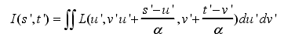

$L​$是以探测器面$u,v​$和微透镜阵列面$s,t​$为坐标系的空间光场。$I​$是在重聚焦面得到的重聚焦图像。获得重聚焦图像就是将采集到的光场图像按照这个方程进行计算，通过坐标相同方向不同的光线的叠加，得到最终的图像信息。由于积分过程中，$u​$和$v​$并未发现变化，只是$s​$和$t​$发生了平移。

在光场相机中。$u,v​$是被离散采样的，每个$u,v​$对应于主镜头孔径的一部分。限制积分范围，我们将获得主镜头某以部分孔径所成的像，可表示为

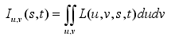

子孔径成的像$I_(u,v)​$相当于小光圈情况下相机系统所成像，他相对于整个光圈成像时具有更高的景深和更多的噪声，不同子孔径存在不同的观察视角。重聚焦方程可以理解为光场相机所有子图像的移动和叠加。子孔径的光场表示为$L^u,^v​$重聚焦算法可以重新写成：

---

分析：这里不太理解：主要是关于系统的结构问题。主光学系统实现对物体的初步聚焦，而微透镜是实现对主光学系统光瞳面进行分区的关键。在限制积分范围的时候是对主光瞳面的积分范围进行限制，但是上面公式得到的成像只是主光学系统的成像结果，并非是微透镜阵列下面的像。因此这里还差一个成像的过程，用于描述微透镜面上的光线到最后成像面上的结果。

这样进行分析的话，可以发现下面公式中的$I​$，并非是子孔径成像的结果，而是主光学系统到微透镜上的成像结果。

---

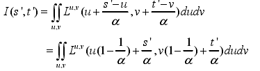

方程中可以看出，对子孔径图像进行移动因子为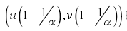的移动，alpha倍的放大，将这些移动过的子图进行叠加，就能够获得最终的重聚焦图片。下面的两个子孔径图像是什么意思，以及如何得到的。如果是利用斯坦福光场相机的话，对于单个的图像来说是不可能出现下面孔径的图像的。

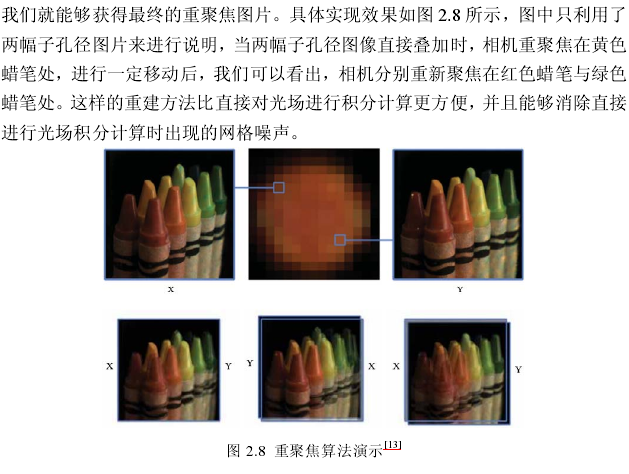

### 2.2.2 斯坦福光场相机仿真

利用zemax搭建了一套光场相机系统，仿真得到光学系统的光场图像，通过对仿真光场图片进行处理，验证光场相机的成像与重聚焦功能。

由主镜头、微透镜阵列和像平面组成，主光学系统采用理想透镜作为主光学系统。

不知道下面的是不是正确的，因为每一个微透镜阵列都是对整个光瞳面进行成像，和上面的理论差的多。上面说了光场成像的关键在于对光瞳面的取样，但是通过仿真图像可以看出来，是对整个光瞳面成像，并没有我们想要的东西。但是关于离散化光瞳面的作用这里还不是很清楚。

光场采集过程中所用的光学系统中，光线透过理想主光学系统，成像在透镜阵列上。从光学系统的细节可以看出来，微透镜阵列将入射光线分散至最终的探测面上，实现对光线的记录。由于zemax只能针对平面物体进行成像，本文以软件自带的图像作为处理图进行光场相机成像仿真，为实现光场相机的重聚焦功能，本文将物体放在无穷远，微透镜阵列放在主光学系统焦平面后方，产生离焦效果。希望后期的光场处理中得到正确的聚焦图片。

---

分析：对上图进行分析，发现这里的微透镜阵列在进行成像特性的时候就类似于一个小孔成像原理每个微透镜相当于一个小孔。而且这个小孔是对整个主光学系统的光瞳面进行成像，这就和他最前面的理论相矛盾啊。之前的理论是光场相机记录的是相机内部的光场分布，但是在后续进行成像仿真的时候出现了微透镜阵列只是作为一个小孔成像，而且单独微透镜阵列没有记录下各自对应的光瞳面位置。

---

原图和普通相机拍摄图如下所示

光场相机获得的光场图像如下所示，包含$200*270​$个宏像素，部分放大细节中，看到每个宏像素都是一个圆形，每个宏像素下包含$10*10​$个像元。整体的图像轮廓中，只能分辨出小孩的离焦图片，从放大的宏像素细节下看出，每个宏像素都记录了部分的空间信息。

为了能够对采集的光场图像进行处理，需要将宏像素提取出来。观察发现宏像素不是按照固定的间隔进行排列，增加了宏像素提取时的难度。利用微透镜阵列的物像关系来确定宏像素中心位置，实现宏像素位置快速有效的确定。由于探测器放置在微透镜阵列的焦平面处，可以近似看作是对主光学系统光阑成像，物像关系确定下来。

---

注意：每一个宏像素都是对整个光学系统进行成像，但是由于微透镜阵列的中心位置的不同，所成的像也有一定程度上的差异。每个宏像素下的图像拉伸的程度不一样，可以根据透镜中心位置的关系，判断光学系统中心在宏像素处的位置，从而得知宏像素的拉伸结果。由于角度的问题，靠近微透镜中心处的光学系统能够在宏像素后面成更大的像，为主要像。而且对下面的图形进行分析，这里可以看出来，在微透镜阵列焦距保持比较好的时候，成像阵列上有位置是没有成像的。这也是上面的图形中为什么有很多黑色小圆圈的原因。分析可知，每个微透镜的所成宏像素的大小是保持不变的。即在成像阵列上，所成图像的大小都是一样的。

2019.3.27分析：因为是斯坦福光场相机，所以下面的图形是不可能出现对透镜进行成像的。通过之前对斯坦福光场的分析可以知道，一个单微透镜的成像是物面上点经过主光学系统光心到达微透镜面上是主光线，而主光学系统光瞳上的其他位置则是主光线的分光线。因此下面的图应该是寻找主光线的图形，找到微透镜阵列后面的成像点的主光线位置。一个微透镜阵列后面的所有像素点都是物面上相同点集合的像。但是每个微透镜又不可能对整个光瞳面成像，不然就和普通成像没有区别了，因此每个微透镜阵列根据自己的视场角来对光瞳面上不同的位置进行成像。

---

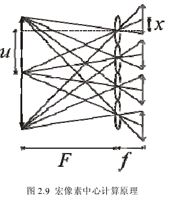

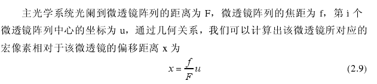

该方法可以快速计算出各个微透镜所对应宏像素的位置，有效的提取出各个宏像素，方便后续处理。

将各个宏像素中同一位置处的单元像素进行提取，我们就能够获得各个孔径所成的子图像。按照子孔径的排列顺序排列出来，如图所示。

---

思考：上面红字中说同一位置处的单元像素进行提取，每个宏像素是对整个系统进行成像包含了所有的像点位置。这里的意思应该是将变形的图像进行整形。这里没有进行具体的说明，等后面有进一步了解的时候再来仔细看看。

下面说了，子通道图片的分辨率和微透镜数目相同。那么这里可能是将每个微透镜阵列中同一位置提取出来进行叠加。这样叠加成一副分辨率和微透镜数目一致的图片。

可知，还原出来的图片分辨率和微透镜数目一直。

进一步分析：思考如果将每个微透镜对应宏像素的中心位置进行提取，那么可以提取出来一个以微透镜阵列数目为分辨率的图形。再次考虑，由于透镜在近轴具有很好的稳定性，成像效果在近轴处不会出现很大的畸变。因此考虑对近轴的像素进行提取的方法可行。由于偏离轴太多的地方成像存在巨大的畸变，不宜进行图像的提取，因此能够成功还原出来的图片数量应该是比较少的。

以上的分析应该是错的，每一个宏像素对应着真实物面的像素集合，而且宏像素中所有像素应该是一样的才对，都是对应物面上相同像素集合，只是在主光瞳面上的位置不一样。微透镜所对应的光瞳面的位置只和微透镜阵列的视场角有关，和光线等其他问题不相关。因此每个宏像素中不应该存在多个孔径的图像才对

---

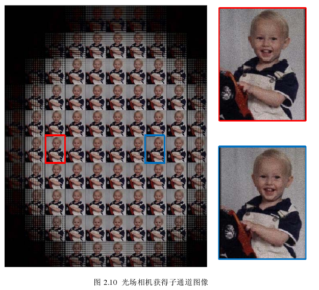

其中，各个子通道图片的分辨率与微透镜阵列数目相同，从单个通道子图中发现，单通道子图还存在许多噪声。单通道子图是相机主光学系统的部分孔径所成的像，因此景深有所提高，然后由于在相同的曝光时间下，子孔径所成像的曝光量变小，因此会产生更多的噪声，信噪比相对于全空净成像有所降低。不同孔径图像的对比中，发现不同的视角图像之间存在不同的位置关系，从三维成像的角度来看，这是由于采集时，相机的孔径存在视差关系。将这些不同孔径成的子图像直接进行叠加，可以得到整个孔径在此时的成像结果。

---

思考：由于在提取图形的时候是系统利用图形中畸变比较小的成像结果来进行图像的还原的，因此图像具有很小的视角差，这个可能会在一定程度上影响到三维重建的结果。由于每个还原出来的图像都是对应不同的视角，从原来上来分析是对应是不同的点的，可以对图形进行插入的方式将图形的分辨率进行提高。

---

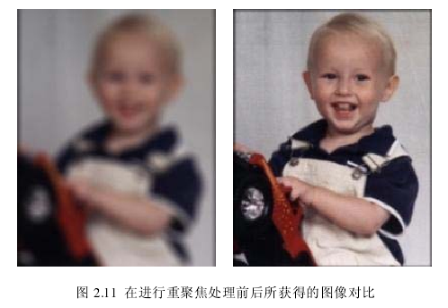

由于此时的对焦关系不准确，目标物体此时无法正确的成像，从光场的角度来看就是不同孔径所成的像无法正确叠加。从光场的角度对这些子图像进行放大，平移和叠加，在得到理想成像面处的成像结果。如上图右边所示，物体显示清晰，所有的单通道图像准确叠加，信噪比相对于单通道有较大的提高。推测利用该方法可以在任意单通道子图像景深范围内重聚焦，通过一定的成像办法，就能实现相机景深的延长。

---

小结：对于每个单孔径来说，都是很小的，在单孔径下具有很好的景深效果，通俗来说就是不管物体的远近都能够得到很好的成像效果，因此单通道的图像肯定是清晰的。但是由于单孔径通光量的不足，导致此时的信噪比较低，对多孔径的图像进行叠加实现图像的还原。

---

## 2.3 聚焦型光场

斯坦福光场相机将微透镜阵列放置在主光学系统的像平面处，并且将探测器阵列放置在微透镜阵列的焦平面处。因此，每个微透镜阵列对应一个宏像素，微透镜阵列的个数决定了光场相机的空间分辨率，宏单元对应的探测器像素数代表了光场相机的角度分辨率。

每个微透镜的孔径越大，得到的图像分辨率就会越小，但是每个微透镜阵列的角度分辨率就越大。因此为获得高像素的斯坦福光场相机就需要缩小微透镜阵列的孔径。但是这个在前期的制造中很难实现。

Andrew提出聚焦型光场相机，通过改变微透镜阵列在相机内部空间位置，将角度分辨率和空间分辨率矛盾的决定因素由微透镜阵列的孔径参数转变为微透镜阵列的空间位置参数。该方法增加了相机在构建时参数选择的灵活性，通过合理的参数选择，能够适当的提高最终图像分辨率。

---

**采集原理**

矩阵光学理论，空间光线表示为$r(q,p)$，$q$和$p$在三维下是一个二维向量，分别代表了光线的位置信息和角度信息。和光场的四维理论是相同的，可以把光场表示$L=(q,p)$。由矩阵光学理论，光线在自由空间中传播了一段距离$t​$，有

---

注意：这里的公式中的$t$，应该是直接在Z轴上的投影距离。比如$f$。

---

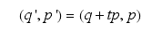

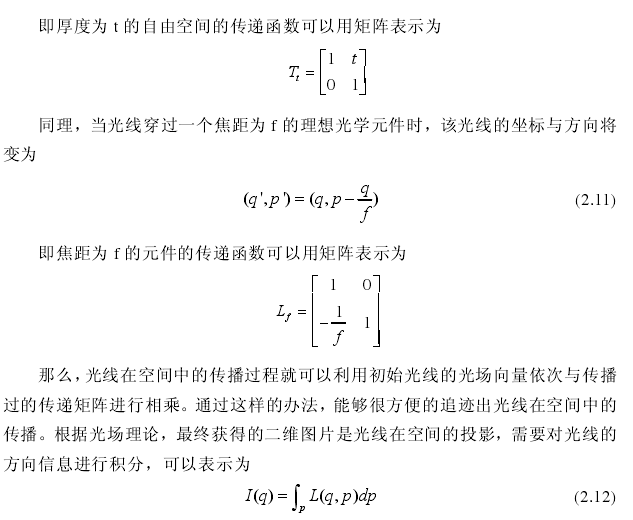

---

注意：在下图中可以看到直接将$d/f​$作为角度，这个近似只有在角度很小的时候才能够进行近似的。那么可以认为这里面都是认为$d​$在一定程度上是远远小于$f​$的。

---

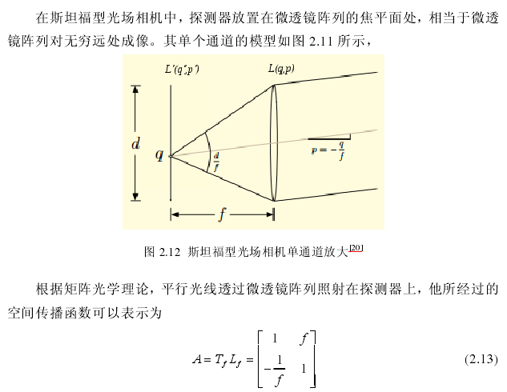

---

文中光场推导存在一定的错误，正确的推导如下。最终结果是$d/f*(f*p,p)$，这里是假设每根光线的强度一样，将光强全部按照中心光强（设置位置q为0）进行叠加，并以此得到的结果。

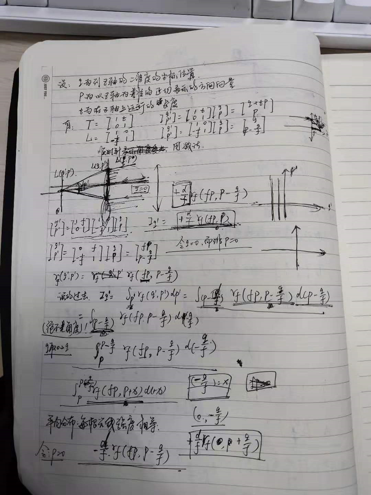

---

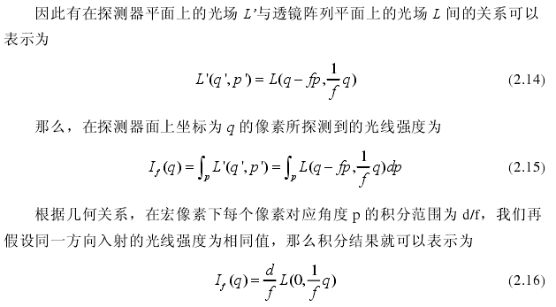

从方程中我们可以看到，每个宏像素下的像素对应一条入射到单个微透镜口径中心的光线，这条光线方向为$q/f​$。因此斯坦福光场相机对光场采集结果如图

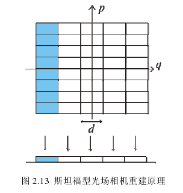

在利用光场图片生成二维图像时候，直接将采集的光场信息按角度叠加在一起，一个微透镜对应一个像素，导致图像分辨率严重降低。

---

思考：上述这种说法是不对的，因为在进行微透镜阵列采集的时候，虽然一个微透镜对应一个像素，但是一个微透镜可以提取很多次像素，完全可以将分辨率进行重建。而且实际中的成像也不是平行光线进行输入的。

---

聚焦型光场相机利用微透镜阵列对主光学系统所成像进行二次成像，用探测器阵列记录成像结果。在对主光学像进行二次成像的过程中有实像模式和虚像模式两种方式。这里对实像模式进行介绍。

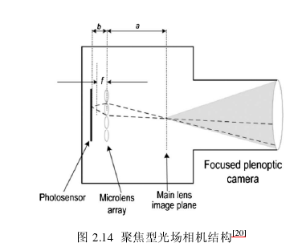

以单通道模型对这一类光场相机的采集原理进行分析，单通道简化模型如图

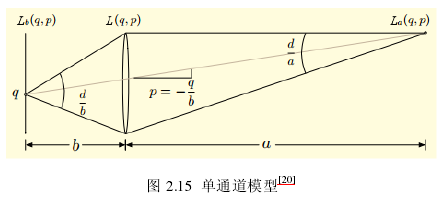

其中主光学系统像面光场为$L_a​$，探测器面光场为$L_b​$，相机内部光线会在光学系统的像面即$a​$面汇聚，然后透过微透镜阵列记录在探测器面$b​$上。

根据矩阵光学，中间传播过程的传递矩阵可以表示为

---

下面的公式实在不知道是怎么计算出来的

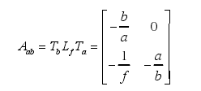

因此可以得到

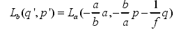

那么探测器面上某个微透镜下$q​$位置处的像素对应强度为

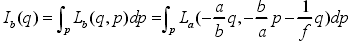

我们假设在$p=q/b​$方向的$a​$平面的光场为常数，并且根据几何关系入射至$q​$点的光线角度在$d/a​$范围内。有

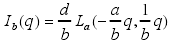

方程可知，微透镜将主透镜像平面$a​$上的图像放大了$b/a​$倍后成倒像记录在图像传感器上，因此他的空间分辨率是探测器分辨率的$b/a​$倍，并且只有$a/b​$视场范围内的图片不会与其他微透镜采集的图片重复。

具体每个微透镜记录光场信息在光场分布图中可以表示为下图，每个网格代表一个像元，所有蓝色网格代表同一微透镜下的所有像元。可以看出，每个探测器像元都能够探测到主光学系统像面$a​$上一个坐标位置的像点，每个像元所以可以记录通过该像点$b/a​$角度范围内的光线。整个微透镜可以记录$a​$平面上范围为$d*a/b​$内的光线。图片重建结果发现，每个微透镜阵列不仅只对应一个像素，具体还原像素数是与参数$a​$和$b​$来同时决定。聚焦型光场相机能够非常有效的调节空间分辨率与角度分辨率之间的相互关系，在保证重聚焦能力的同时，又尽量提高相机的分辨率。

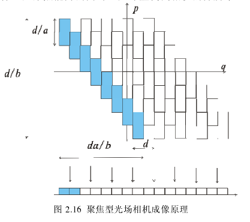

---

**算法原理**

微透镜阵列对像面进行二次成像，可以得到微透镜阵列对应的放大率为$a/b​$。主光学系统到到探测器阵列间投影示意图如图所示，物体的不同部分被记录在不同微透镜阵列所对应的像元区域内，分别记录主光学像面的部分信息。根据角度分辨率原理，每个微图像之间的不重复部分视场只有$b/a​$。在图中对应为$M​$，$d​$为微透镜阵列的孔径大小。

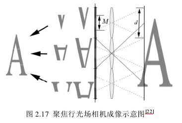

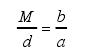

将这些不重复的部分拼接起来就能够得到一张完整的二维图像，不重复部分的像素数$M​$一般远远大于1个，因此聚焦型光场相机的像素数比斯坦福光场相机有比较大的提高。

---

思考：这里指的不重复部分的像素大于1，那么就是和斯坦福光场相机在拼接上进行比较。斯坦福光场相机，一个微透镜阵列对应一个像素值，而聚焦型光场相机能够对应一个不重复区域的像素值。

---

微透镜与其所对应的像元区域可以视为一个独立的光学系统，由于独立微透镜阵列所组成的光学系统景深远远长过主光学系统焦深，可以认为微透镜记录的微图像可以对整个相机的物空间都是清晰成像的。重聚焦时，新的聚焦面与微透镜所记录宏像素之间的放大关系就可以通过几何关系重新计算出来。同样我们能够计算出不重复部分所包含的像素大小，将他们拼接，能偶获得重聚焦在不同深度上的图片。获得更高于斯坦福光场相机的像素利用率，同时保证了一定的重聚焦能力。

---

**聚焦型相机仿真**

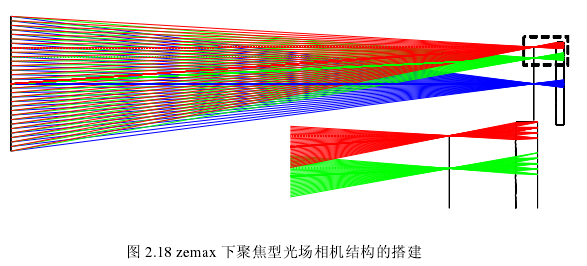

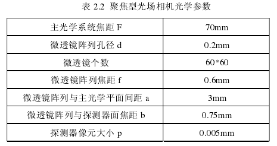

空间信息经过主光学系统成像在$a​$平面上，微透镜阵列又对$a​$平面进行成像，最终的微图像阵列被探测器所采集。图像阵列如下图所示，包含微图像个数$39*29​$，每个微图像都包含$40*40​$个像素。从光学结构发现，$b/a=0.25​$，那么每个微图像中不重复的图片大小为$10​$个像素，提取中间的是个像素，对图像进行重建。

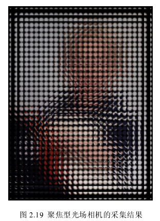

该方法快速有效重建出准确对焦时的图片结果，成像视角上和主光学没有差别，但是像素数有所降低。由于该方法舍去了大部分信息，只保留宏像素中间部分进行图像重建，造成信息的严重浪费，也降低了结果图片的信噪比，最终结果中存在较大的噪声。

提出利用多个重聚焦图片累加的方法来提高图片的信噪比。重建时，将每个微图像分割成16个$10*10$像素的小图像块，提取同一位置处的小图像块并拼接，能够得到类似于不同孔径所成子图像的图片集合。

在图像重建的时候使用的图像小块存在一定的位置差别，在将这些图像进行叠加的时候需要对各个图像进行一定位置移动，移动距离为图像小块相对于宏像素中心的距离。叠加后，能够获得一副信噪比更高的最终重建结果。

聚焦型光场相机也能重建处准确对焦的图片。合理的参数调整后，每个宏像素中可以提取多个像素，空间分辨率相对于斯坦福光场相机有提升。保留了一定的角度分辨率，具备一定的重聚焦能力。对成像过程分析，若光场图像中记录了多个深度的物体，在非聚焦深度处的物体将会存在严重的网格噪声，和传统的离焦模糊不同。

## 3.1 计算集成成像图像重建

传统集成成像的显示过程一般利用显示设备显示出单元图像阵列，在后方摆放针孔阵列或者微透镜阵列来观看。计算集成成像和常规集成成像的主要不同之处在于他不需要后期的光学设备对采集图像进行显示，直接在计算机上计算出所采集物体的三维信息，这样能够克服常规集成成像还原过程中由光学元件引入的问题。

还原三维场景图像信息方面有两种代表性方法，基于视点的图片重建和基于深度的图片重建。基于视点时根据光线追迹原理，通过模拟集成成像的观察过程，获得任意视点处的观察图片，这些图片具有不同的视角信息。基于深度的重建通过逆向投影方法，将单元图像阵列逆向投影至目标空间，快速的在目标深度处重建处该深度处的图片。计算集成成像在图像的重建过程中，没有引入新的噪声和衍射，相对于传统集成成像显示方法，在图像质量上有一定的提高。

集成成像主要包含两个步骤，采集和重建。

集成成像的采集过程如下图所示：

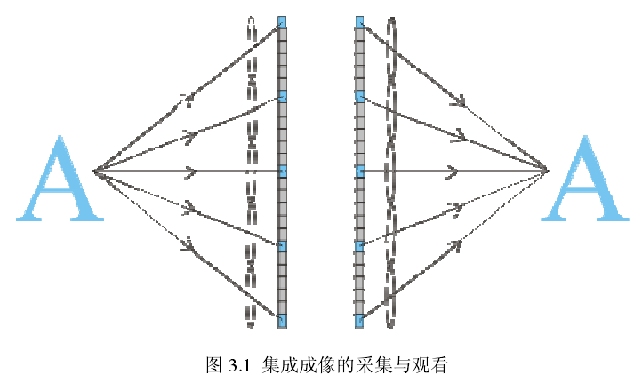

同一物体透过不同的微透镜记录在单元图像的不同位置处，即同一物体在不同单元图像中的视差不同。对于大小固定的探测器阵列，微透镜的口径决定了物光线的空间采样率，而单元图像所包含的像素数和像素尺寸决定对光线的方向采样率。由于微透镜阵列的尺寸一般较小，所采集到的单元图像阵列所包含的像素数一般也比较少。为了放置各个单元图像之间的串扰，每个微透镜阵列的视场角必须进行限制。

在重建过程中，一般利用参数和采集过程中相同的微透镜阵列来进行，将与记录时参数完全相同的微透镜阵列放置在单元图像阵列之前，就能看到记录的三维图像。

### 3.1.1 基于视点的计算集成成像重建

我暂时把这里的集成成像看成是那种随着你位置不同，有不同显示效果的图形。那么在这种的图片中，肯定是具有连续视差的三维图片。

集成成像的采集如上面图形所示，单元图像阵列中的每一个像素点就记录了一条光线信息，集成成像的观察过程就是采集过程的逆过程，通过光线追迹，在某个视点P，透过虚拟针孔阵列观察到的每个单元图像下的像素可以根据集合关系计算出来。最终在该视点处观察到的视点图像就是这些所观察到的像素按对应微透镜阵列排列规则组合起来的图片。

也就是说通过微透镜阵列（类似于小孔成像），每个透镜在该视角下对应的像素点不一样，所有的像素点排列之后就是这个视点的图像。

在一维情况下，对组成正射投影子图的像素坐标进行推导。

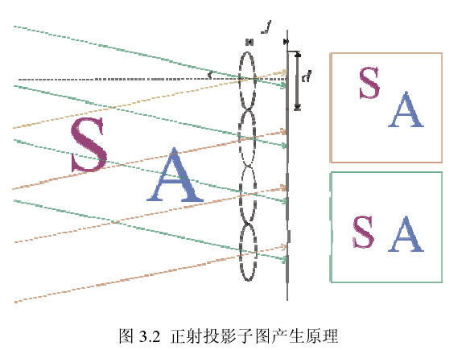

假设微透镜的孔径为$d$，像距为$f$，那么视角为$theta$时观察到的弟$p​$个微透镜所对应的像素强度为

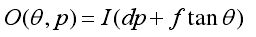

改变观察视角时，我们将会观察到不同位置处的像素，对应不同的观察视角。

距离越远的物体在不同视点子图的位置变化越大，这和常规物体视差效果相反的。然后通过该方法，每个微透镜只能观察到一个像素，最终得到图形的像素数等于微透镜数目。

**相关仿真**

为了体现多个视角处观察到视点的差别，利用3Dmax进行目标物体采集，利用构建的算法对采集得到的单元图像阵列进行处理，实现重建方法。

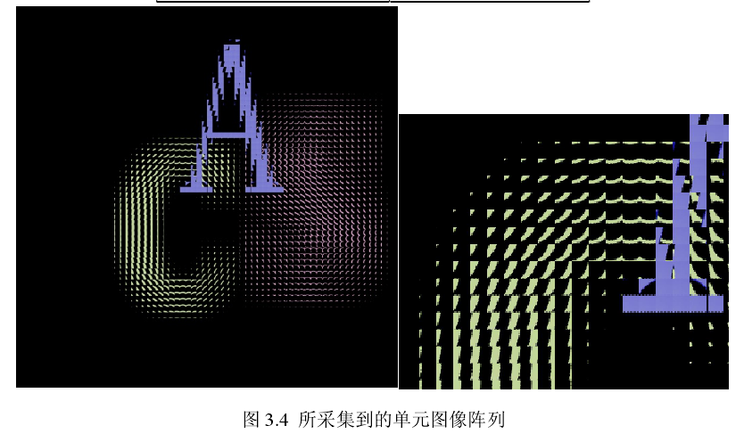

如图3.4得到了系统所采集单元图像阵列，每个单元图像相当于有个独立相机，都采集到部分空间场景信息，并相对于实际的空间情况产生了一个翻转。最终采集到的图像阵列包含$70*70$个单元图像，每个单元图像包含$50*50$个像素。

重建结果如下所示，但是分辨率限制了该方法的使用。

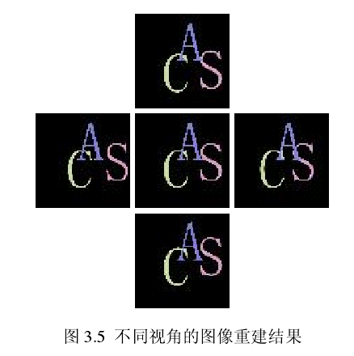

### 3.1.2 基于深度的计算集成成像重建

采集过程看做空间信息通过微透镜阵列投影到探测器平面上，根据光学原理，最终图像产生一定倍率缩小。根据光路可逆，将单元图像方法并投影到目标空间深度处就能正确重建处空间的深度切片图。

在计算机中仿真处参数与采集过程所用微透镜阵列相同的针孔阵列，放置在单元图像阵列采集时微透镜所在的位置。逆向投影中，单元图像的放大倍数可以通过集合关系计算出来，$M=z/g$。由于投影距离一般大于微透镜阵列的成像距离，因此，$M$一般大于1。所以这些单元图像的逆向投影结果会相互叠加。单元图像中记录了不同深度位置的物体图像信息。当这些单元图像进行逆向投影放大叠加时，只有当重建深度刚好等于某一物体所在深度时，这一物体的所有投影图像才能正确叠加，产生聚焦的效果。此时其他深度的物体没有正确的放大倍率关系，相互叠加产生模糊，即离焦效果。

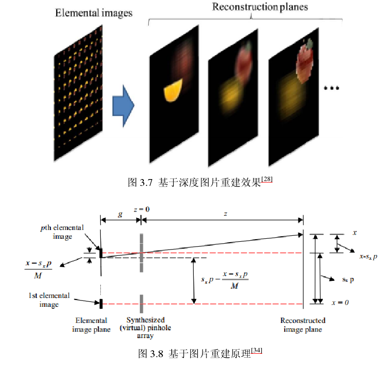

上图用一维投影说明该重建的算法原理，假设重建平面上的坐标为$x$，以$Ipq$来表示单元图像阵列中第$p$行$q$列的单元图像。$Opq(x,y,z)$为该图像在坐标$(x,y,z)$上的逆向投影。

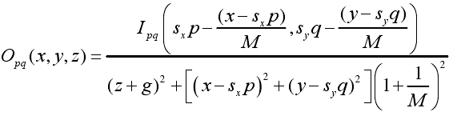

其中：

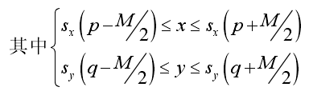

$s_x,s_y$分别为单元图像在$x,y$两个方向的孔径大小。根据放大率关系，我们可以将该公式改写为如下

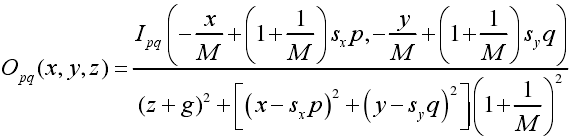

最终的光强为

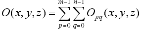

$m,n$分别代表单元图像在两个方向的数量。可以看出最终物体的成像像素数和微透镜阵列的数目没有直接关系。

---

# 2.基于微透镜阵列的光场成像系统

之前一直在分析上面那篇文章，但是内容并不是很详实，抽个时间看看这篇。

本文以Levoy的光场渲染理论为基础，利用光学设计软件Zemax在普通成像系统中加入一个微透镜阵列，设计处一个由成像主镜、微透镜阵列和像面CCD探测器三部分组成的光场相机系统，仿真了光场图像的采集。对光场图像的后处理以傅里叶切片理论为基础，通过matlab编程，实现光场图像的重新聚焦。

如图所示，进入主镜头的光线经过单个微透镜后投影到探测器平面上形成一个子图像，子图像中一个点对应于镜头光瞳发出的一条光线，则每个宏像素对应于光场的一个位置采样，而宏像素内的每一点对应对光场在该位置的一个方向采样。系统对光场的位置分辨率由微透镜的孔径大小$d​$决定，而光场的方向分辨率则取决于每个宏像素内所包含的像元数目。

最大程度利用探测器像元，需使相邻微透镜的子图像在边界处相切，满足

$f/d$是微透镜的焦距除以其孔径直径，即微透镜的$F$数目。$a/D$可理解为主镜头的像距除以主镜头光瞳直径，即主镜头的像方$F$数。微透镜和主镜头的F数相等时候能够最大程度利用探测器的像元数。理想情况下，若微透镜阵列的数量是$M1*M2$，每个微透镜覆盖的像元数是$N1*N2$，则探测器的像元数是$M1*M2*N1*N2​$

$F​$数的定义如下：

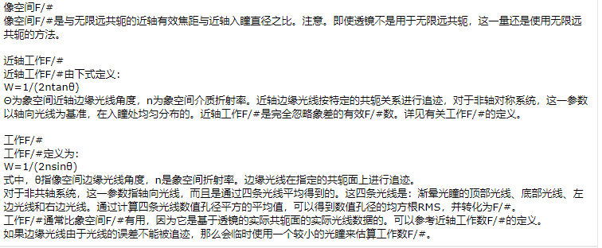

光场的处理：

探测器记录得到的二维图像是四维光场的二元积分。

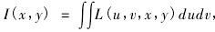

数字重聚焦是将采集的四维光场重新投影到新的像平面上再进行积分。

如下图所示，$L(u,x)$为采集到的光场信息，$u$和$x$分别表示主镜头光瞳所在面和微透镜阵列所在平面，两个平面之间的距离为$l$。选择新的焦平面$X'$，与$U$之间的距离为$l'$，令$l'=al$.$X'$面上的像等于$UX'​$之间的光场的积分。即

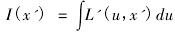

从上式中可以发现，自变量是$u​$，对应的定点是$x'​$。在$x'​$确定的时候，可以发现不同的$u​$将对应于不同的$x​$。

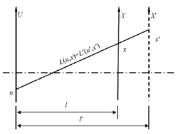

对同一条光线来说

根据集合关系可以知道：

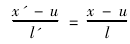

几何关系变换后得到：

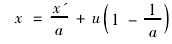

上式把原始聚焦面中的$x$位置用重聚焦面的参数来进行替换。

带入积分式子得到：

下面的公式肯定式存在问题的

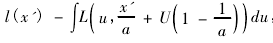

为光场投影到新对焦面上的成像公式，可以看出，光场重聚焦实质上式对记录光场现在位置上进行平移后在方向上进行积分的过程。

根据傅里叶切片定理，空间域中的投影积分的过程等效于傅里叶频域中的切片，推导处傅里叶切片成像定理。下图式光场处理的算法示意图，空间域中四维光场函数$L_l(u,v,x,y)​$的投影积分为

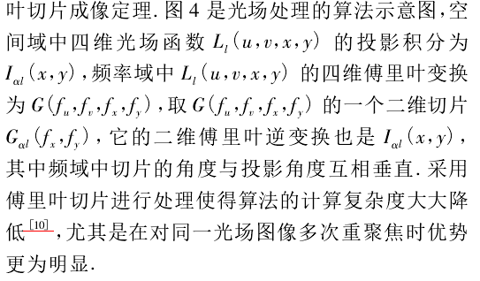

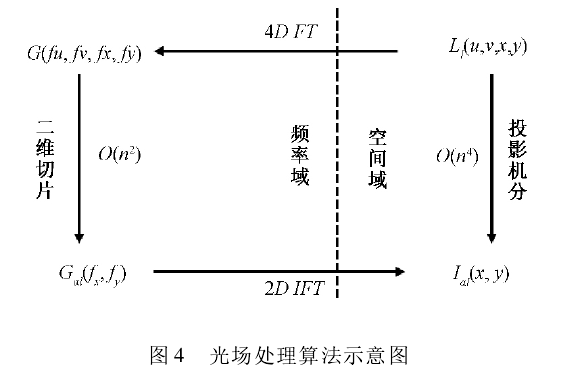

系统设计：主镜、微透镜阵列和探测器组成。该结构中，将微透镜阵列放置在主镜头的像面位置，真实像面放置在微透镜后方距离一个微透镜焦距的位置。文中采用us_array.dll方式来设置微透镜阵列，通过设计使得微透镜阵列与主镜F数相匹配，在不造成光场方向信息和空间信息的混叠的前提下得到最大方向分辨率。

