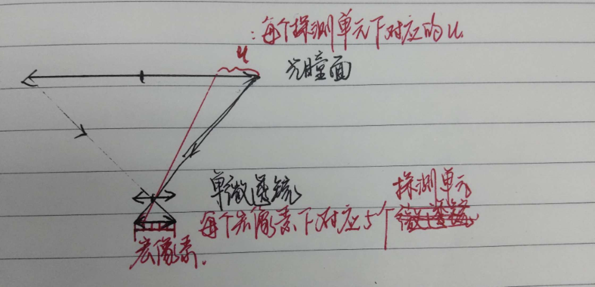
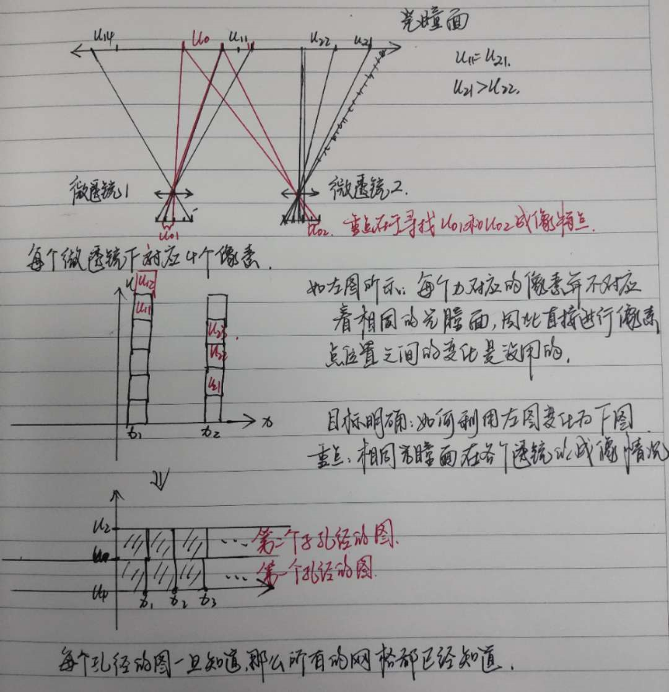

# 2019.3.29汇报

---

1. 本次的汇报没有像之前汇报那样涉及尖端技术，希望大家多交流交流。关于光学里面的具体内容，我这里还是有很多不能完全解决的，能力有限，如果有错误大家多见谅。
2. 我的毕设是眼纹相关的，但是由于前期的图像提取一直没有处理好，也就导致我后续的眼纹提取相关的内容没有进一步的开展。
3.  在比较各个硬件之间的关系之后，最后的选择还是通过光场相机的方式来进行眼睛图像的采集和眼纹三维信息的重建。

---

# 光场相机

# 1. 结构：

下图是一个简单的光场相机的结构图。主要结构分为物体、主透镜系统、微透镜阵列。

# 2. 作用

下图就是通过光场相机进行拍摄的时候得到的图形，这里可以发现出现很多的小圆点，每个小圆点都是包含很多像素点的集合。这就是宏像素，每一个微透镜对应着图片中的一个宏像素。

光场相机的主要作用是进行重聚焦功能。

重聚焦：就是在拍摄的时候不用进行对焦，而是在拍摄完毕之后利用光学的计算来实现相机的聚焦。

下图就是利用上面得到的图形进行重聚焦的结果。

# 3. 两种类型的光场相机

根据微透镜阵列在相机结构中的位置来进行区分。如果微透镜阵列放置在主光学系统的像面上，则为斯坦福光场相机，而如果微透镜阵列的位置放在远离像面，每个微透镜进行二次成像的话，则为聚焦型光场相机。

## 3.1 传统相机

下图是一个传统相机系统的结构，物面上的一个点发出来的光线通过光学系统经过光瞳面最后到达成像单元上进行成像。我们利用$L(u,x)$来表示这跟光线，由于每根光线之间是完全相互独立的，因此不可能出现经过两个相同点的不同光线，因此$L(u,x)​$对每一跟光线的具有唯一表示。在坐标系中表示如下

对于一个实际的成像系统来说，他的$L(u,x)$表示如下图所示。探测器上的每一个$x$都会对应着许多个$u​$的坐标位置。

对于传统相机中，一个物点发出的光线通过光瞳平面，汇聚在最终的像素上。由于传统相机结构限制，无法区分出光线与光瞳面的交点坐标，因此他的光场信息如图中所示。每一个长条代表了不同像素采集到的光线信息，长条的宽度等于像素像元的宽度。从图中可以看出常规相机实际上是采集到相机内部光场在$x$平面上的投影，这种投影最大化的保存$x$信息，但是完全丢失$u​$信息。

简单来说就是对于图像上的每个$x$，不能记录下是哪些光线经过的。

当聚焦物体的空间位置改变时，仍然以$x​$作为四维光场的坐标面。当聚焦物体变近时，所成的像就要离焦平面更远一点。对应的光场分布如图，光场信息相对于正常情况发生了逆时针的倾斜。可以看出，光场分布图的倾斜情况正对应者相机聚焦位置的变化。

## 3.2 斯坦福光场相机

光场相机克服了传统相机中光瞳面坐标信息丢失的问题。光场相机在主光学系统的像平面处添加了一块微透镜阵列，利用探测器来探测微透镜焦面处的光场图像。每个微透镜都对应于探测器上一小块区域，宏像素。宏像素平面对应四维光场中$(s,t)​$的坐标信息，每个宏像素都是对应微透镜对光瞳面所成的像。因此，每个宏像素下所包含的探测器像素都对应着光瞳面上的不同区域即$(u,v)​$，通过对这些像素的重新计算，得到光场相机特有的一些三维功能。

每个像素不再是对应一个长条，而是光场分布图上的一个网格。这些网格表示入射到该宏像素处某一方向光线强度。光场相机中的条形宽度对应于宏像素的宽度，同一个宏像素记录的空间位置信息是相同的，只是角度不同。从这个角度来进行分析，光场相机牺牲了最终的空间分辨能力，即$x​$的采样间隔，来获取角度分辨能力，即$u​$的采样能力。

拍照过程中的重聚焦可以对应于相机内部光场信息的倾斜，常规相机中一次曝光只能进行某个方向的投影，一次只能记录一个聚焦平面的信息。光场相机将空间的光场分布进行网格化。

---

个人理解：每个微透镜都是对整个光瞳面进行成像得到宏像素，但是每个宏像素下面还有很多探测器的像素，通过对探测器像素和$u​$的对应得到网格。通过对每个网格中的数据进行记录，然后按照旋转的角度进行一定的旋转就可以实现重聚焦功能。

当我们对光场所用的坐标系进行变换时，其所表示光线不会有所改变，只是表示所用的参考系发生了变换。

**图像处理算法：**

$L$是以探测器面$u,v$和微透镜阵列面$s,t$为坐标系的空间光场。$I$是在重聚焦面得到的重聚焦图像。获得重聚焦图像就是将采集到的光场图像按照这个方程进行计算，通过坐标相同方向不同的光线的叠加，得到最终的图像信息。由于积分过程中，$u$和$v$并未发现变化，只是$s$和$t$发生了平移。

在光场相机中。$u,v$是被离散采样的，每个$u,v$对应于主镜头孔径的一部分。限制积分范围，我们将获得主镜头某以部分孔径所成的像，可表示为

子孔径成的像$I_(u,v)$相当于小光圈情况下相机系统所成像，他相对于整个光圈成像时具有更高的景深和更多的噪声，不同子孔径存在不同的观察视角。重聚焦方程可以理解为光场相机所有子图像的移动和叠加。子孔径的光场表示为$L^u,^v$重聚焦算法可以重新写成：

方程中可以看出，对子孔径图像进行移动因子为的移动，alpha倍的放大，将这些移动过的子图进行叠加，就能够获得最终的重聚焦图片。下面的两个子孔径图像是什么意思，以及如何得到的。如果是利用斯坦福光场相机的话，对于单个的图像来说是不可能出现下面孔径的图像的。

**仿真：**

光场相机获得的光场图像如下所示，包含$200*270$个宏像素，部分放大细节中，看到每个宏像素都是一个圆形，每个宏像素下包含$10*10$个像元。整体的图像轮廓中，只能分辨出小孩的离焦图片，从放大的宏像素细节下看出，每个宏像素都记录了部分的空间信息。

将各个宏像素中同一位置处的单元像素进行提取，我们就能够获得各个孔径所成的子图像。按照子孔径的排列顺序排列出来，如图所示。

## 3.3 聚焦型光场相机

故名思意，就是进行再次聚焦的光场相机。首先是通过主透镜成像，然后利用微透镜阵列对主透镜成的实像进行二次成像。