**2019.4.24**

昨天晚上突然想到一个问题，如果我买的是圆形的微透镜阵列的话，那么每个圆形之间是否会存在一定的间隙导致我成像的结果被通过间隙的光给干扰了，这是必须要考虑的问题。因为在进行仿真的时候是不会出现这些情况的，仿真的时候只是用自带的微透镜阵列的方式，和实际的微透镜阵列之间是存在一定的问题的。关于微透镜的大小是否会对成像结果有影响，这个应该是没有影响的，微透镜的成像和本身孔径的大小没有必然联系，知识口径大的透镜通过的光线就会多，成像的亮度会更加亮一点。

进行仿真已经完成了，现在要进行的是如何对仿真的结果进行分析。昨天晚上我想了一下，每个微透镜阵列的口径都比较小，那么在进行近轴成像的时候应该会得到一个比较好的结果，但是如果偏离的太厉害可能成像的效果就不是那么的好了。而且是二次成像，理论上来说是对实际成像结果进行二次成像分辨。此时是否需要考虑一个景深问题，在多大的景深的情况下，微透镜阵列还能够进行比较好的成像。

昨天利用以前学长留下来的透镜进行了试验，试验的结果真的是要多差有多差。基本看不到像，全部都是一片白光。


对光阑进行限制，利用没有透镜的时候对系统进行分析。但是在进行实际分析的时候存在着更多的问题，最主要的一个问题就是光线数目不够的问题，在对光阑进行限制后，小光阑意味着很小的通光孔径，这会直接导致成像结果的好坏，我在进行光阑限制的时候，直接利用一个打孔的纸板放在入瞳孔径前，在这个情况下得到的像已经出现了一定的模糊。对这些光线进行二次成像，那么会直接导致结果更加的昏暗。能不能得到一个清晰的像依旧是一个问题。

今天对已经有的微透镜阵列和普通镜头进行比较了，发现微透镜阵列和普通镜头之间成像存在一定的区别。

首先，普通的镜头在距离镜头后方一定距离的位置，可以直接通过人眼进行观察看到微透镜的成像内容。但是微透镜阵列就必须在特别靠近的地方才能够进行通过肉眼之间进行观察，而且成像基本不是一个很好的结果，全部都是胡的。

---

**2019.4.23**

昨天询问了关于是否可以给我加框架的想法，最后得到的结果是可以加框架，但是加框架的话会在需要5-6周的时间进行进货，那我是肯定等不起的。所以目前只能想着自己打印一个框架，然后自己打印的这个框架最好能够实现对光学器件之间距离的调节。

考虑怎么样实现对距离的调节：

1. 采用螺纹连接的方式
2. 系统内部无法实现螺纹的连接，在每个框架外部建立连接手柄。该方法的问题存在于器件之间是否能够出现密封的情况

昨天在进行学习的时候，突然想到我的微透镜阵列成像出来的结果是否可以利用光流发来进行分析。因为在微透镜阵列进行成像的时候，每个相机相对于物体的位置都是不同的，那么是不是可以认为相机在相对于物体运动，那么系统也是在相对于相机进行运动。这里出现一个问题，就是光流发是对于一个图形中具有运动和静止物体的时候，区分静止和运动的方法，如果一个图形全部相对于相机进行运动，那么光流法是不可行的。

考虑每个图形之间的差别，是否每个图形之间都可以存在一个转换关系，能够通过该转换坐标得到我们不同微透镜阵列之间成像的转换关系。

[学长买透镜的地方](http://io.rayscience.com/product-314.html)

---

**2019.4.22**

之前几天利用老师那边的电脑进行了仿真，设置了很多光线数目，在初步仿真成功的情况下利用人眼图像进行了再次仿真模拟在进行成像中是否可以观察到清晰的眼纹图像。

由于之前分析的原因，这里为了实现比较好的成像效果，我在已有的微透镜阵列中进行了筛选。得到的最后确定的微透镜型号[购买地址](https://www.suss-microoptics.com/shop/microlens-arrays/fused-silica/circ-lenses-quad-grid/microlens-array-nr-18-00039.html)


微透镜阵列pitch为$250um$，曲率为$0.535mm$，厚度为$0.9mm$，高度宽度分别为$10mm$。

在利用zemax进行仿真的时候忘记将微透镜的厚度改为$0.9mm$了，真是尴尬。但是影响应该是不大的。

zemax的仿真参数如下图所示

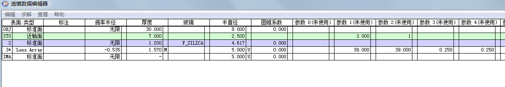

这是设置为20万根光线进行追迹得到的图形

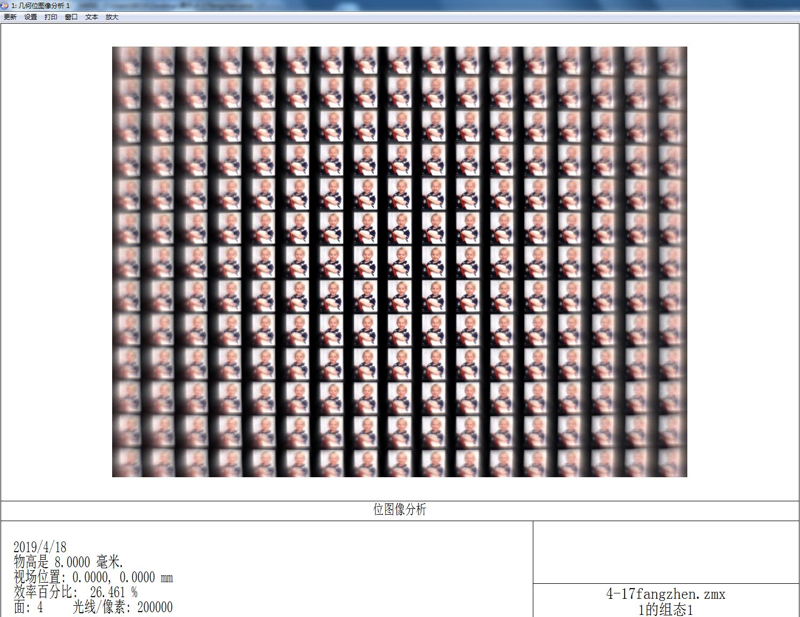

20万根光线图形放大后得到的形状

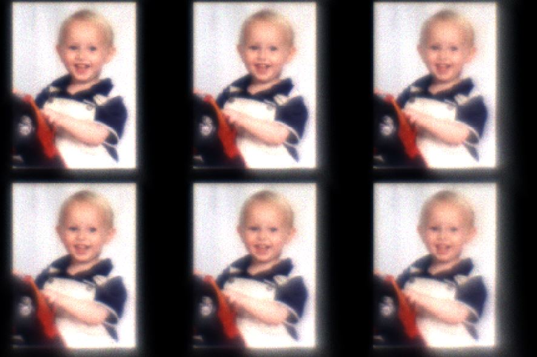

可以看出来模模糊糊的图像，这里保持在100*100分辨率左右，得到了稍微理想一点的情况。

由于之前是采用自带的图像进行仿真，可能实际得到的结果不会像这么好，而且眼纹在图像中能否进行识别也是一个比较大的问题。为此采用一个拍摄得到的图形进行仿真。如下图所示

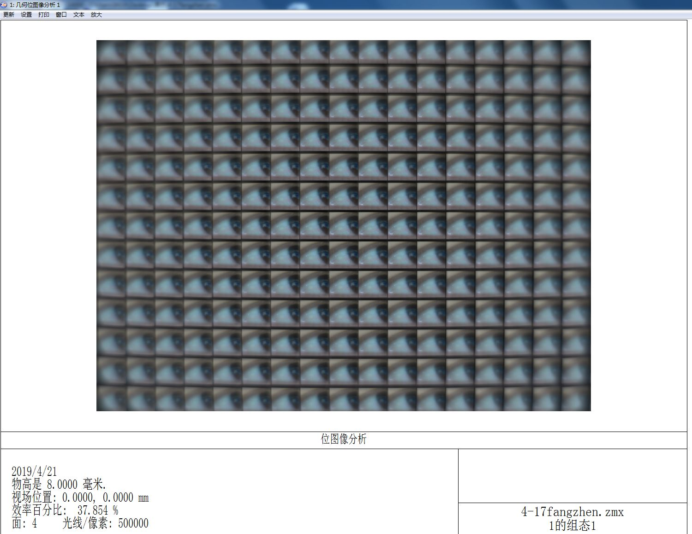


通过放大的图像进行观察，可以发现，眼睛中的眼纹也能够比较好的呈现出来，那么就决定采用这个光学系统了。

光学系统的理论搭建仿真过程到这里就结束了，后面进行实际光学系统的构建。

确定型号之后，向销售人员进行咨询报价等。

进行solidworks的系统初步搭建，如下图所示

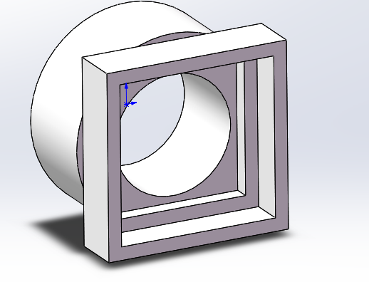

初步将这个系统框架分为三个部分，第一个部分是主镜头的后延框架，目的是保证主镜头和后方微透镜阵列保持一定的距离，这里初步定为$7mm$。接下来就是微透镜阵列的框架，由于微透镜阵列是$10*10mm$的大小，为此需要进行对框架进行扩大，该方法中需要将微透镜阵列粘贴在这个框架上面，最后是如何保持微透镜阵列和探测器之间的距离。这里需要进行注意的是，最后一个框架是连接到底板上的，底板和探测器之间依然存在一定的距离。在微透镜阵列来了之后再进行后续的模型建立处理。

---

**2019.4.19**

对zemax仿真的结果进行三维建立，得到我们后面镜头的三维模型。

进行镜头的三维实现过程中需要保证一些器材之间的距离是能够进行调节的。

1. 主镜头和微透镜阵列之间的距离应该是可以进行调节的，保证主镜头和微透镜阵列之间的距离能够使后方成像能够出现离散图形。
2. 微透镜阵列和后方探测器之间的距离是可以调节的，保证微透镜能够将光线聚焦在后方的探测器阵列上面。

---

**2019.4.18**

昨天将今天的结果进行分析，弄清楚成像结果不好的准确原因是什么。

1. 焦距太小造成的成像效果不好，那么就考虑焦距的问题了，是否在焦距稍微大一点之后会得到比较好的成像结果。
2. 口径太大造成的成像结果不好，将口径进行调节之后进行仿真测试得到的结果依旧不是很好，出现白色坨坨的效果依然存在。
3. 口径和焦距的比例过大导致成像结果不好。

在进行透镜的焦距对比后，发现在焦距稍微大的时候得到的图像成像结果要明显的好于焦距特别小的时候。但是和之前的长焦距相比，这几次用的短焦距都存在一定的问题，由于焦距比较短，微透镜和实像面的距离比较近，近轴微透镜具有比较好的成像效果，但是远轴透镜在进行成像的时候存在着比较大的畸变。而之前的较长焦距的物体，在进行仿真的时候由于实像和微透镜阵列距离比较远，实像相对于微透镜阵列来说都不会出现比较大的畸变出现。

在利用曲率0.535mm，pitch=0.25mm的时候，在光线追迹数目为200000的时候得到一个比较好的结果。下面考虑将光线追迹调整到2000000时候会不会得到一个非常好用的结果。如果依旧有一个比较好的结果的话，就考虑用这个微透镜阵列进行后续的仿真了。                                                                                                                                                                                                                                                                                                                                                                                                                                                                                                                                                                                                                                                                                                                                                             

---

**2019.4.17**

将zemax安装到老师的电脑上面去，然后进行仿真。

已经安装上去，仍然存在一定的问题。我这里还没有用昨天确定的微透镜阵列进行仿真模拟。

对微透镜阵列的系统中的系统的距离进行优化。

在利用网上找到的透镜阵列进行仿真的时候出现一坨一坨的样子，没有进行很好的成像。

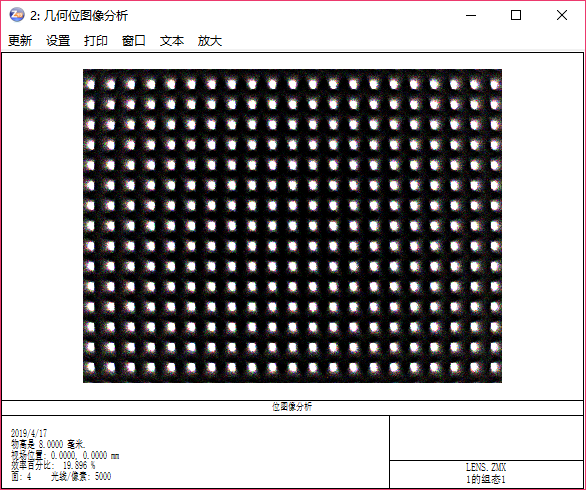

成像分析：成像结果中可以看到每个微透镜阵列后面的图像都出现啦分离，但是存在问题就是每个区域过于紧密，光线之间成像相互交错在一起，没有实现聚焦功能。更改入瞳直径，再次进行上面的操作发现依旧是这样的结果。将主透镜和微透镜阵列之间的距离调近后，发现出现了像，那么是否需要考虑这里的全白是由于光线堆积在一起造成的。

在得到的结果中一直存在着仿真图像中过曝的情况，在距离较近的时候可以看到一点图像，在距离较远的时候基本就只能看到一坨白光啦。这个现象在之前的微透镜阵列中是不存在的，对之前大曲率半径的微透镜阵列进行仿真可以发现得到的结果中可以得到很好的仿真图像，是不是由于在焦距过小的时候，微镜对光线的聚集效果就不好了，多个光线容易产生混合现象，导致成像结果中出现过曝的现象。这是由于短焦距透镜并不能很好的解决好色差的问题，在实际应用中焦距越短的透镜色差也就越大。


百度之后发现一个问题，口径越大像差也就越大，我这里是否口径的大小也对上面的结果产生了一定的影响。尝试在透镜的焦距不变的时候，将透镜的尺寸进行修改。[文献参考](https://wenku.baidu.com/view/4192267deef9aef8941ea76e58fafab068dc4471.html)

进行多次的对比后发现，图像在进行缩小之后必然会出现过曝光的情况。物距越远，那么像距就越小，就越有可能发生光线汇聚出现问题的现象。要想具有比较好的效果，需要像距能够保持在一定的范围之内进行。

---

**2019.4.16**

为了考虑分辨率的问题，对整个系统进行一定的计算和仿真。物体大小设置为15mm，经过主透镜和微透镜在探测器上面进行成像，大小保证在100*100的分辨率，此时得到的图像利用PS进行模拟，观察是否可以得到眼纹图像．利用PS进行原图的像素手动模拟低像素下的眼部图像成像结果如图所示。在一定程度上能够对眼纹进行识别，但是可能识别的结构不是很精确。

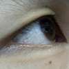

在确定昨天的微透镜后，对微透镜的焦距和pitch进行了确定。并对系统的数据进行了计算。

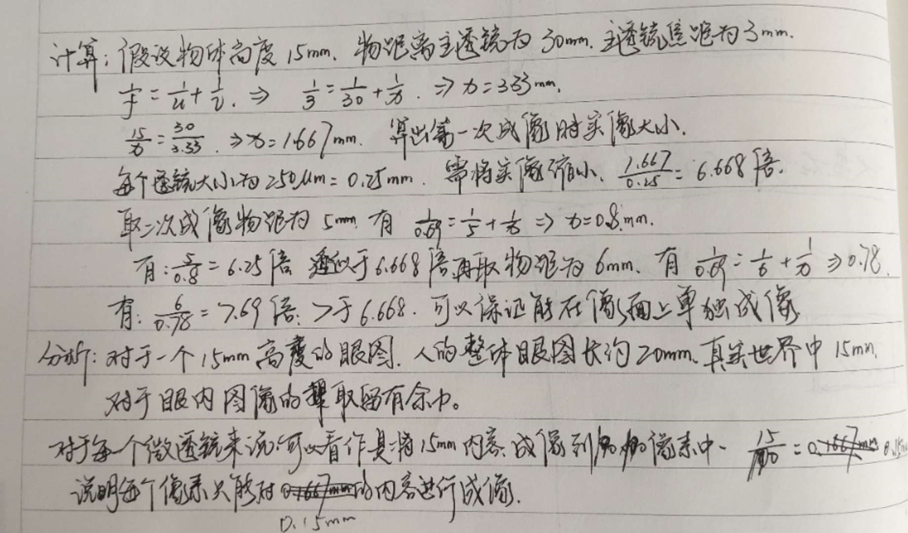

今天需要确定一下这个微透镜阵列是否真的可以进行后面的计算。

为了明确zemax仿真的结果，今天将zemax安装到老师机子上面去，后续进行仿真的时候用。

---

**2019.4.15**

进行微透镜的选取，准备搭建整个系统。

如果微透镜的作用是成像的话，那么每个微透镜阵列之间的间距越大越好，应该每个透镜的大小越大，那么后面对应的探测区域也就越大，在保证各个微透镜阵列之间不发现重叠的时候也能够保证整个系统的长度。

必须考虑两种光场相机，哪种相机得到的分辨率会大。在网上又找到一个微透镜阵列，这里进行具体的计算分析。探测器像元大小为0.0022，像面大小为$5.694*4.268mm$。

1. pitch尽量小，保证在斯坦福光场下有更多的宏像素 pith=0.075mm，$4.268/0.075=56.0，5.694/0.075=75.92$,此时每个图形的分辨率为56*75.9
2. pitch尽量大，保证每个pitch后面的探测器像素数目最大。pitch=0.25mm，有$0.25/0.0025=100$，那么每个微透镜后面的图像成像都为$100*100$分辨率。

利用zemax对真实眼图进行仿真，仿真参数设置为如下图所示，得到以下结果。

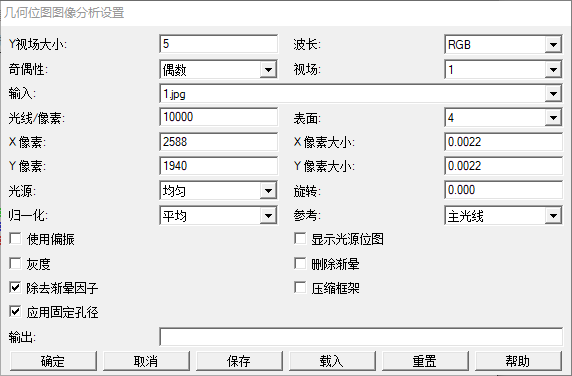

得到的结果如下图

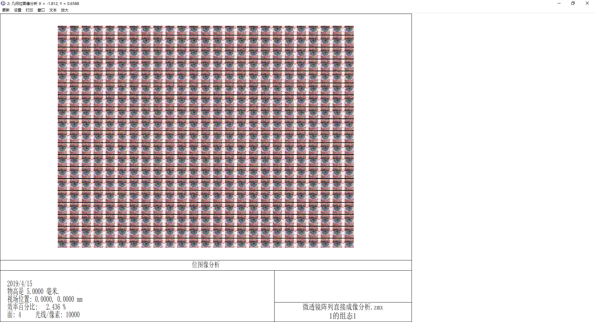

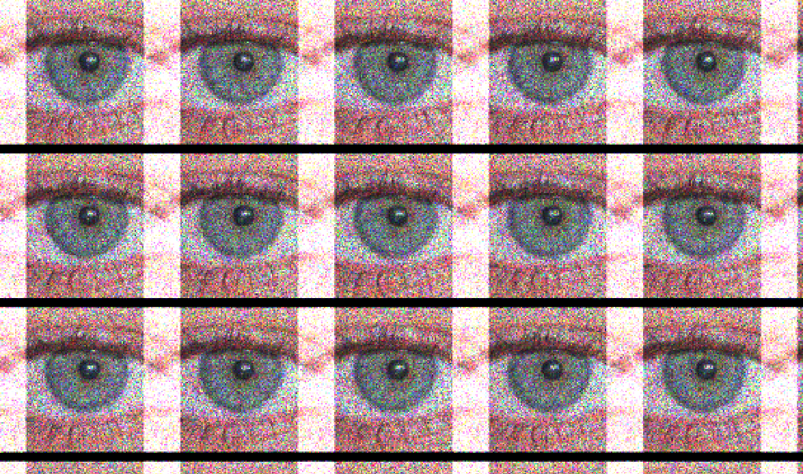

可以发现，得到图像的分辨率不够，每个像元得到的光线不够用，噪声太多。

增加到20000

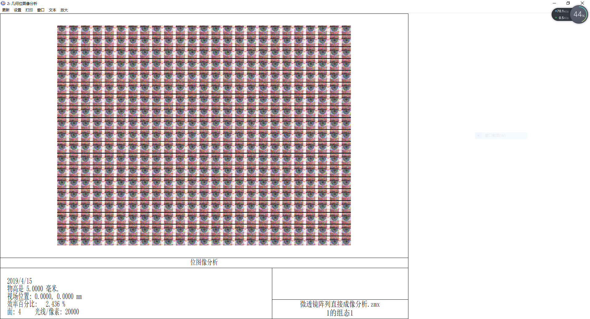


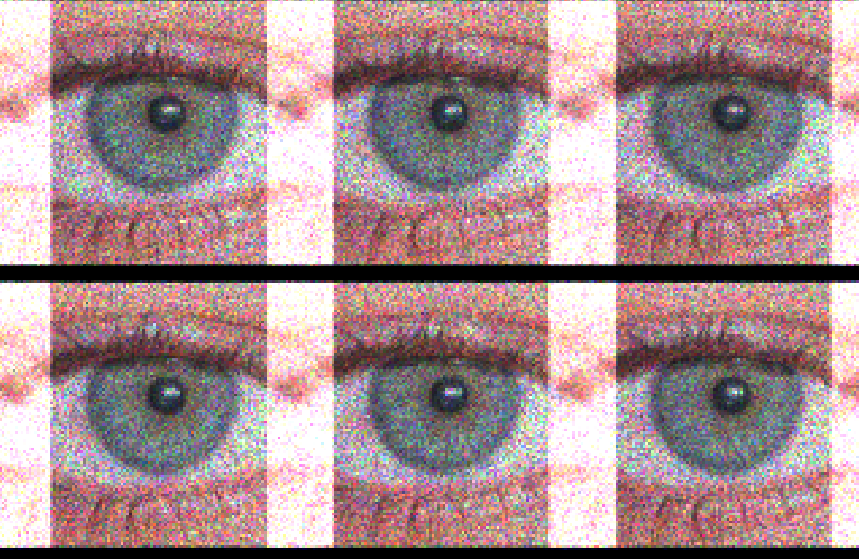


---

**2019.4.11**

又遇到了难点了，如何在进行图像获取是这个的关键。但是我现在得到的内容基本没有很好的图像成像结果。斯坦福光场中微透镜阵列的数目过于少，导致成像中并没有很高的丰年率，而且该方法中微透镜阵列的放置位置，对计算有很大的考验。

之前有过直接成像的方式，设置合理的视场角实现微透镜成像之间的相互不干涉。在进行二次成像的过程中，主透镜的作用就是将远处的大像拉近缩小，那么我思考透镜的作用在一定程度上就是将大像拉近，再将他变小。微透镜阵列中的每个微透镜都是这个作用，二次成像的时候，就是将主透镜成的大像再次进行拉近和缩小。这是对于成像的时候。

在进行二次成像的光场成像的时候，我们采用的将主透镜放置在前方，我们记录的是主透镜上面的光线信息，这里我们希望去掉主透镜，那么我思考如何得到相应的参数。其实在我的任务中并不需要对对具体的光场信息进行计算，主要任务是得到每个微透镜阵列下面对应的图像。如果真的想要得到光场信息，我觉得可以在入瞳上进行分区，用来是实现光线的追踪。

在前面的仿真中发现，用微透镜阵列进行直接成像是可行的，但是需要进行设置的是根据微透镜阵列中每个微透镜的视场角确定整个入瞳口径的大小。但是想要将远处物体拉近的时候需要远处物体要足够远，在我的仿真中只有远处物体的范围到达了100mm的时候，我这里才能够得到分的比较开的图像。

在进行直接成像的过程中，既然是微透镜阵列之间存在重叠，说明每个微透镜阵列成像过大了，利用透镜的拉近和缩小的特点，对微透镜成像的结果进行变化，满足成像芯片上面的要求。

找到之前成功进行成像时候的系统参数设计，竟然我的物体高度竟然是设置的1.5，这也太小了把，根本就达不到我的需求啊。说到底还是透镜的聚焦能力不行，后面得考虑怎么来提高透镜的聚焦能力了。在进行二次成像的时候应该注意到物体的大小很大的，大概都有8mm的范围。那么如果想要对物体进行完整成像的话，其实和直接限制

距离的远近通过几何计算来说和主要是和距离有关系。

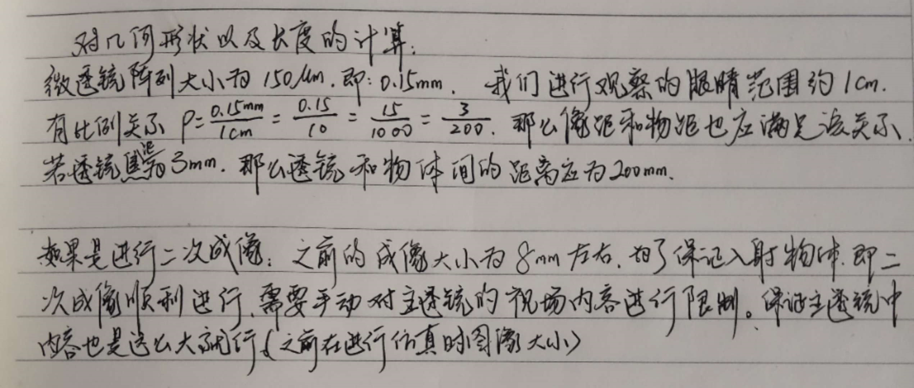

最后的最后还是一个问题，那就是如何对整个光学系统进行统一。进行了一次仿真

这次仿真中使用的就是我们上次在网上得到的微透镜参数，在然后会视场角和器件位置进行限制

如下图所示，可以知道，物体和主透镜的距离为40mm和我们对眼球进行观察的距离差不多，

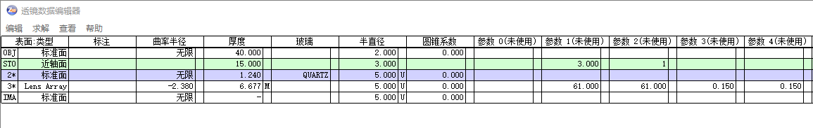


---

**2019.4.9**

今天尝试利用opencv对昨天得到的斯坦福光场进行一定程度的重建，接下来会有一段时间是对opencv的记录。

opencv中的坐标表示方式，opencv中的坐标是以横轴向右为x，竖轴向下为y，记录为(x,y)。这和我们在进行逐行遍历的时用到的at函数不同。

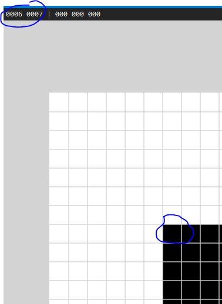

opencv中at函数，如何获取多通道中的一个通道中的像素值

```c++
image.at<Vec3b>(i, j)[0]
```

表示的是image图中第0个通道中坐标为(j,i)的图像。这里的`(i，j)`是第`i`行，第`j`列的意思。

注意：今后在对图像进行遍历的时候要按照opencv中图像的规范，先对横轴进行遍历，再对纵轴进行遍历。opencv中坐标系统尤为要注意，不能把横纵坐标弄混淆。

得到仿真图像之后就是对图像进行区域的划分，将每个子区域提取出来，进行后续的操作。

对图形放大进行分析，发现图形中有几条非常明显的分割线，利用直尺进行测量发现两个分割线之间的区域大小一致，那么可以确定这两根线就是区域的分割线。直接数之后发现每个单元内x方向上有10个像素，y方向上有11个像素。每个单元的像素数目是$10*11=110$。知道每个透镜的大小之后，就需要对每个透镜进行定位，需要一个起始的坐标。利用这里一个子区域中左上角点的位置，$(58, 289)$。利用每个区域的大小得到左上角区域的左上角点的位置$(8, 3)$

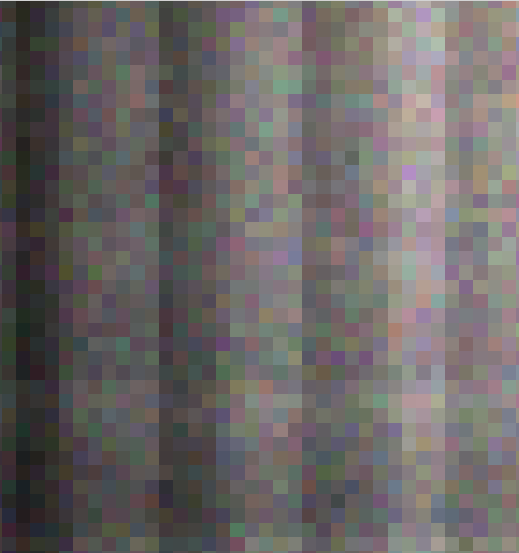

将每个区域进行裁剪获得每个透镜下面的子区域，然后进行子区域中像素的提取。每个区域提取最中间的一个像素，得到如下结果。好吧，这样的结果基本上不能实现对物体进行识别。如果按照这个提取方法的话必须实现更多的微透镜阵列的数目。   

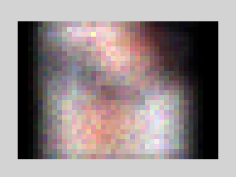

下面是原图的比较

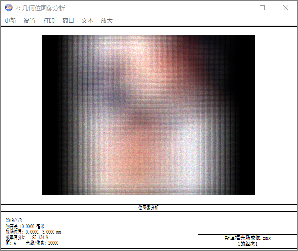


---

**2019.4.8**

在经过和商家的询问之后，了解到AMS商家并不提供单独的微透镜阵列购买。那么还是回到了最开始的时候，如果采用之前在网络上得到的微透镜阵列，那么整个系统的结构将会变得特别的远，这个和我们在手机上的使用以及设计初衷是相违背的。为此我们放弃聚焦型光场的方式，对斯坦福光场进行仿真。按照之前的光学系统的成像，可以知道经过主透镜后的像面大小大约是8mm直径的圆形。那么进行微透镜阵列模拟的时候，考虑主透镜的像面大小的话，需要模拟这个系统设计出相应的zemax系统。首先尝试在镜头库中寻找一个像面为8mm大小的镜头。

微透镜的焦距大小，利用入射平行光对微透镜阵列进行成像，得到微透镜在平行光作用下的聚焦结果。通过下面的数据可以知道，微透镜阵列的焦距在距离曲面4.359mm的位置。

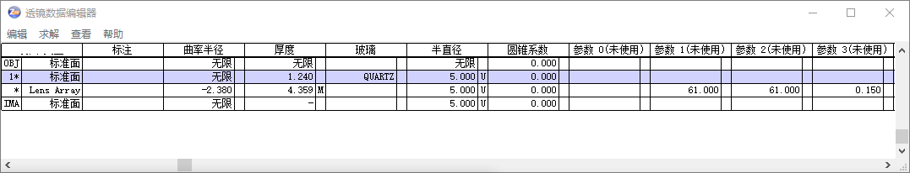、

利用老师之前的想法，即将探测器面放置在微透镜后面的焦平面处进行成像。通过上面分析，微透镜阵列的焦距是$4.359mm$，然后微透镜本身的大小是$0.15mm$.在这样的成像条件下，如果将成像面放置在焦平面处，那么肯定会出现很多的重叠区域。在进行斯坦福光场设计的时候必须对每个微透镜的视场进行限制，减小微透镜阵列之间的重叠部分。由于每个微透镜之间没有使用光阑限制成像，这将导致每个微透镜都将对整个光瞳面进行成像。那么为了使得每个微透镜成像的光瞳面相互之间不发生重合，将像面和微透镜之间的距离尽可能的移近一点。

考虑微透镜阵列的利用率，在我们之前的探测器中，我们知道探测器的大小为$5.694*4.268mm$，在进行斯坦福光场成像的时候，我们将微透镜阵列和探测器放置的很近，尽量保证每个微透镜对整个光瞳面成像而相互不干扰。如下图中，我将设置了理想透镜焦距为$12mm$，然后设置微透镜在主透镜焦距面上，相距$13.24mm$，探测器则距离微透镜$1mm$，得到如下的结果。可以发现在一定程度上，微透镜成像光瞳面之间存在一定的可分辨边界。

<font color=#ff0000>对图像进行分析，发现竖方向图像占据了整个探测器面。由于探测器面的高度为$5.694mm$，每个微透镜的大小为$0.15mm$，在近距离成像的时候，假设每个微透镜都只在后面相同大小范围内进行成像，可以得到成像的数目为$5.694/0.15=38$。即竖向存在着38个可以进行分辨的像素。</font>

尝试利用opencv对图像结果进行重建，查看得到的结果。

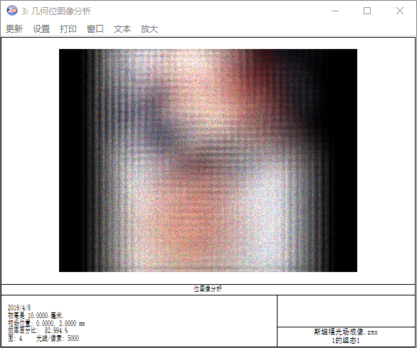


光线/像素设置为20000,距离设置为0.5mm


---

**2019.4.4**

利用昨天的系统，直接将成像的物高调节到20，模拟真实成像的现象，因为真实成像中，不可能只有一部分的物体供你成像，肯定是整个外围能够成像空间都会有光线进入到系统中来，任何两个微透镜成像之间肯定会存在相互重叠的部分，为此只能对入瞳孔径进行设置。避免不必要的内容进入到成像范围内。

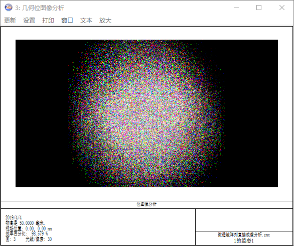

2000/pixel的仿真结果

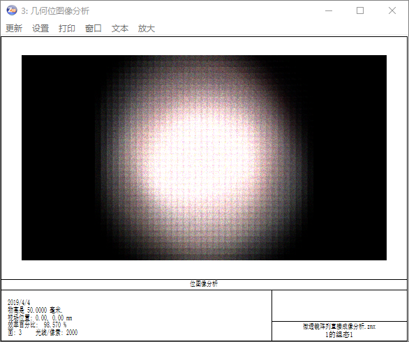

<center>增大物高之后的成像效果</center>

那么经过上面的分析，我最开始利用学长给的微透镜阵列没有成功进行成像，整个成像系统泛白的解决方法就出来了。通过添加入瞳孔径，将不必要的光线的入射尽可能的减少。后续可以尝试对之前的那种方法进行入瞳孔径限制得到相应的结果。


关于光阑在工程光学中的描述：

通常，光学系统中用一些中心开孔的薄金属片来合理的限制成像光束的宽度、位置和成像范围。这些限制成像光束和成像范围的薄金属片称为光阑。如果光学系统中安放光阑位置与光学元件的某一面重合，则光学元件的边框就是光阑。光阑主要有两类：孔径光阑和视场光阑。

孔径光阑：进入光学系统参与成像的光束宽度与系统分辨物体细微结构能力的高低、与进入系统的光能多少密切相关，因此在具体的光学系统设计之前，<font color=#ff0000>光学系统物方孔径角大小已经确定，或者说像方孔径角的大小已经确定。</font>如图所示，在设计一个横向放大率为-5倍的生物显微镜，就首先会要求物方孔径角是多大，这里$u=-0.12,u'=0.024$。

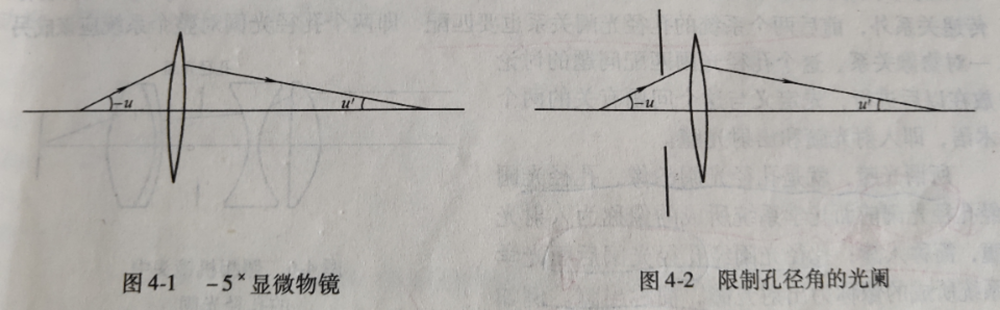

对孔径角的要求就是使这个范围内的光线进入显微物镜，超过这个范围的光线被拦住不参与成像。这个限制轴上物点孔径角$u$大小的金属圆片叫孔径光阑。对于轴上物点来说，孔径光阑在前在后，没有什么影响。但是对于轴外物点的成像来说就会出现一定的问题。

​                                                                           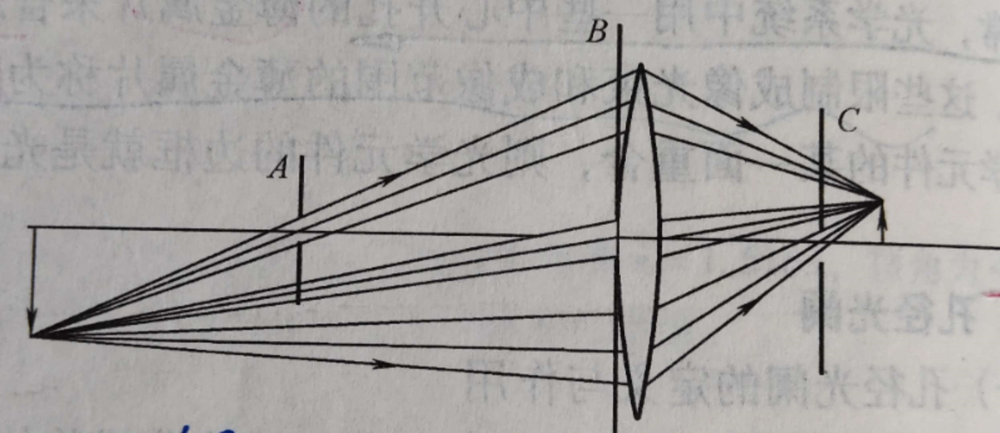

值得注意的是孔径光阑的位置不同，轴外物点发出并参与成像的光束通过透镜的位置就不同。例如孔径光阑在A处，轴外物点发出并参与成像的光束通过透镜的上部。若孔径光阑在B处，轴外物点参与成像的光束通过透镜中部。若在C处，轴外物点发出并参与成像的光束通过透镜的下部。显然孔径光阑位于透镜上，所有轴上物点和轴外物点发出的光束均参与成像需要的透镜口径是最小的。

入射光瞳和出射光瞳：

当两个光学系统组合成一个系统时，除了前一个系统的像即为后一个系统的物这种物像关系传递关系外，前后两个系统的孔径光阑也需要匹配，两个孔径光阑对整个系统应该成另一对物像关系。所谓光瞳，就是孔径光阑的像，孔径光阑经孔径光阑前面光学系统所成的像称为入射光瞳，简称为入瞳；孔径光阑经孔径光缆后面光学系统所成的像成为出射光瞳，简称出瞳。

​                                        

---

**2019.4.3**

经过昨天的分析发现，在几何位图图像分析中每个像素单元的成像结果和他的追迹光线数目相关，这里就会出现一个问题。每个像素进行多少根光线的追迹时候能够得到一个和理想结果差别不大的仿真结果。

下面是经过对每个像素对应的光线数目进行设置后的结果，我这里依次进行增加，得到不同效果下的仿真结果。尽量让通过光线追迹仿真得到的结果和通过卷积运算的得到的结果相匹配。

对于同一个图像仿真，在将像元大小都设置为一样之后，几何位图分析和图像模拟得到下图的结果

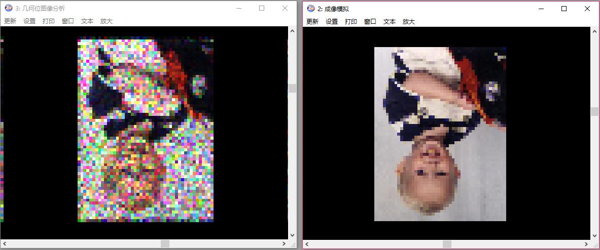

<center>左边为几何，右边为图像</center>

这里的几何图像我已经设置了200/pixel，但是通过调用发现，仍然存在着普通像素的情况。图像模拟是一个比较好的图像。

在将追迹像素增大到500之后，好像是得到了一定的提升。

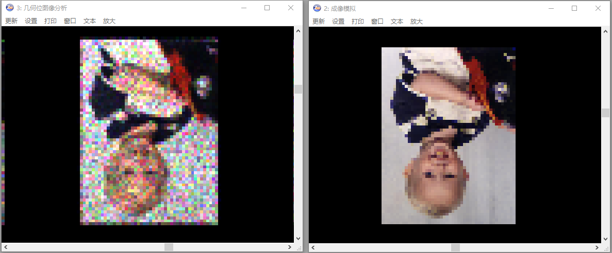

增加大1000/pixel，好像又得到了一定提升

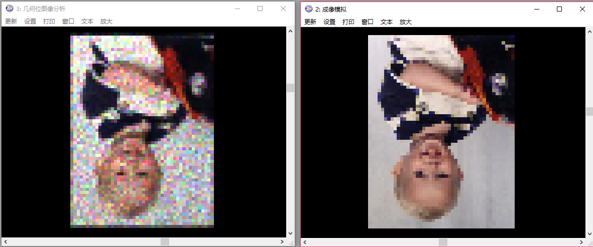

增大到2000/pixel

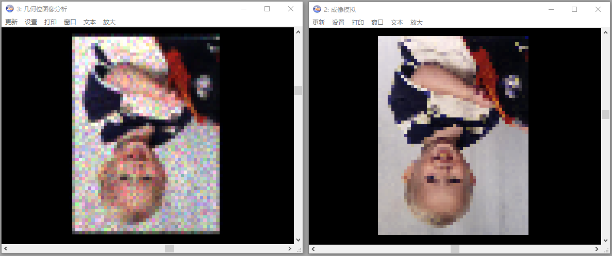

增大到5000/pixel

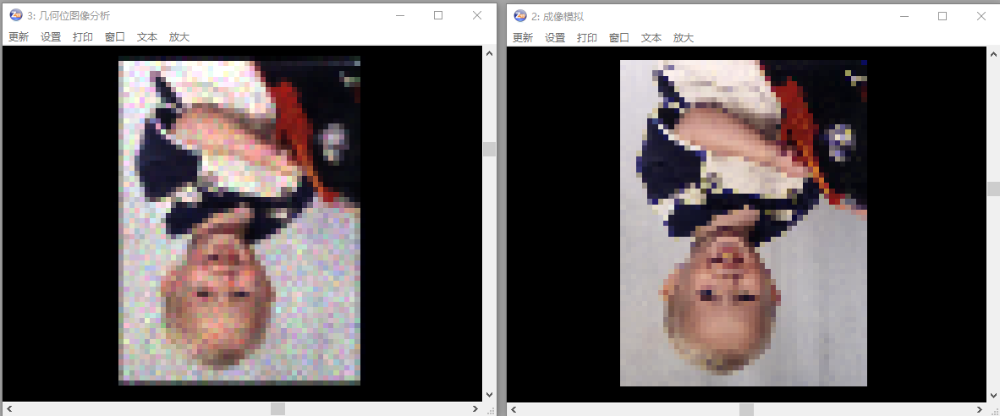

增加到10000/pixel

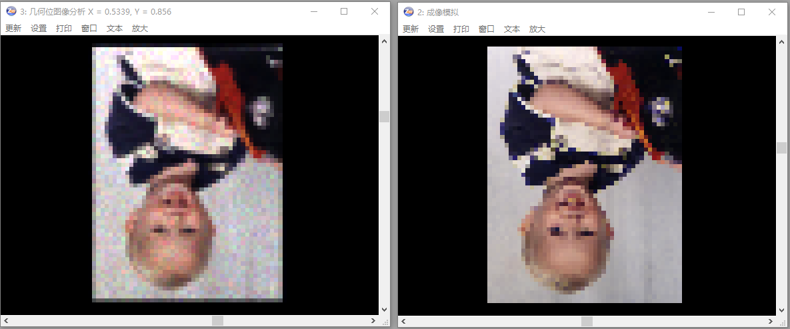

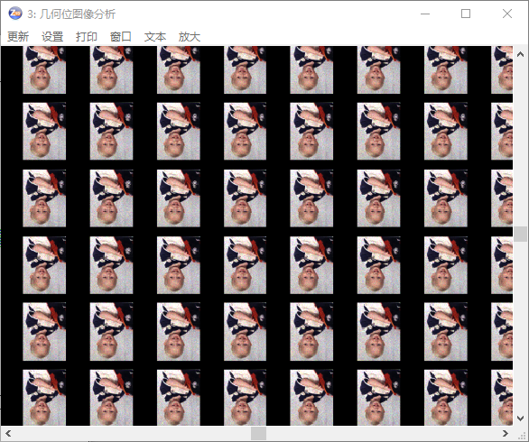

<center>10000/pixel得到结果的部分截图</center>

可以发现在增大到10000/pixel后，得到的结果和实际的效果已经很接近了。由于硬件限制，试想如果进一步增大追迹光线的数目，那么将会得到更好的效果的图片。中午去吃饭的时候再尝试将追迹光线数目增加到20000，应该会得到更好的结果。

增加到20000/pixel，可以看出来已经很接近了。到此为止利用zemax对微透镜阵列进行成像的过程基本完成。后面是利用成像结果来进行三维计算和重聚焦的仿真。

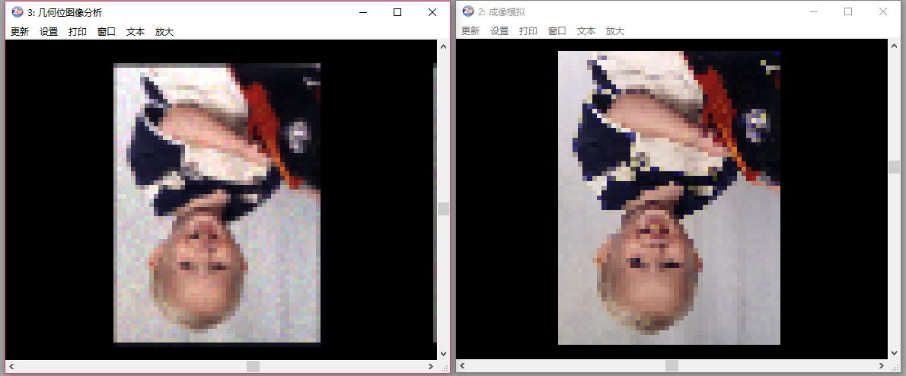

在几何位图图像分析的时候的全貌，其中圆形是孔径光阑的限制，每个微透镜在后方会呈现一个像出来，通过位置关系保证微透镜阵列后面的像不会发生相互的重叠。实际上对于微透镜阵列只是使用了其中一部分，很多在孔径光阑外面的微透镜阵列都是没有用上的。

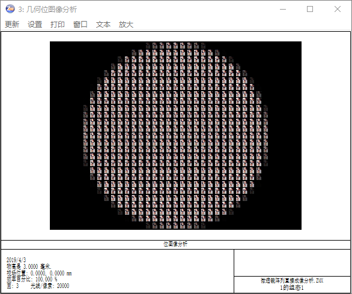

那么下一步就是对得到的图形进行计算了，由于zemax只是对二维的图形进行成像，那么在进行三维立体计算的时候应该会出现得到的深度信息一致的情况。

问题：虽然图得到了，但是这个图的实现却是无比艰难的。和现实中的结果相比，图要进行分析就需要每个微透镜的成像结果之间相互不干扰，那么会导致微透镜的物距要比像距大好多倍，具体倍数和微透镜的焦距，以及微透镜后方像大小与物体大小的比值。

在本次的仿真中，采用的是实际可以购买到的微透镜阵列，但是这个阵列的焦距是5mm多直接导致微透镜成像系统的距离就会很长，根据这个分析的话，想要一个更好的成像效果，在微透镜和物体之间的距离是100mm的时候，微透镜后方的成像之间才没有相互重叠。那么就需要一个焦距更短的微透镜阵列。

利用几何位图图像分析菜单栏中的文本-窗口-存储，可以将位图中的数据以像素的形式存储进.txt。但是中间会有一个正常化强度值，这个是我所不知道的。下图中的像素位置和值都已经到$2588*1940$，但是下面还有很多的值，是正常化强度值。

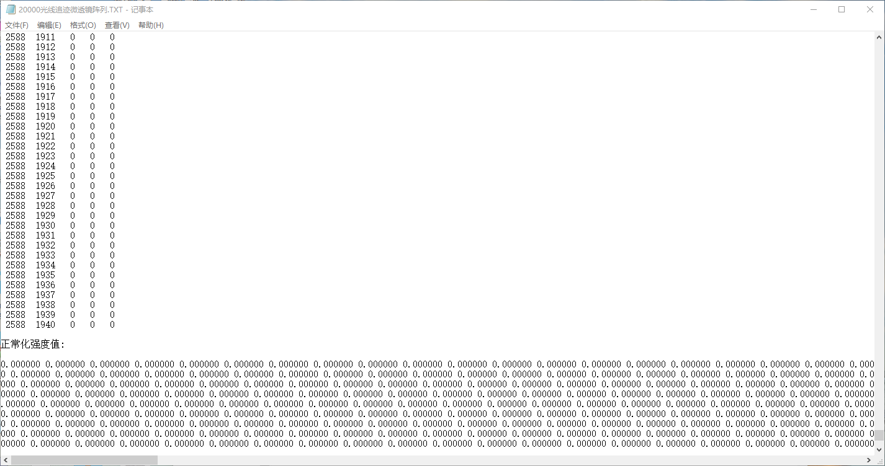

在zemax使用说明中找到文本的描述

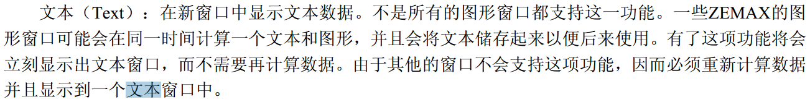

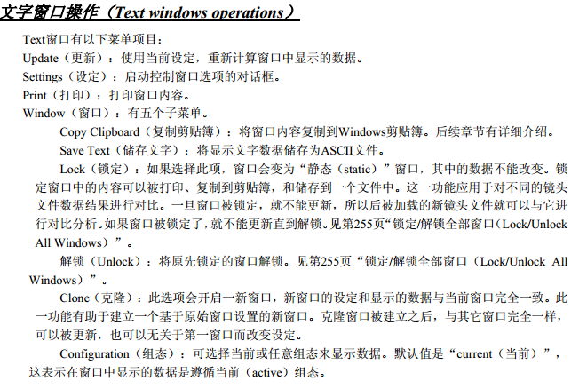


---

**2019.4.2**

昨天想找到张占强论文中的微透镜阵列，公司找到了，但是具体的款型和微透镜的参数并没有找到。后面再找了，后面两天就把之前那个微透镜的参数进行设置和查找好了。

对已有参数的透镜进行分析，希望能够对单独的物体进行成像。

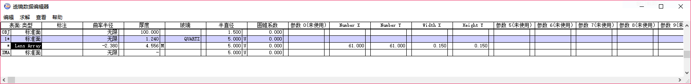

设置lens array面为系统光阑，并设置入瞳孔径为4.光路图如下所示

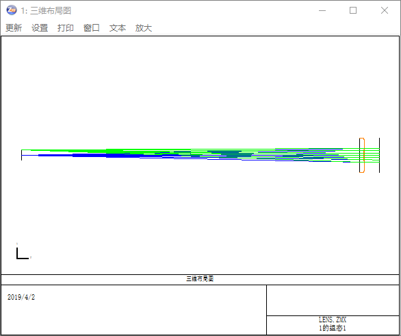

几何位图像分析如下图所示

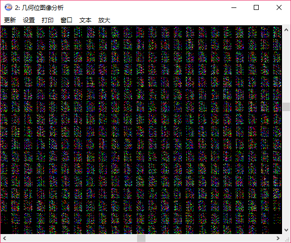

分析可以发现这里出现了微透镜阵列进行二次成像的效果，但是存在问题就是这里没有出现我们目标图像的样子，整体都是像素分，每个图片由单独的像素进行描述，这和我们想要的效果相差甚远。

但是在进行像模拟的时候却可以看到一个图像

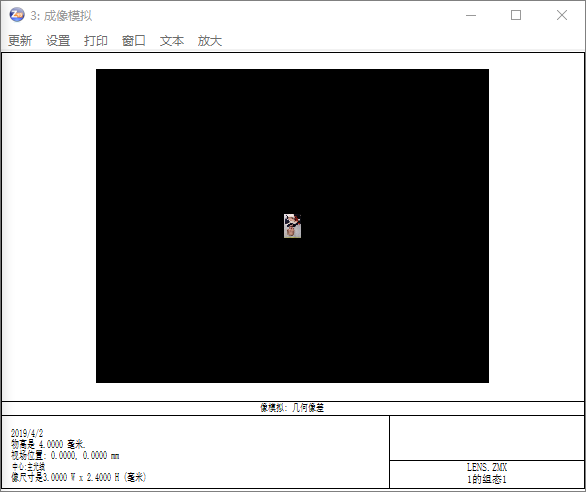

分析几何位图图像分析，考虑是不是由于通光量不足，导致得到的结果中不能很好的进行成像。

尝试对入瞳孔径进行调整，但是在入瞳孔径增大之后，对于每个小透镜来说，他的孔径大小没有发生变化，那么他的入光量也不会发生变化。考虑孔径设置中的其他方式，利用像方空间F/#进行设置，我这里设置值为2，得到下面的图形。可以看出来这个图中的像面明显清晰了很多，和最开始的图像相比具有一定的形状。

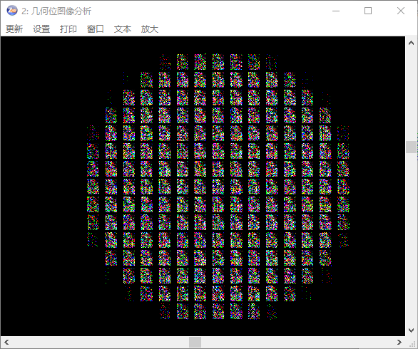

解决：好吧，的确是由于光线数目太少的问题，在进行几何位图图像分析的时候有个设置中，对成像的结果中每个像素点的光线追迹数目进行设置。如下图中20，每个像素对20条光线进行追迹得到相应的结果。

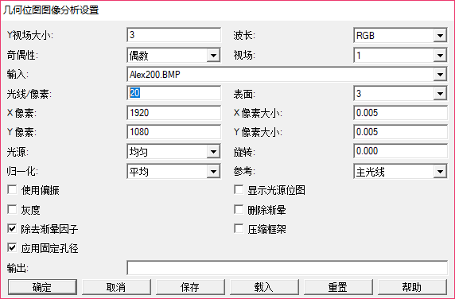

得到的结果如下图所示

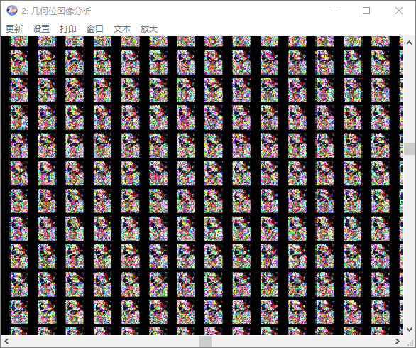

在把追迹光线调节到100/pixel之后，得到下面所示的图片，可以看出来，每个子图都有比较好的成像结果。但是每个子图的分辨率固定了，导致后续图像的精度上不来。

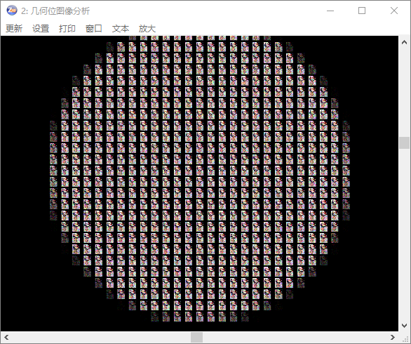

成像模拟中，像尺寸是$0.1*0.1354mm$，说明图像最终的大小就是这个样子了，那么接下来就是看这么大一点的位置中有多少像素了。

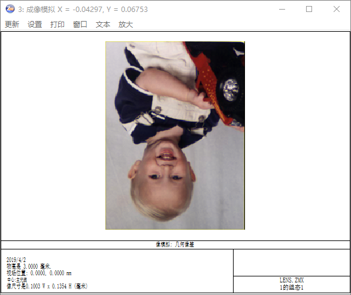

之前看过我们使用的探测器是1/2.5inch，虽然我不知道具体有多大，但我在网络上找到一个类似的探测器，好像和我的差不多，（500万像素）。http://www.dhkj123.com/

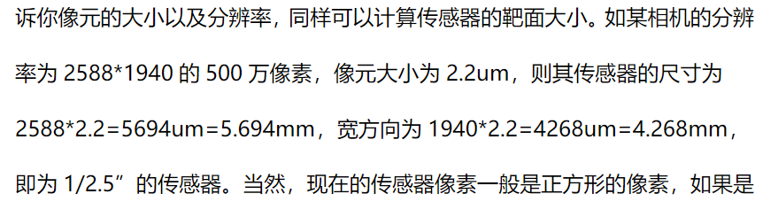

---

**2019.4.1**

在前几天进行汇报的时候，和老师讨论了一些关于微透镜阵列成像的理论，感觉老师的理解挺好的。这里我对老师的理解进行记录。

老师关于微透镜阵列的理解，在老师这里认为微透镜阵列是记录空间光场作用，而且在老师进行分析的时候喜欢用平行光的成像特点来对光线进行分析。从微透镜的角度来说，他后面像面上的点必定是平行光进行入射进行成像得到的点，但是这些平行光并不是从同一个点出发的，因此该点后面得到的是发出该平行光的区域的像，那么必定是一个模糊的像。但是通过这样的分析就可以知道每一个点所对应的入射孔径就是微透镜的孔径大小。那么通过这样的分析，像面上的每一个点对应在光瞳面上的大小是一致的。

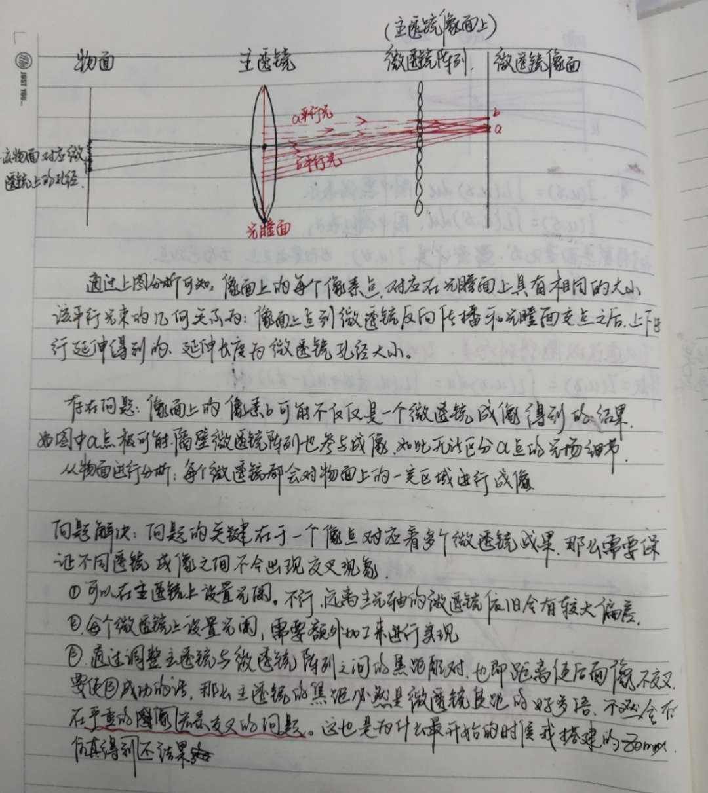

在进行利用微透镜阵列进行实际眼纹成像的时候，我们需要考虑的事情是很多的。

1. 真实图像的范围大小，也是整个主光学系统所对应的物面大小。
2. 成像芯片上得到结果的大小。

在询问之前学长购买摄像头的店家之后了解到他的感光芯片是镁光5100，竟然在百度上搜到这个元件的内容。[镁光5100](https://wenku.baidu.com/view/b999b1ff01f69e3142329429.html)

https://www.china.cn/shumashexiangtou/3820144986.html

进一步了解知道他是$1/2.5$ Inch 5mp CMOS数字图像光感器。

后面在进行进一步思考的时候发现，其实我还没有到考虑像素分辨率的时候，首先第一任务就是在图像传感器上能够进行成像，然后才是考虑成像的分辨率。

通过上面的分析发现微透镜阵列的焦距越短就越好，我在百度上进行查找，发现我之前进行查找的那个阵列，5.2mm的焦距已经是最小的了。如果还需要进行缩小的话，那就只有以前学长用的蝇眼透镜了，焦距最短可以达到3mm。看到之前张占强的内容，这里发现他找到的是一个3.46mm焦距的微透镜阵列，那么这里我在百度上搜到这个公司[AMS](https://ams.com/zh/mla).但是没有得到相应的微透镜的参数。


---

**2019.3.28**

学弟用他的把参数卡卡一调节竟然出来结果了。我用他的看了下，主要是参数的调节的问题，之前的处理方式是没有问题的

，

下面是我这里觉得需要好好调节的几个参数：

1. 微透镜的宽度需要适当调节小一点，我之前一种用的是0.15，这将导致得到的结果中存在比较少的点分区部分。将结果调节为0.05可以得到较多的图像结果。
2. 在几何位图图像分析设置中Y视场大小要稍微设置大一点。他这里设置的是30，而我一般在进行设置的时候只是设置了10左右。小的视场也必然会导致结果中出现的宏像素数目比较少。

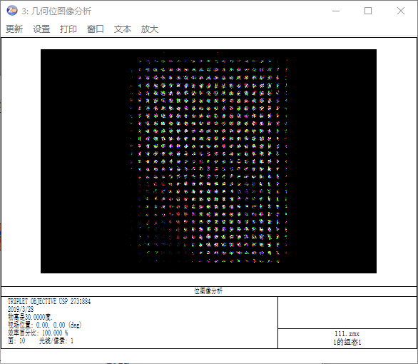

以下是孔径修改为0.15时候的图像仿真

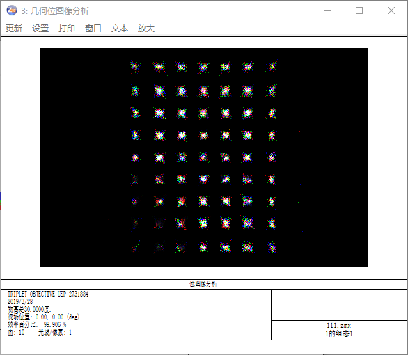

以下是设置为视场高度为10的仿真

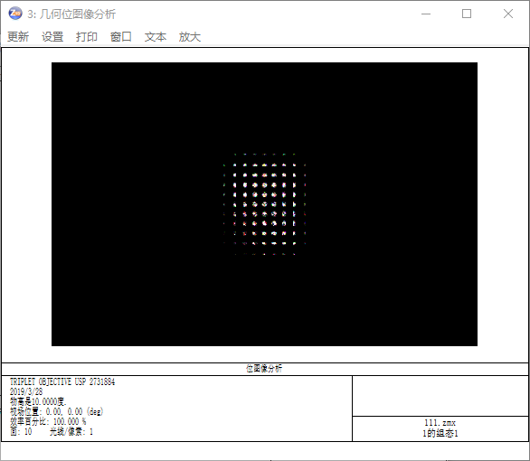

对于镜头的F数，$A=D/f$其中$A$表示物镜的相对孔径，$D$表示入瞳直径，一般就是指物镜直径，$f$表示物镜焦距。在相机中为了方便将$A$的倒数作为相机的表示值，成为光圈$F$。其实光圈数目F在一定程度上体现了视场角的程度。在焦距保持一定的时候，$D$越大那么通光量越大，得到的视场也越大。

经过分析$F$数和视场角之间没有必然的联系，具体的分析情况如下图所示。

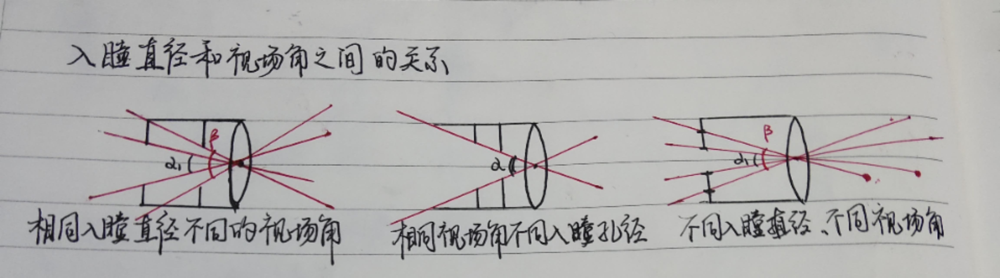

对于单一的微透镜阵列来说，并不会存在光阑，但是怎么会出现那种一部分成像的结果？但是在进行像面分析的时候可以发现，每个微透镜都有各自的光线集合，彼此之间并不会出现相互的交叉。因此这里需要对每个透镜阵列的视场进行分析。

在进行分析的时候发现视场是通过视场光阑来进行决定的，是在像面上进行放置。那么很多时候其实3视场光阑就是整个成像芯片的大小。对于透镜来说忽略他的成像大小而考虑视场角是没有意义的。因此对于一个单透镜来说，<font color=#ff0000>如果他的成像探测器没有进行限制的话，那么他的视场角将是无比大的，基本可以对物空间的内容进行成像。</font>

回到之前的讨论，如何在成像中使得每个微透镜都有自己的成像图像而不会相互干扰。继续用下面这个图来进行描述，这个时候最左边的不是主光学系统光轴，我们把他看作是一个要成像的物体。如下所示，如果每个微透镜都能够在后面有一个完整的缩小的像，那么每个微透镜阵列就不会出现交叉的地方。


通过上面分析可以知道，通过调节主系统成像面和微透镜阵列之间的间隔可以起到相应的作用。距离越远，那么相应的微透镜成像就会越小。两个微透镜阵列之间的空隙就会越大。下面对图形进行分析，令$d$为距离。

$d=1.6$

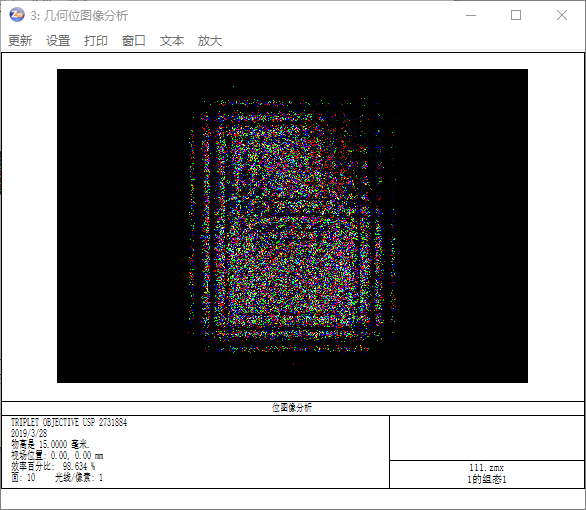

$d=1.8$


$d=2.0$

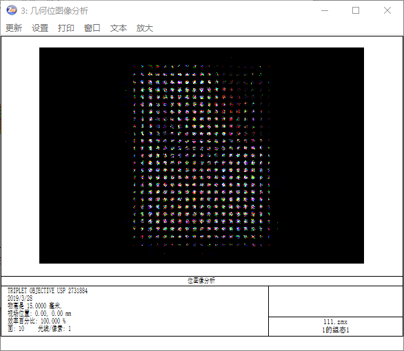

$d=3.0$

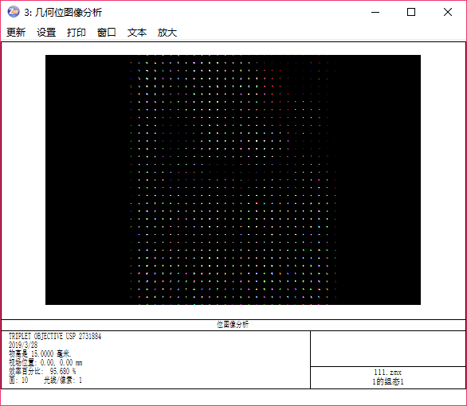

通过上述仿真，也进一步证实这个猜想。

如果想要最可能大的利用探测器的像素，那么应该让两个微透镜成像之间尽量没有间隙，或者让两个微透镜之间的重合部分是畸变大的部分。对于每个透镜近轴的光线成像能够有比较好的表达能力。

---

**2019.3.26**

已经这么久了，我还没有很好的实现图像的模拟，这里我已经不知道该怎么办了，很想求助于淘宝了。

关于几何位图图像分析和像模拟之间的区别，可以看出几何位图可以在像面之前的中间面上分析，而像模拟只能在像面上分析。

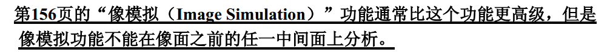

几何位图分析的目的：该功能基于光线追迹创建一个RGB彩色图像，用RGB位图文件作为光源文件。只能是光线的汇聚。

像模拟：通过使用一个点扩散函数阵列卷积源位图图像文件来模拟成像。这样才能得到一个有图形的结果。

---

**2019.2.25**

在和冯迪老师进行讨论之后，老师觉得我这里就算是利用微透镜阵列进行二次成像，但是我这里采用序列化计算，轴外透镜将导致很大的视场角就是很大的轴外像差，后面能不能进行计算是不一定的。但是通过文献的理解，文献中基本都是对一部分进行成像。

我这里尝试利用微透镜阵列直接对图像进行成像， 利用 光路图进行仿真发现微透镜阵列实现了分别的聚焦。但是在进行成像模拟的时候发现只有一个像出现。

在利用混合模式中的NSC自带的微透镜阵列进行模拟，能够进行聚焦，但是也不能呈现多个像出来。

混合模式注意局部出口的设置，2作为非序列元件的输出面，并且设置厚度和后面的面进行保持。

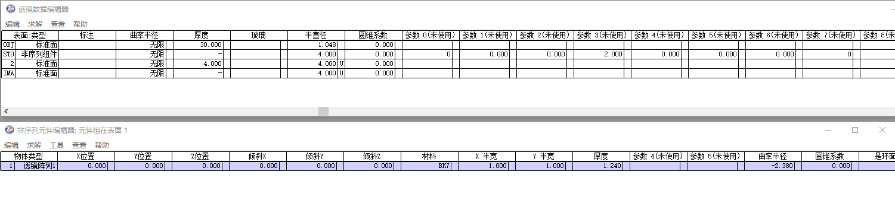

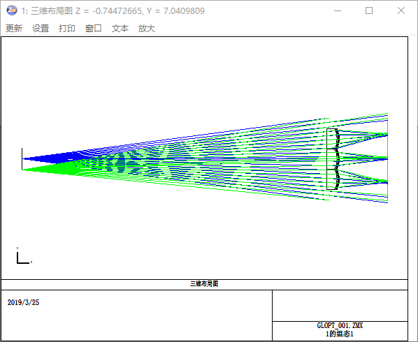

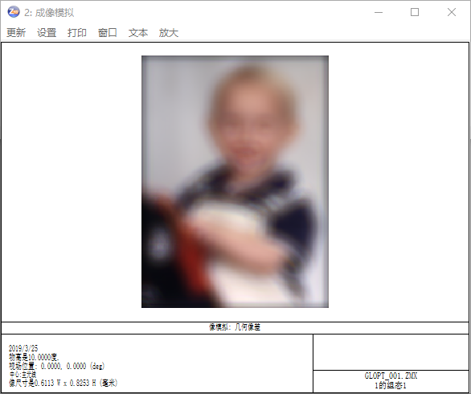

非序列元件下也没有成功的对图像进行多次成像，那应该就是其他的问题了。

有进展，在利用几何位图分析的时候发现可以得到9宫格的成像。由于是单独使用微透镜阵列进行成像，这个和我之前利用单独的一个透镜进行成像的时候得到的结果是一样的，也是一片白花花的东西，根本就没有我要的结果。考虑需要利用前置主光学系统进行初步的成像。

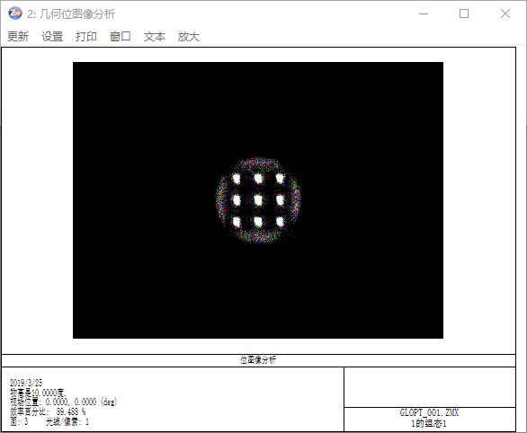

直接利用我之前的内窥镜组后面加微透镜阵列的做法得到图，分析是因为内窥镜成像之后图像太小，过于小的物体经过后面的二次成像，差不多就是下面这个样子。

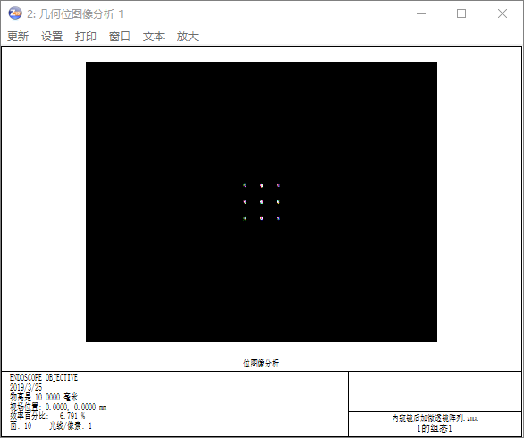


---

**2019.3.23**

在成像模式的地方知道了怎么对成像芯片进行设置，以及他们的含义是什么。

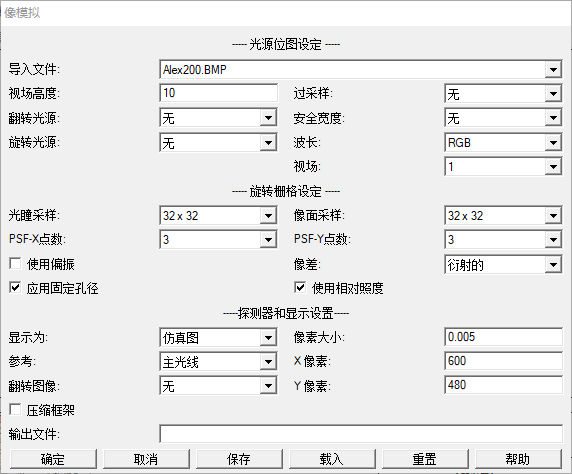

在探测器和显示设置这里，可以对成像芯片（探测器）进行设置。我这里进行设置的是像素大小为0.005，x像素数目为600，Y像素数目为480。那么可以通过计算知道探测器的x边为$600*0.005=3mm$,y边为$480*0.005=2.4mm$，下图就是进行成像模拟的时候出现的样子，可以发现这里的像尺寸就是我刚刚进行设置的。但是不幸的是，这里的图像依然只有中间有一个图像，而周围却没有图像出来。应该是在光路中出现的问题了。经过计算中间图像的x轴大小为$0.5mm$

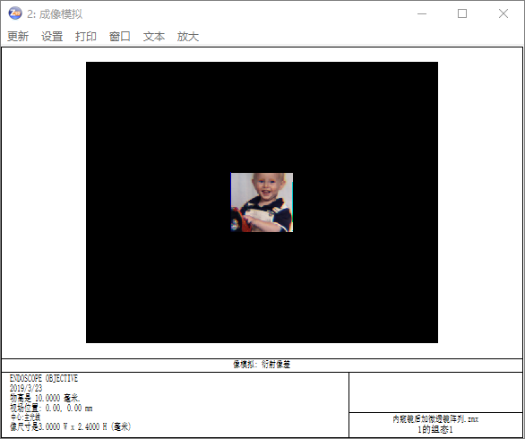


---

**2019.3.22**

今天找到老师询问了关于我的问题，冯老师说之前的微透镜阵列的建模方法是可行的。笔者后面分析了整个光学系统的光路和焦距等， 终于知道为什么没有实现对光线的聚焦了。

之前我进行模拟的微透镜阵列是下面这个，他的焦距是在表面后$f$处，这样其实并没有知道他的焦距在哪里。而且这个是一面的焦距，也就是说光线平行从左边入射，能够在右边距表面$f$处进行汇聚。

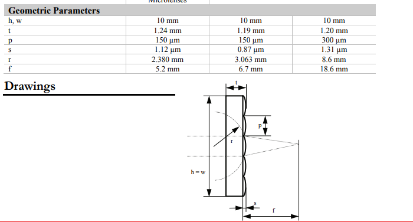

从普通透镜的角度进行分析，有以下三种情况。

1. 平行于光轴入射的光线汇聚到后面焦点处
2. 从前方焦距入射的光线，经过折射后和z轴平行射出
3. 从前方焦距内部进行入射的光线，最后将不能汇聚到z轴上，属于发散的光线

注意：这里说的焦距在左右很有可能就不同，比如我们上面的平凸透镜，他正反方向的光线规律一定是不同的。

通过上面分析，思考我之前的系统之所以不能得到汇聚的像，是不是因为微透镜和像面之间的距离太近了。基本的透镜规律告诉我们，想要成实像就需要物距保持在焦距之外。尝试拉开主光学系统成像和微透镜阵列之间的关系。可以发现微透镜阵列后方对光线进行了汇聚。这里的前方透镜采用，库克三片式结构。

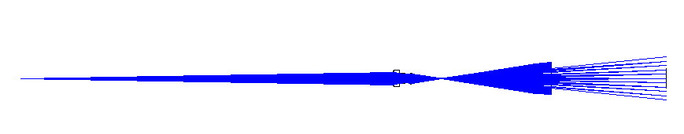

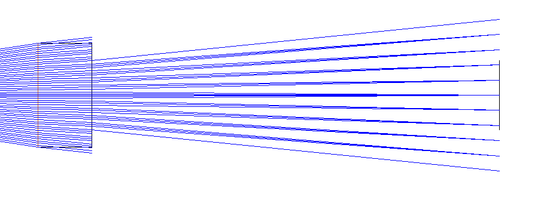

利用zemax中的像模拟对图像进行仿真。额...怎么跟恐怖片一样。。。观察像尺寸也只有$0.0001*0.0001mm$，怎么像的尺寸这么小，肯定是哪里存在问题。

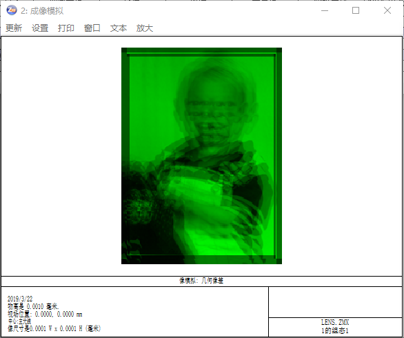

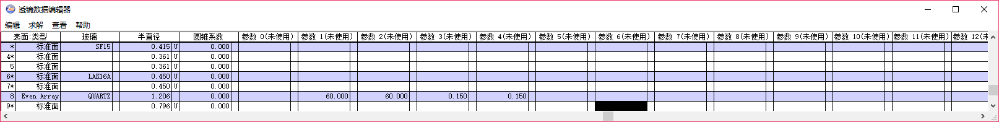

通过对LED数据进行分析，这里的尺寸都太小了，每个面的大小基本保持在0.5左右，但是我们的光学系统肯定不是这样的。尝试对我已有的一个镜头进行分析，发现他的像尺寸至少是$8mm$，那么整个系统的孔径都要重新进行计算。

尝试从镜头库中找到一个和10mm差不多大小的系统。实在找不到后面就在内窥镜后面加微透镜阵列，少设置一些阵列的数目，尝试能够成功得到光场图像。

下图是采用内窥镜后面加微透镜阵列的方式，通过光路图可以发现后方微透镜阵列成功对物体进行成像。但是通过像模拟发现并没有得到想要的结果。左图中整个成像阵列至少是$4mm$，但是右边的像尺寸只有$0.36*0.49mm$。<font color=#00ff00>这里对IMA像面中的半直径和像尺寸的联系不清楚。</font>

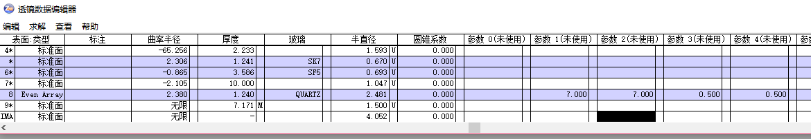

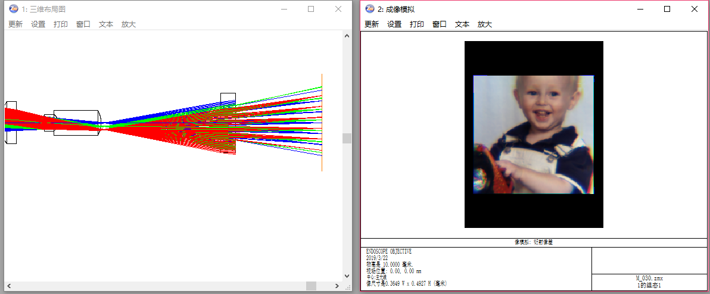

​                                                                                                                                                                              

注意：这里不能采用近轴面的面型，在和老师进行交谈的时候老师跟我说过微透镜阵列的成像需要满足一定的孔径要求才行，用近轴面可能会对结果产生一定的影响。在我后面的实际操作中，发现近轴面的确是不行的。采用近轴面是不能按照我的要求得到透镜阵列后面光线汇聚的。

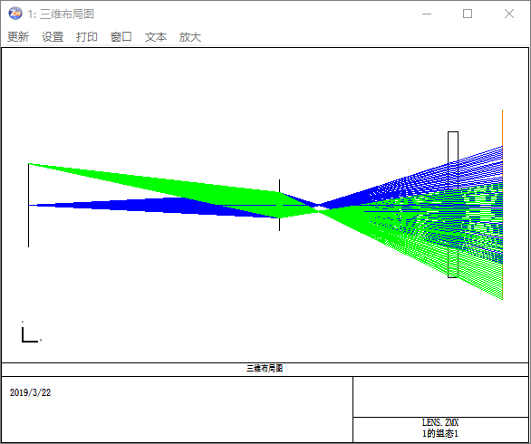

---

**2019.3.21**

通过昨天的分析发现我们在市面上所能够买到的微透镜阵列的数目是比较少的，很难上百的。为此我们在进行光场成像的时候只是利用斯坦福光场进行成像是不能够实现高分辨率的重建的。为此考虑聚焦型光场相机的结构。

由于微透镜阵列是对主光学系统成的实像进行再成像，那么我可不可以将一个图片就放在微透镜阵列前面让他来成像。

按照文章中的zemax仿真结果来看，每一个小的透镜都能够进行聚焦，但是在我这里好像没有成功。


这是我仿真出来的，光线没有一点汇聚的可能。

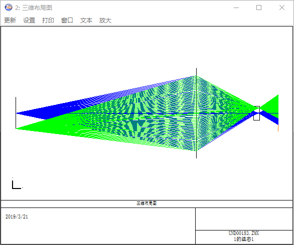

---

**2019.3.20**

昨天晚上一直尝试用微透镜阵列进行模拟，但是却也一直没有得到希望得到的内容。首先，模拟的像有的时候出不来，其次，模拟的结果不会出现宏像素块那样。

思考：在对微透镜阵列进行理论分析的时候都是采用理想透镜，但是在进行仿真的时候是不会出现理想透镜的情况的，需要根据实际情况绘制出不同透镜的形状。

暂时可以考虑利用理想透镜来实现模拟，如果成功再采用理想透镜

利用理想微透镜阵列，只采用lens arrays一层面，而没有其他的内容。这个时候感觉微透镜阵列对光线没有任何作用，将微透镜阵列放置在理想透镜后面的成像位置处，可以发现此时的微透镜阵列对光线没有任何调试作用。是不是因为这只是一个面，没有指定他的材料那些。只利用一层面是不行的。

在这层面之前加上一层面，然后设置两个面之间的材料是quartz，如图

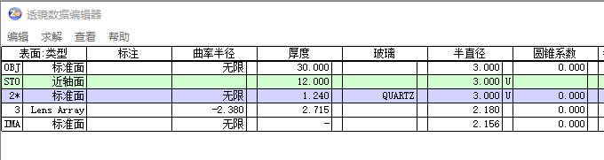

此时得到图形

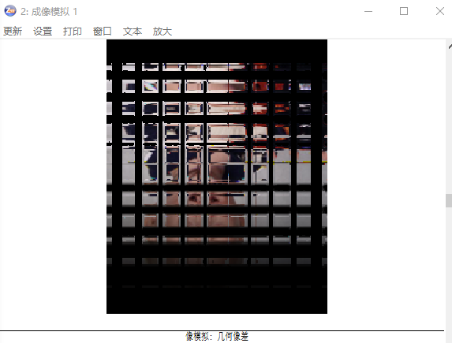

虽然这个结果不是很理想，但是这个结果能够说明我们这个是微透镜阵列，而不像之前那样没有任何作用。但是也存在很多问题，和我们希望的结果不一样。

分析可以了解到，这里的微透镜阵列都是矩形的阵列，和我们所希望的圆形阵列是不一样的。因此不能采用默认的微透镜阵列的排列方式。

查看了一下手册中关于array的说明，如下。

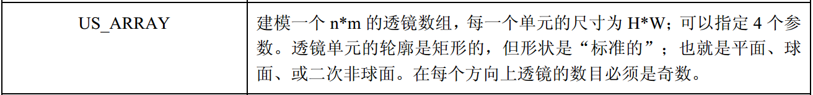

这里可以知道每个微透镜阵列在这里的轮廓都是矩形的，但是形状是标准的。


下面的这两个方式都是在非序列模式下进行的

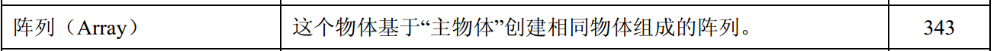

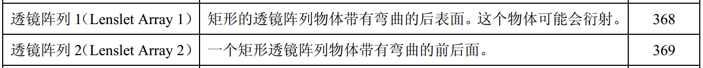


思考：矩形轮廓的话，会不会就得不到像文中那样的结果的。

对于上述的结果，我今天下午的时候发现，是我的结果出现的问题。通过这个方法是可以得到透镜阵列的，但是存在问题就是没有将所有的透镜进行成像，都只是对一部分的透镜阵列进行成像。成像结果肯定是满足不了我们的需求的。

通过对下图的观察得到的结果

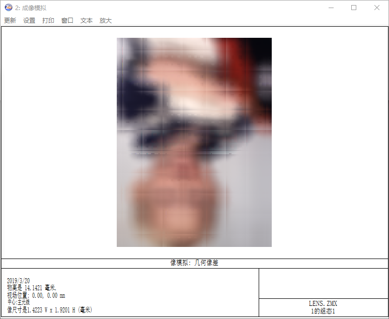

该图我对微透镜的大小设置为$0.15*0.15$，数目设置为$60*60$，可以明显观察到这里没有60个宏像素存在，这是为什么呢？我看了下成像模拟下面的像尺寸，为$1.4223*1.9201mm$。然后我将成像面和透镜面拉近，得到上图中的结果。可以明显看到上面的图也进行了分区，分为很多个矩形的区域，可以发现矩形区域的数目和透镜大小以及像尺寸大小是对应的。那么分析结果就是，每个微透镜阵列都成像了，但是由于像尺寸的大小和微透镜没有全部成像的问题，导致一部分的微透镜没有得到使用。而且，每个微透镜阵列成像内容有点多，这个应该和真是使用的微透镜数目相关。

下面考虑，如何让所有的微透镜阵列都能够进行成像。

关于像尺寸：通过下面的图片可以知道， 像尺寸在很大程度上决定于第一个透镜的成像角度。成像角度越大，那么在后面成像芯片上的图像就很大。

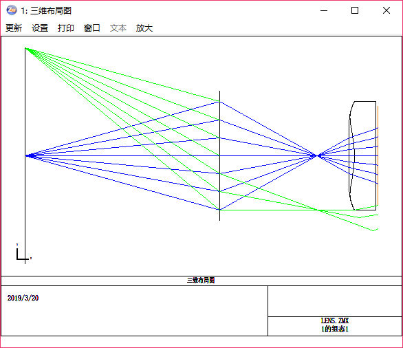

通过对系统的调整，发现像尺寸有所增加，但只是增加两倍之后并不能对整体分辨率有很大的提升。如果采用斯坦福光场来进行计算的话是肯定得不到想要的分辨率的。

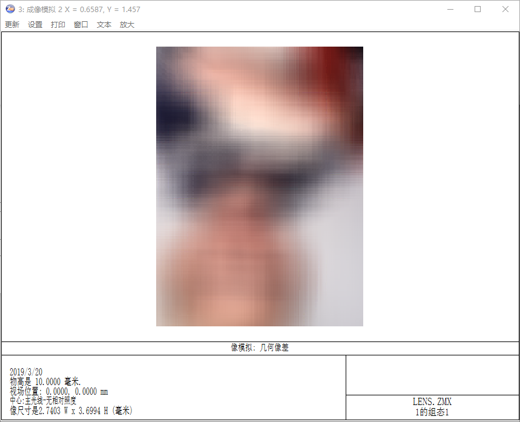

增加分辨率的方式还有一个就是减小微透镜的孔径，这样的话就可以得到更多的小孔的图像，增加了分辨率。

---

**2019.3.19**

这几天没有进行过程的记录，因为这几天都在对微透镜的原理进行学习和了解，现在大概了解了微透镜阵列的基本原理和两种微透镜阵列的成像方式。在学习的论文中用zemax进行了仿真，说明zemax是可以进行仿真的，今天的任务主要是学习zemax怎么进行仿真，以及能够得到基本的图像出来。

zemax2014的安装，由于之前安装的zemax2005不能满足日常使用的所有功能，为此开始尝试安装2009，但是我安装了很多次都没有成功，后来尝试安装2014，开始也没有成功，可能是破解的问题没有弄好，在其他网站重新找了一个下载的地方，之后成功破解。

[zemax2014安装包下载地址](www.xue51.com/soft/8171.html#xzdz)

1. 如何建立离线透镜，在面型里面选择paraxial，然后后面设置焦距大小就行了。


2. 如何建立像模拟平面，分析-图像模拟-图像模拟得到下面的图形
3. 

设置


导入文件为你想要进行模拟的图像；视场高度必须进行设置，因为是对图像进行成像，不可能为0的视场高度存在。

关于视场高度的具体含义我目前也不是很清楚。

以下是利用理想透镜进行离焦成像的仿真


第一张为光路分析图，第二张为原图，第三者为离焦图

关于视场高度的问题，下面的图形进行了比较。发现像模拟的设置中的视场高度和最后成像的物高是一样的。那么视场高度很可能就是实际的物高。


---

注意：在进行视场数据设置的时候，这个只是设置了你要模拟光线的视场高度。你在进行图像模拟的时候进行读取的时候，需要重新设置视场高度。这两个东西不是一起的。


试试单独对微透镜阵列进行模拟，发现得到的结果就不如人意，难怪光场相机结果不好。

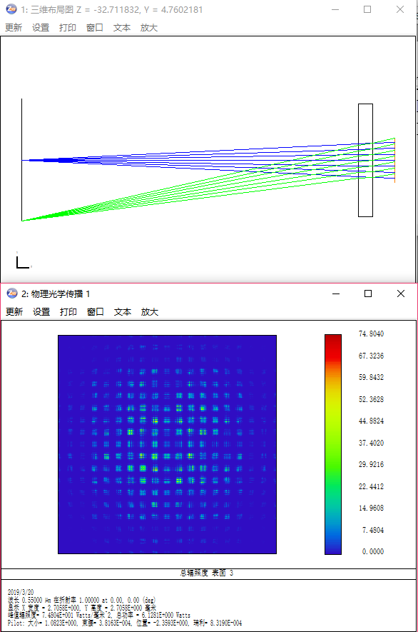

由平行光进行的入射最后的结果应该是点才对的

将探测器放在微透镜阵列后面的光线交汇点处时

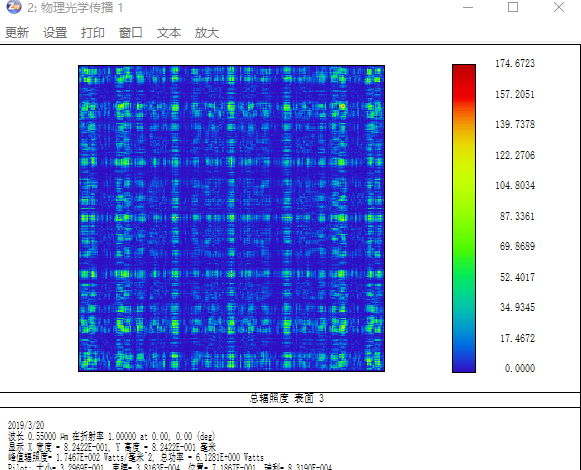


---

**2019.3.16**

继续研读微透镜成像原理的文献，深入了解微透镜的成像机理，为后面微透镜的选型等提供一定的准备知识。

---

**2019.3.15**

关于光场相机的几个问题，

1. 能否用微透镜阵列搭建光场相机
2. 微透镜阵列组中相邻的微透镜之间有没有光阑，防止两个不同透镜之间光线的相互干扰
3. 光场相机成像的分辨率问题，能否分辨我需要的像的内容，这里具体到能否对眼纹进行识别
4. 微透镜阵列的方形和圆形哪个具有光场成像的能力，以及他们的区别是什么，具体就是该如何进行选择

---

**2019.3.14**

上次在进行一定的比较后发现还是需要用学长这种的摄像头才行，如果是内窥镜的话，他的分辨率是一个比较大的问题，其次由于内窥镜都是需要打光来补偿光线不足的缺点的，因此内窥镜的方式目前就我们来说不是很合适。

在对学长的镜头进行打磨之后发现镜头的芯片板子在32mm上，两个镜头放在一起就是65mm左右，搭建这样一个双目系统，眼睛的侧下方进行拍摄会得到比较好的眼睛图像。              

希望后续能和老师进行一定的讨论， 确定这个方案，然后争取早点能够完成这个系统的搭建任务。

今天和老师说了，老师又说回了微透镜阵列。现在我已经没有追求了，就照老师说的弄把。为了其他方法已经耽误了这么久的时间感觉真的是不值得。就照着他的想法弄，最后出什么幺蛾子他也没有什么好说的了。

既然是要按照之前的方式来进行光学系统的搭建的话需要利用zemax对光学系统中的微透镜阵列进行仿真。看到有人利用lighttools和transcope进行仿真。

翻了一下zemax两本书籍并没有我所需要的内容，而且我这里对于光场相机的原理也不是很理解，决定先学习光场相机的原理。

[参考](https://blog.csdn.net/endlch/article/details/44539055)博客中利用matlab进行了光场相机的仿真。这里面提到的微透镜焦距远远小于主透镜的焦距，主透镜可以看作位于微透镜的无穷远处。光场相机中每个微透镜后面的图像是对原始数据进行求和得到的，因此一个微透镜也就成了最终的一个像素。

今天下载了tracepro，后面如果需要的话可以在这里进行仿真模拟。在网上找了一家比较正规的[透镜供应厂商](https://www.thorlabschina.cn/thorproduct.cfm?partnumber=MLA150-5C)。微透镜具有平凸外形，排列在方形网格中，透镜间距为150 µm或300 µm。间距为150 µm的微透镜阵列为圆形微透镜，而间距为300 µm的微透镜阵列为方形微透镜，填充系数为100%。

目前有方形的和圆形的透镜阵列，该如何取舍？？明天问一下透镜的相关人员把。以及如何进行仿真。

---

**2019.3.12**

经过一定的思考，我的任务重点应该不在搭建这个双目镜头组的实现上面。

昨天我稍微思考了学长微透镜阵列的搭建方法。该方法中将微透镜阵列放在主镜头的后面，首先就是不能将系统的直径缩小，其次就是像差问题。作为一个透镜来说，仅仅在近轴的光线才能够具有很好的成像质量，一旦光线近轴出现一定的夹角，作为一个透镜来说，一定是会出现像差的。然后就是学长的透光口径的问题，微透镜阵列的透光孔径是会相互影响的。一个物体发出的光线经过1微透镜进入可能会从其他透镜中出现。这样肯定会影响其他透镜的成像质量。

分析得到，在主透镜后面添加透镜组的方式是不合理的。只能是利用两个光学镜头分别进行成像，然后在同一个成像芯片上进行显示。该方法的作用是电脑只需要对一个镜头进行读取，无需在两个镜头之间来回进行切换。

为了说明计算机可以之间打开两个摄像头进行读取，[百度](https://jingyan.baidu.com/article/9158e000392cada25412281a.html)可知，利用opencv中函数就可以之间实现两个摄像头的读取方法。那么双镜头和双目的本质以及调用上并不会有特别大的影响，无非就是调用一个镜头还是调用两个镜头的问题。为此，我考虑能不能先从多个镜头入手，实现想要的内容。

在淘宝又找了几家的内窥镜，普遍存在一下几个问题。内窥镜的长度会比较长，内窥镜模组的芯片一般是顺着管道延展，所以内窥镜的长度一般会有3厘米以上，这样固定在眼镜上之后就会出现长长的相机突出。但是他的宽度一般在5mm左右，两个内窥镜进行并列放置的话面积不大，对视线的影响不大，遮挡相较于之前的会好很多。

今天和老师说一下吧，尽量用已经有的东西来解决这方面的问题。 

---

**2019.3.11**

昨天尝试了进行三段式的镜片处理，今天希望能够用淘宝上已经有的透镜搭建出一个简单的相机系统。

今天在想要实现镜头的时候发现镜头这里的问题实在太多了，不能简单的进行解决。像差过多，三片式镜头并不能很好的解决这中间存在的问题，而且我们的重点是后期的算法处理不是在镜头的搭建上面。如果镜头的像差美哟达到一个很好的效果，势必会对后面的图形计算造成很大的影响。

暂时放弃镜头的自己搭建。

进行方案寻找镜头，然后自己搭建成双目相机。尝试对医疗内窥镜入手。

但是学弟在csdn中找到一个zebase库，这个是已有的一些申请过专利的透镜组合。在其中选取一个内窥镜的光学系统进行仿真，得到很好的结果。其中的尺寸也比较小，这个纯光学系统直径可以保持在4mm。在物距为30mm的时候进行仿真，具有很好的成像效果。


---

**2019.3.10**

这几天对zemax有了初步的理解，但是并没有成功的得到我们想要的镜头。之前也说过单一的透镜是不可能作为镜头来进行成像的，在透镜的近轴区可以看作是理想成像，但是在偏离镜头中心，或者说成一定角度进行入射的时候是肯定会出现像差的。我之前用已经有的镜头进行过像差的测试，在有一定角度的光线进行入射的时候是不会产生这样的结果的。

百度相机物镜镜头的设计，找到一个[设计案例](https://wenku.baidu.com/view/62bc6435c850ad02de804199.html)，学习一下。

下面的一个摄像机的镜头是在光学设计手册中找到的一个系统参数，我们可以参考这个系统的结构来对我们自己的系统进行设计。这是典型的三片透镜式。


三片式透镜的设计过程参考[网址](https://wenku.baidu.com/view/300d91c667ec102de3bd8940.html?sxts=1552202736153)

上面三透镜的光学系统分析如下


平行光入射，大角度入射光会出现一定的像差。

但是如果是点光源光线的话就会有很长的像距，这里取物距为30mm，则模拟像距为110mm多如下


从上面的模拟可以发现，3个透镜的组合可以在一定程度上解决像差的问题。但是这里的焦距，物像等内容不符合我们的要求，为此需要对该透镜进行进一步的优化，达到我们的设计要求。下次的任务是进行优化。

---

**2019.3.8**

昨天对于简单的一个透镜的分析有了基本的了解，今天的主要任务是将其他的内容进行熟悉一下。

1. zemax中的透镜类型可以是standard，表示为标准类型，存在者像差等。也有paraxial，表示理想型透镜，不存在像差。

2. zemax中经常出现哑面的说法，这里认为应该是不透明的面，和透镜那些透光的面相对，比如成像面。

3. 在进行添加转折面的时候，发现在添加之后，二位的layout不能进行显示。但是在3维的layout中就能显示。

4. 在field中选择多个高度如下

   

   对昨天的平凸透镜进行分析得到结果如下，取物距为2cm

   

   结果分析，昨天的透镜在近轴光线得到的结果是比较好的。但是我们如果作为镜头的话，不可能只对近轴的光线进行分析。上图是对于一个2厘米的物体进行成像得到的结果，远离光轴的地方光线出现明显的色散现象。因此用这个透镜来进行成像是不能成功的。

---

**2019.3.7**

昨天下午和晚上看电视去了，没有时间学习ZeMax相关的知识，今天学习一下，尽早把光路分析完善，之后再进行下一步的透镜装配。

下面对在光路设计中出现的光圈数百度后的结果，可以发现对于一个相机来说，F/#后面的数目是可以变的，代表的就是透光孔径变化。F为焦距，这里的#是光圈数，结果是入瞳大小。


Zemax对透镜的光路分析

1. 双凸透镜，是直径2mm的那款，取入瞳孔径为0.5


2. 直径3mm的平凸透镜，取入瞳孔径为1


入瞳孔径在比较小的时候能够满足像差比较小的要求，在入瞳孔径过于大的时候会出现轴向偏差。如下图，取入瞳孔径为1.5，在轴向出现偏差


Zemax的初步操作：zemax是一个从左到右依次进行设计的系统软件，首先是对光学系统的入瞳大小的确定，并确定入射光的角度和波长等，然后是对光学元件各个面的设计，最后是光路模拟。

---

**2019.3.6**

昨天在淘宝上看到的是一个4mm大小的相机，[4mm相机](https://item.taobao.com/item.htm?id=567662380992&price=120&sourceType=item&sourceType=item&suid=5403ce29-6405-4077-9431-2d85c25c508f&ut_sk=1.XCCtwIplz4ADAAU1908o9CAQ_21646297_1551775133634.TaoPassword-WeiXin.1&un=d636b38876734e9a28b5e1fb31f54c83&share_crt_v=1&sp_tk=77+lRVpYSGJ2Q1Q4bk/vv6U=&cpp=1&shareurl=true&spm=a313p.22.2bu.1015291715699&short_name=h.3Djxt6m&app=chrome)但是经过学弟询问发现是模拟信号，并且没有usb的输出口。

但是用两个一样的相机来进行搭建的方法是可行的，因为在询问以前同学的双目相机的时候发现存在两个usb的项目相机类型，那么就是通过两个完全一样的相机进行搭建的。

1. 继续进行寻找，看是否有符合我们要求的相机。自己进行组合，得到我们需要的双目相机类型。
2. 利用已有的相机进行分析，得到同一芯片上的双目相机。寻找小镜头，或者是寻找合理的光路组合。

和老师讨论后，又要我去在zemax中设计光路。这些东西应该就不是我来考虑的事情啊，直接将焦距和透镜直径告诉了不就好了。然后考虑透镜的像差就好了。感觉真的是很费。就算自己弄出来了，也没有地方给你去要这个东西的。还是先找到一个东西，然后对该模型进行仿真。

淘宝上找到一个[3mm平凸透镜](https://item.taobao.com/item.htm?spm=a1z10.5-c.w4002-17109880963.65.36914fe1RjoTZn&id=560644912787)


这里对这个透镜进行仿真，仿真没有问题后就买这个了，然后利用自己打印的框架来进行后续的结果。今天的任务就是学习Zemax仿真软件吧，不然老师真的不肯松口。

[Zemax教程](https://wenku.baidu.com/view/1e14025be87101f69e3195ab.html)


----------------

**2019.3.5**

关于成像系统的设计失败，没有在成像单元上得到想要的结果。透镜和框架如下图所示，其中正方形为摆放好的透镜阵列，这样的装置不能得到一个像结果出来。


结果如下


分析：

针对上述情况进行分析，微透镜阵列能够对外部场景出现的光亮度变化做出反应。不同的亮度透过微透镜阵列能够得到一定的体现，但是得到的像特别模糊，而且特别暗淡。

1. 透镜的孔径很小，导致进入透镜和成像芯片上的光很少，难以满足成像芯片对光照的要求。（不同的成像芯片需要不同孔径的镜头？？）在利用手对已有的成像镜头进行遮挡，发现并不会出现上面的情况。孔径的大小，对成像质量的影响并没有想象的严重。
2. 焦距的问题，微透镜阵列没有将光线聚焦到一点。在利用已有镜头，将镜头和成像芯片的距离拉远，也会出现成像结果模糊的现象。而且分别对微透镜阵列和已有镜头进行聚光实验，发现微透镜阵列没有成功的将光线聚集在一个点上，为此考虑微透镜阵列没有聚焦的能力。或者说，微透镜阵列的聚集点在透镜内部，在外部无法找到该点。


对此放弃以前学长用的微透镜阵列，这里希望采用两个凸透镜进行组合在一起，得到我们需要的结果。

自己定制双透镜阵列。

但是双透镜阵列和成像之间又存在一定的差距，镜头并不是单一的凸透镜，为了消除像差，镜头中一般包括了很多组镜头的组合。为此只是单一的凸透镜并不能得到很好的成像结果。

如果想要实现双目透镜的话就需要进行镜头的设计。


-------------------------------------------------------------------------------------------------------------------------------------------------------

**2019.3.4**

修改透镜外的小框架尺寸，如下图


在此基础上拉伸一个2.5的凸台，然后在凸台底部，建立一个0.5的等距实体，拉伸0.5，用于遮挡光线用。因结构过于细腻，无法打印出螺纹来，因此这里不对螺纹进行表述，后期尽量不用螺纹进行连接。

相应的由于3d打印机的特殊，并不能对框架悬空的部分进行打印，而如果采取支架的方式可能会在一定程度上减小打印的质量，为此在外部框架的地方，一分为二。将悬空的部分进行分开打印，后续再进行组装的方式来避免悬空打印的结果。如下


下面部分为已经组合好的外部框架。并对该轮廓的尺寸和内部进行对应修改。

注意：在3d打印的结果中需要保证打印结构具有一定的刚度，我在选取0.5作为边厚的时候就不能，结构软不能保证应有的形状。在选取1mm可保证结果的强度。

在打印过程中存在一定的热胀冷缩等情况，在进行配对的时候可能会出现不能对齐的情况。比如我这里的透镜框架和最外框架完全按照数据上进行配比，就不能完全严丝合缝的进行组合。这里出现装不进去的情况，就是孔小了。     设置0.5毫米的多余空隙，方便后续。


