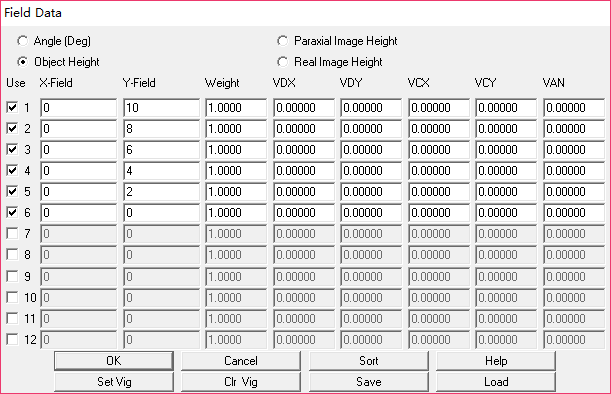
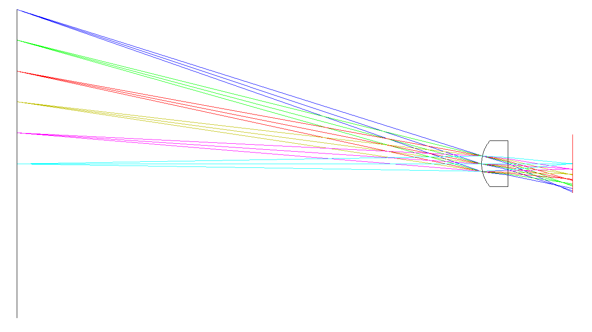
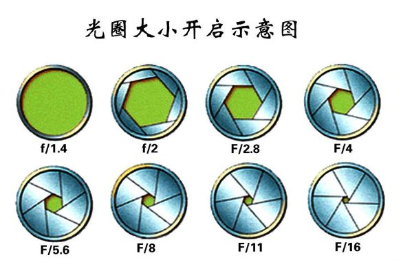
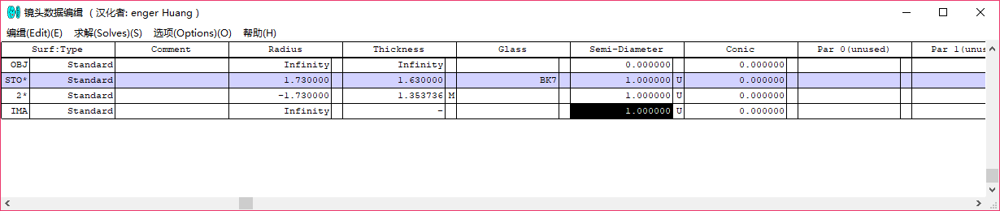
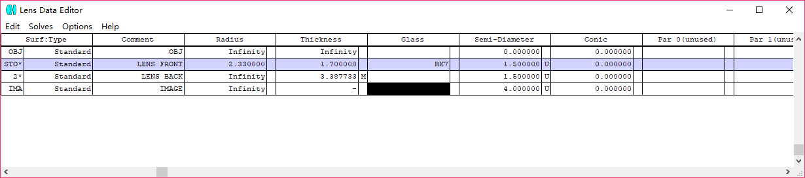
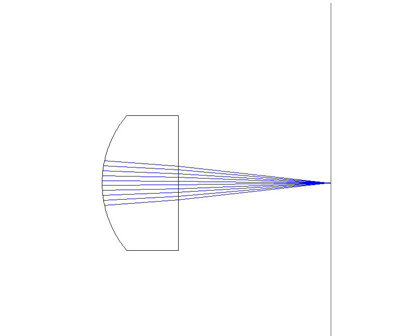
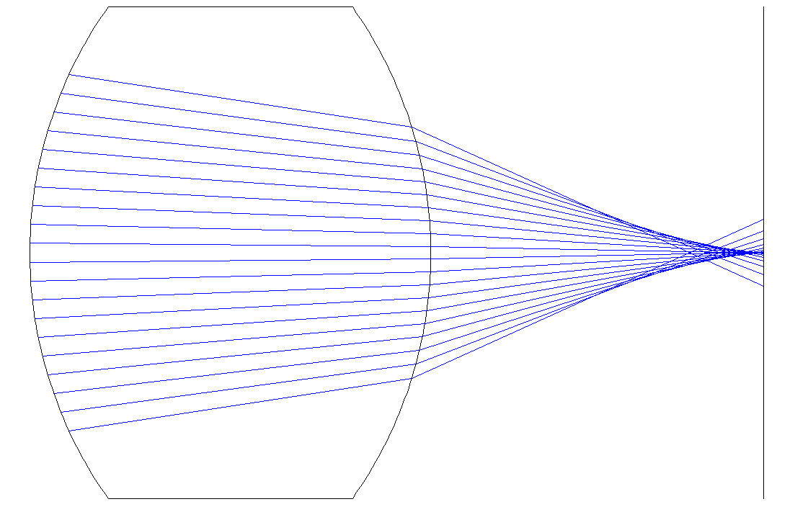
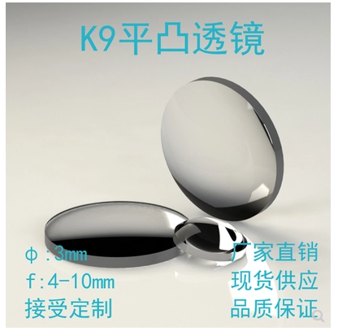
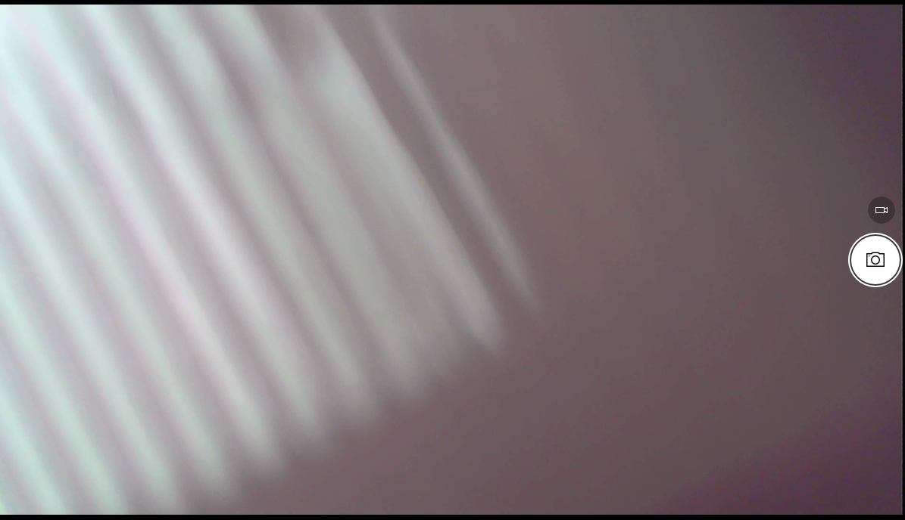
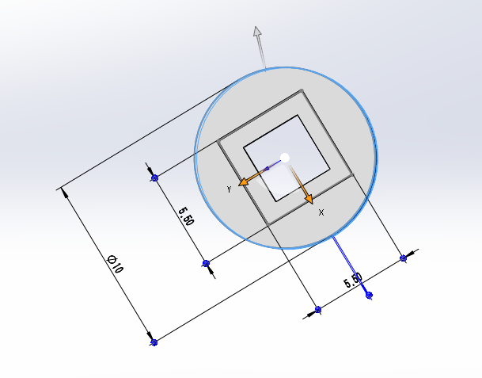

**2019.3.8**

昨天对于简单的一个透镜的分析有了基本的了解，今天的主要任务是将其他的内容进行熟悉一下。

1. zemax中的透镜类型可以是standard，表示为标准类型，存在者像差等。也有paraxial，表示理想型透镜，不存在像差。

2. zemax中经常出现哑面的说法，这里认为应该是不透明的面，和透镜那些透光的面相对，比如成像面。

3. 在进行添加转折面的时候，发现在添加之后，二位的layout不能进行显示。但是在3维的layout中就能显示。

4. 在field中选择多个高度如下

   

   对昨天的平凸透镜进行分析得到结果如下，取物距为2cm

   

   结果分析，昨天的透镜在近轴光线得到的结果是比较好的。但是我们如果作为镜头的话，不可能只对近轴的光线进行分析。上图是对于一个2厘米的物体进行成像得到的结果，远离光轴的地方光线出现明显的色散现象。因此用这个透镜来进行成像是不能成功的。

---

** 2019.3.7**

昨天下午和晚上看电视去了，没有时间学习ZeMax相关的知识，今天学习一下，尽早把光路分析完善，之后再进行下一步的透镜装配。

下面对在光路设计中出现的光圈数百度后的结果，可以发现对于一个相机来说，F/#后面的数目是可以变的，代表的就是透光孔径变化。F为焦距，这里的#是光圈数，结果是入瞳大小。

Zemax对透镜的光路分析

1. 双凸透镜，是直径2mm的那款，取入瞳孔径为0.5

2. 直径3mm的平凸透镜，取入瞳孔径为1

入瞳孔径在比较小的时候能够满足像差比较小的要求，在入瞳孔径过于大的时候会出现轴向偏差。如下图，取入瞳孔径为1.5，在轴向出现偏差

Zemax的初步操作：zemax是一个从左到右依次进行设计的系统软件，首先是对光学系统的入瞳大小的确定，并确定入射光的角度和波长等，然后是对光学元件各个面的设计，最后是光路模拟。

---

**2019.3.6**

昨天在淘宝上看到的是一个4mm大小的相机，[4mm相机](https://item.taobao.com/item.htm?id=567662380992&price=120&sourceType=item&sourceType=item&suid=5403ce29-6405-4077-9431-2d85c25c508f&ut_sk=1.XCCtwIplz4ADAAU1908o9CAQ_21646297_1551775133634.TaoPassword-WeiXin.1&un=d636b38876734e9a28b5e1fb31f54c83&share_crt_v=1&sp_tk=77+lRVpYSGJ2Q1Q4bk/vv6U=&cpp=1&shareurl=true&spm=a313p.22.2bu.1015291715699&short_name=h.3Djxt6m&app=chrome)但是经过学弟询问发现是模拟信号，并且没有usb的输出口。

但是用两个一样的相机来进行搭建的方法是可行的，因为在询问以前同学的双目相机的时候发现存在两个usb的项目相机类型，那么就是通过两个完全一样的相机进行搭建的。

1. 继续进行寻找，看是否有符合我们要求的相机。自己进行组合，得到我们需要的双目相机类型。
2. 利用已有的相机进行分析，得到同一芯片上的双目相机。寻找小镜头，或者是寻找合理的光路组合。

和老师讨论后，又要我去在zemax中设计光路。这些东西应该就不是我来考虑的事情啊，直接将焦距和透镜直径告诉了不就好了。然后考虑透镜的像差就好了。感觉真的是很费。就算自己弄出来了，也没有地方给你去要这个东西的。还是先找到一个东西，然后对该模型进行仿真。

淘宝上找到一个[3mm平凸透镜](https://item.taobao.com/item.htm?spm=a1z10.5-c.w4002-17109880963.65.36914fe1RjoTZn&id=560644912787)

这里对这个透镜进行仿真，仿真没有问题后就买这个了，然后利用自己打印的框架来进行后续的结果。今天的任务就是学习Zemax仿真软件吧，不然老师真的不肯松口。

[Zemax教程](https://wenku.baidu.com/view/1e14025be87101f69e3195ab.html)

----------------

**2019.3.5**

关于成像系统的设计失败，没有在成像单元上得到想要的结果。透镜和框架如下图所示，其中正方形为摆放好的透镜阵列，这样的装置不能得到一个像结果出来。

结果如下

分析：

针对上述情况进行分析，微透镜阵列能够对外部场景出现的光亮度变化做出反应。不同的亮度透过微透镜阵列能够得到一定的体现，但是得到的像特别模糊，而且特别暗淡。

1. 透镜的孔径很小，导致进入透镜和成像芯片上的光很少，难以满足成像芯片对光照的要求。（不同的成像芯片需要不同孔径的镜头？？）在利用手对已有的成像镜头进行遮挡，发现并不会出现上面的情况。孔径的大小，对成像质量的影响并没有想象的严重。
2. 焦距的问题，微透镜阵列没有将光线聚焦到一点。在利用已有镜头，将镜头和成像芯片的距离拉远，也会出现成像结果模糊的现象。而且分别对微透镜阵列和已有镜头进行聚光实验，发现微透镜阵列没有成功的将光线聚集在一个点上，为此考虑微透镜阵列没有聚焦的能力。或者说，微透镜阵列的聚集点在透镜内部，在外部无法找到该点。

对此放弃以前学长用的微透镜阵列，这里希望采用两个凸透镜进行组合在一起，得到我们需要的结果。

自己定制双透镜阵列。

但是双透镜阵列和成像之间又存在一定的差距，镜头并不是单一的凸透镜，为了消除像差，镜头中一般包括了很多组镜头的组合。为此只是单一的凸透镜并不能得到很好的成像结果。

如果想要实现双目透镜的话就需要进行镜头的设计。

-------------------------------------------------------------------------------------------------------------------------------------------------------

**2019.3.4**

修改透镜外的小框架尺寸，如下图

在此基础上拉伸一个2.5的凸台，然后在凸台底部，建立一个0.5的等距实体，拉伸0.5，用于遮挡光线用。因结构过于细腻，无法打印出螺纹来，因此这里不对螺纹进行表述，后期尽量不用螺纹进行连接。

相应的由于3d打印机的特殊，并不能对框架悬空的部分进行打印，而如果采取支架的方式可能会在一定程度上减小打印的质量，为此在外部框架的地方，一分为二。将悬空的部分进行分开打印，后续再进行组装的方式来避免悬空打印的结果。如下

下面部分为已经组合好的外部框架。并对该轮廓的尺寸和内部进行对应修改。

注意：在3d打印的结果中需要保证打印结构具有一定的刚度，我在选取0.5作为边厚的时候就不能，结构软不能保证应有的形状。在选取1mm可保证结果的强度。

在打印过程中存在一定的热胀冷缩等情况，在进行配对的时候可能会出现不能对齐的情况。比如我这里的透镜框架和最外框架完全按照数据上进行配比，就不能完全严丝合缝的进行组合。这里出现装不进去的情况，就是孔小了。     设置0.5毫米的多余空隙，方便后续。

